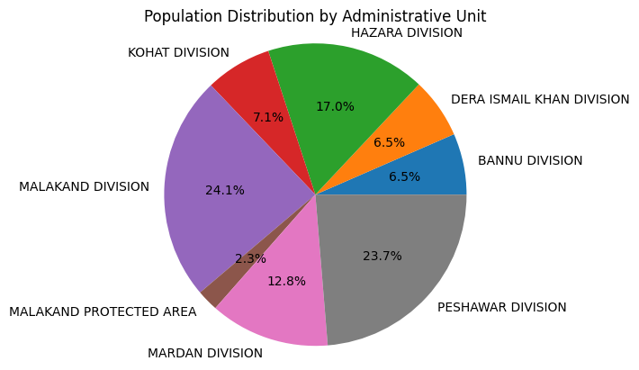

### Below we will see the Visualization of Pakistan Population According to the Census 2017
###### 1. Population Distribution by Administrative Unit
###### 2. Population Density Per Sq Km by Administrative Unit
###### 3. Urban Population Proportion by Administrative Unit
###### 4. Avg-Household-size by Administrative Unit
###### 5. Average Annual Growth Rate 1998-2017 by Administrative Unit
###### 6. Proportion of each gender in each administrative unit
###### 7. Population by Administrative Unit
###### 8. Population by Gender in each Administrative Unit


```python
# import liberaries
import pandas as pd
import numpy as np
import seaborn as sns
import matplotlib.pyplot as plt

```


```python


# Load the Excel files
df_pakistan = pd.read_excel('Pak_Census_2017/pakistan_Table01.xlsx')
df_punjab = pd.read_excel('Pak_Census_2017/punjab_Table01.xlsx')
df_sindh = pd.read_excel('Pak_Census_2017/sindh_Table01.xlsx')
df_kpk = pd.read_excel('Pak_Census_2017/kpk_Table01.xlsx')
df_balochistan = pd.read_excel('Pak_Census_2017/balochistan_Table01.xlsx')
df_fata = pd.read_excel('Pak_Census_2017/fata_Table01.xlsx')
df_isb = pd.read_excel('Pak_Census_2017/islamabad_Table01.xlsx')


```

# Pakistan Data

## Pakistan: Data Preprocessing


```python
df_pakistan.head()
```


<div>
<style scoped>
    .dataframe tbody tr th:only-of-type {
        vertical-align: middle;
    }

    .dataframe tbody tr th {
        vertical-align: top;
    }

    .dataframe thead th {
        text-align: right;
    }
</style>
<table border="1" class="dataframe">
  <thead>
    <tr style="text-align: right;">
      <th></th>
      <th>Admn-Unit</th>
      <th>Area-Sq-km</th>
      <th>All-Sexes</th>
      <th>Male</th>
      <th>Female</th>
      <th>Trans</th>
      <th>Sex-Ratio</th>
      <th>Pop-Density-Sq-km</th>
      <th>Urban-Proportion</th>
      <th>Avg-Household-size</th>
      <th>Pop-1998</th>
      <th>Avg-Ann-Growth-Rate-1998-2017</th>
    </tr>
  </thead>
  <tbody>
    <tr>
      <th>0</th>
      <td>PAKISTAN</td>
      <td>796096.0</td>
      <td>207684626</td>
      <td>106318220</td>
      <td>101344632</td>
      <td>21774</td>
      <td>104.91</td>
      <td>260.88</td>
      <td>36.44</td>
      <td>6.39</td>
      <td>132352279</td>
      <td>2.40</td>
    </tr>
    <tr>
      <th>1</th>
      <td>RURAL</td>
      <td>NaN</td>
      <td>132013789</td>
      <td>67167099</td>
      <td>64836918</td>
      <td>9772</td>
      <td>103.59</td>
      <td>NaN</td>
      <td>NaN</td>
      <td>6.55</td>
      <td>89315875</td>
      <td>2.07</td>
    </tr>
    <tr>
      <th>2</th>
      <td>URBAN</td>
      <td>NaN</td>
      <td>75670837</td>
      <td>39151121</td>
      <td>36507714</td>
      <td>12002</td>
      <td>107.24</td>
      <td>NaN</td>
      <td>NaN</td>
      <td>6.12</td>
      <td>43036404</td>
      <td>3.01</td>
    </tr>
    <tr>
      <th>3</th>
      <td>KHYBER PAKHTUNKHWA</td>
      <td>74521.0</td>
      <td>30508920</td>
      <td>15444481</td>
      <td>15062440</td>
      <td>1999</td>
      <td>102.54</td>
      <td>409.40</td>
      <td>18.80</td>
      <td>7.83</td>
      <td>17743645</td>
      <td>2.89</td>
    </tr>
    <tr>
      <th>4</th>
      <td>RURAL</td>
      <td>NaN</td>
      <td>24773492</td>
      <td>12470370</td>
      <td>12302031</td>
      <td>1091</td>
      <td>101.37</td>
      <td>NaN</td>
      <td>NaN</td>
      <td>7.90</td>
      <td>14749561</td>
      <td>2.76</td>
    </tr>
  </tbody>
</table>
</div>


```python
df_pakistan
```


<div>
<style scoped>
    .dataframe tbody tr th:only-of-type {
        vertical-align: middle;
    }

    .dataframe tbody tr th {
        vertical-align: top;
    }

    .dataframe thead th {
        text-align: right;
    }
</style>
<table border="1" class="dataframe">
  <thead>
    <tr style="text-align: right;">
      <th></th>
      <th>Admn-Unit</th>
      <th>Area-Sq-km</th>
      <th>All-Sexes</th>
      <th>Male</th>
      <th>Female</th>
      <th>Trans</th>
      <th>Sex-Ratio</th>
      <th>Pop-Density-Sq-km</th>
      <th>Urban-Proportion</th>
      <th>Avg-Household-size</th>
      <th>Pop-1998</th>
      <th>Avg-Ann-Growth-Rate-1998-2017</th>
    </tr>
  </thead>
  <tbody>
    <tr>
      <th>0</th>
      <td>PAKISTAN</td>
      <td>796096.0</td>
      <td>207684626</td>
      <td>106318220</td>
      <td>101344632</td>
      <td>21774</td>
      <td>104.91</td>
      <td>260.88</td>
      <td>36.44</td>
      <td>6.39</td>
      <td>132352279</td>
      <td>2.40</td>
    </tr>
    <tr>
      <th>1</th>
      <td>RURAL</td>
      <td>NaN</td>
      <td>132013789</td>
      <td>67167099</td>
      <td>64836918</td>
      <td>9772</td>
      <td>103.59</td>
      <td>NaN</td>
      <td>NaN</td>
      <td>6.55</td>
      <td>89315875</td>
      <td>2.07</td>
    </tr>
    <tr>
      <th>2</th>
      <td>URBAN</td>
      <td>NaN</td>
      <td>75670837</td>
      <td>39151121</td>
      <td>36507714</td>
      <td>12002</td>
      <td>107.24</td>
      <td>NaN</td>
      <td>NaN</td>
      <td>6.12</td>
      <td>43036404</td>
      <td>3.01</td>
    </tr>
    <tr>
      <th>3</th>
      <td>KHYBER PAKHTUNKHWA</td>
      <td>74521.0</td>
      <td>30508920</td>
      <td>15444481</td>
      <td>15062440</td>
      <td>1999</td>
      <td>102.54</td>
      <td>409.40</td>
      <td>18.80</td>
      <td>7.83</td>
      <td>17743645</td>
      <td>2.89</td>
    </tr>
    <tr>
      <th>4</th>
      <td>RURAL</td>
      <td>NaN</td>
      <td>24773492</td>
      <td>12470370</td>
      <td>12302031</td>
      <td>1091</td>
      <td>101.37</td>
      <td>NaN</td>
      <td>NaN</td>
      <td>7.90</td>
      <td>14749561</td>
      <td>2.76</td>
    </tr>
    <tr>
      <th>5</th>
      <td>URBAN</td>
      <td>NaN</td>
      <td>5735428</td>
      <td>2974111</td>
      <td>2760409</td>
      <td>908</td>
      <td>107.74</td>
      <td>NaN</td>
      <td>NaN</td>
      <td>7.52</td>
      <td>2994084</td>
      <td>3.47</td>
    </tr>
    <tr>
      <th>6</th>
      <td>PUNJAB</td>
      <td>205345.0</td>
      <td>109989655</td>
      <td>55909774</td>
      <td>54067446</td>
      <td>12435</td>
      <td>103.41</td>
      <td>535.63</td>
      <td>36.86</td>
      <td>6.38</td>
      <td>73621290</td>
      <td>2.13</td>
    </tr>
    <tr>
      <th>7</th>
      <td>RURAL</td>
      <td>NaN</td>
      <td>69442450</td>
      <td>35088081</td>
      <td>34348752</td>
      <td>5617</td>
      <td>102.15</td>
      <td>NaN</td>
      <td>NaN</td>
      <td>6.46</td>
      <td>50602265</td>
      <td>1.68</td>
    </tr>
    <tr>
      <th>8</th>
      <td>URBAN</td>
      <td>NaN</td>
      <td>40547205</td>
      <td>20821693</td>
      <td>19718694</td>
      <td>6818</td>
      <td>105.59</td>
      <td>NaN</td>
      <td>NaN</td>
      <td>6.24</td>
      <td>23019025</td>
      <td>3.02</td>
    </tr>
    <tr>
      <th>9</th>
      <td>SINDH</td>
      <td>140914.0</td>
      <td>47854510</td>
      <td>24876186</td>
      <td>22972370</td>
      <td>5954</td>
      <td>108.29</td>
      <td>339.60</td>
      <td>51.89</td>
      <td>5.55</td>
      <td>30439893</td>
      <td>2.41</td>
    </tr>
    <tr>
      <th>10</th>
      <td>RURAL</td>
      <td>NaN</td>
      <td>23021876</td>
      <td>11927892</td>
      <td>11091837</td>
      <td>2147</td>
      <td>107.54</td>
      <td>NaN</td>
      <td>NaN</td>
      <td>5.47</td>
      <td>15600031</td>
      <td>2.07</td>
    </tr>
    <tr>
      <th>11</th>
      <td>URBAN</td>
      <td>NaN</td>
      <td>24832634</td>
      <td>12948294</td>
      <td>11880533</td>
      <td>3807</td>
      <td>108.99</td>
      <td>NaN</td>
      <td>NaN</td>
      <td>5.62</td>
      <td>14839862</td>
      <td>2.74</td>
    </tr>
    <tr>
      <th>12</th>
      <td>BALOCHISTAN</td>
      <td>347190.0</td>
      <td>12335129</td>
      <td>6483736</td>
      <td>5850613</td>
      <td>780</td>
      <td>110.82</td>
      <td>35.53</td>
      <td>27.62</td>
      <td>6.87</td>
      <td>6565885</td>
      <td>3.37</td>
    </tr>
    <tr>
      <th>13</th>
      <td>RURAL</td>
      <td>NaN</td>
      <td>8928428</td>
      <td>4685756</td>
      <td>4242183</td>
      <td>489</td>
      <td>110.46</td>
      <td>NaN</td>
      <td>NaN</td>
      <td>6.80</td>
      <td>4997105</td>
      <td>3.10</td>
    </tr>
    <tr>
      <th>14</th>
      <td>URBAN</td>
      <td>NaN</td>
      <td>3406701</td>
      <td>1797980</td>
      <td>1608430</td>
      <td>291</td>
      <td>111.78</td>
      <td>NaN</td>
      <td>NaN</td>
      <td>7.06</td>
      <td>1568780</td>
      <td>4.16</td>
    </tr>
    <tr>
      <th>15</th>
      <td>FATA</td>
      <td>27220.0</td>
      <td>4993044</td>
      <td>2551715</td>
      <td>2441003</td>
      <td>326</td>
      <td>104.54</td>
      <td>183.43</td>
      <td>2.80</td>
      <td>8.60</td>
      <td>3176331</td>
      <td>2.40</td>
    </tr>
    <tr>
      <th>16</th>
      <td>RURAL</td>
      <td>NaN</td>
      <td>4853178</td>
      <td>2478277</td>
      <td>2374597</td>
      <td>304</td>
      <td>104.37</td>
      <td>NaN</td>
      <td>NaN</td>
      <td>8.61</td>
      <td>3090858</td>
      <td>2.40</td>
    </tr>
    <tr>
      <th>17</th>
      <td>URBAN</td>
      <td>NaN</td>
      <td>139866</td>
      <td>73438</td>
      <td>66406</td>
      <td>22</td>
      <td>110.59</td>
      <td>NaN</td>
      <td>NaN</td>
      <td>8.22</td>
      <td>85473</td>
      <td>2.62</td>
    </tr>
    <tr>
      <th>18</th>
      <td>FEDERAL CAPITAL</td>
      <td>906.0</td>
      <td>2003368</td>
      <td>1052328</td>
      <td>950760</td>
      <td>280</td>
      <td>110.68</td>
      <td>2211.22</td>
      <td>50.37</td>
      <td>5.86</td>
      <td>805235</td>
      <td>4.90</td>
    </tr>
    <tr>
      <th>19</th>
      <td>RURAL</td>
      <td>NaN</td>
      <td>994365</td>
      <td>516723</td>
      <td>477518</td>
      <td>124</td>
      <td>108.21</td>
      <td>NaN</td>
      <td>NaN</td>
      <td>5.94</td>
      <td>276055</td>
      <td>6.96</td>
    </tr>
    <tr>
      <th>20</th>
      <td>URBAN</td>
      <td>NaN</td>
      <td>1009003</td>
      <td>535605</td>
      <td>473242</td>
      <td>156</td>
      <td>113.18</td>
      <td>NaN</td>
      <td>NaN</td>
      <td>5.78</td>
      <td>529180</td>
      <td>3.45</td>
    </tr>
  </tbody>
</table>
</div>


```python
df_pakistan.info()
```

    <class 'pandas.core.frame.DataFrame'>
    RangeIndex: 21 entries, 0 to 20
    Data columns (total 12 columns):
     #   Column                         Non-Null Count  Dtype  
    ---  ------                         --------------  -----  
     0   Admn-Unit                      21 non-null     object 
     1   Area-Sq-km                     7 non-null      float64
     2   All-Sexes                      21 non-null     int64  
     3   Male                           21 non-null     int64  
     4   Female                         21 non-null     int64  
     5   Trans                          21 non-null     int64  
     6   Sex-Ratio                      21 non-null     float64
     7   Pop-Density-Sq-km              7 non-null      float64
     8   Urban-Proportion               7 non-null      float64
     9   Avg-Household-size             21 non-null     float64
     10  Pop-1998                       21 non-null     int64  
     11  Avg-Ann-Growth-Rate-1998-2017  21 non-null     float64
    dtypes: float64(6), int64(5), object(1)
    memory usage: 2.1+ KB
    


```python
df_pakistan.isnull().sum()
```


    Admn-Unit                         0
    Area-Sq-km                       14
    All-Sexes                         0
    Male                              0
    Female                            0
    Trans                             0
    Sex-Ratio                         0
    Pop-Density-Sq-km                14
    Urban-Proportion                 14
    Avg-Household-size                0
    Pop-1998                          0
    Avg-Ann-Growth-Rate-1998-2017     0
    dtype: int64


```python
# removing the rows containing null values

df_pakistan = df_pakistan.dropna(how='any')

```


```python
df_pakistan
```


<div>
<style scoped>
    .dataframe tbody tr th:only-of-type {
        vertical-align: middle;
    }

    .dataframe tbody tr th {
        vertical-align: top;
    }

    .dataframe thead th {
        text-align: right;
    }
</style>
<table border="1" class="dataframe">
  <thead>
    <tr style="text-align: right;">
      <th></th>
      <th>Admn-Unit</th>
      <th>Area-Sq-km</th>
      <th>All-Sexes</th>
      <th>Male</th>
      <th>Female</th>
      <th>Trans</th>
      <th>Sex-Ratio</th>
      <th>Pop-Density-Sq-km</th>
      <th>Urban-Proportion</th>
      <th>Avg-Household-size</th>
      <th>Pop-1998</th>
      <th>Avg-Ann-Growth-Rate-1998-2017</th>
    </tr>
  </thead>
  <tbody>
    <tr>
      <th>0</th>
      <td>PAKISTAN</td>
      <td>796096.0</td>
      <td>207684626</td>
      <td>106318220</td>
      <td>101344632</td>
      <td>21774</td>
      <td>104.91</td>
      <td>260.88</td>
      <td>36.44</td>
      <td>6.39</td>
      <td>132352279</td>
      <td>2.40</td>
    </tr>
    <tr>
      <th>3</th>
      <td>KHYBER PAKHTUNKHWA</td>
      <td>74521.0</td>
      <td>30508920</td>
      <td>15444481</td>
      <td>15062440</td>
      <td>1999</td>
      <td>102.54</td>
      <td>409.40</td>
      <td>18.80</td>
      <td>7.83</td>
      <td>17743645</td>
      <td>2.89</td>
    </tr>
    <tr>
      <th>6</th>
      <td>PUNJAB</td>
      <td>205345.0</td>
      <td>109989655</td>
      <td>55909774</td>
      <td>54067446</td>
      <td>12435</td>
      <td>103.41</td>
      <td>535.63</td>
      <td>36.86</td>
      <td>6.38</td>
      <td>73621290</td>
      <td>2.13</td>
    </tr>
    <tr>
      <th>9</th>
      <td>SINDH</td>
      <td>140914.0</td>
      <td>47854510</td>
      <td>24876186</td>
      <td>22972370</td>
      <td>5954</td>
      <td>108.29</td>
      <td>339.60</td>
      <td>51.89</td>
      <td>5.55</td>
      <td>30439893</td>
      <td>2.41</td>
    </tr>
    <tr>
      <th>12</th>
      <td>BALOCHISTAN</td>
      <td>347190.0</td>
      <td>12335129</td>
      <td>6483736</td>
      <td>5850613</td>
      <td>780</td>
      <td>110.82</td>
      <td>35.53</td>
      <td>27.62</td>
      <td>6.87</td>
      <td>6565885</td>
      <td>3.37</td>
    </tr>
    <tr>
      <th>15</th>
      <td>FATA</td>
      <td>27220.0</td>
      <td>4993044</td>
      <td>2551715</td>
      <td>2441003</td>
      <td>326</td>
      <td>104.54</td>
      <td>183.43</td>
      <td>2.80</td>
      <td>8.60</td>
      <td>3176331</td>
      <td>2.40</td>
    </tr>
    <tr>
      <th>18</th>
      <td>FEDERAL CAPITAL</td>
      <td>906.0</td>
      <td>2003368</td>
      <td>1052328</td>
      <td>950760</td>
      <td>280</td>
      <td>110.68</td>
      <td>2211.22</td>
      <td>50.37</td>
      <td>5.86</td>
      <td>805235</td>
      <td>4.90</td>
    </tr>
  </tbody>
</table>
</div>


```python

#convert the 'All-Sexes' into millions
df_pakistan['All-Sexes-mln'] = df_pakistan['All-Sexes'] / 1000000  # Convert to millions


# convert the 'Male' into millions
df_pakistan['Male-mln'] = df_pakistan['Male'] / 1000000  # Convert to millions


# convert the 'Female' into millions
df_pakistan['Female-mln'] = df_pakistan['Female'] / 1000000  # Convert to millions


# convert the 'Trans' into millions
df_pakistan['Trans-mln'] = df_pakistan['Trans'] / 1000000  # Convert to millions


# convert the 'Pop-1998' into millions
df_pakistan['Pop-1998-mln'] = df_pakistan['Pop-1998'] / 1000000  # Convert to millions


```


```python
df_pakistan
```


<div>
<style scoped>
    .dataframe tbody tr th:only-of-type {
        vertical-align: middle;
    }

    .dataframe tbody tr th {
        vertical-align: top;
    }

    .dataframe thead th {
        text-align: right;
    }
</style>
<table border="1" class="dataframe">
  <thead>
    <tr style="text-align: right;">
      <th></th>
      <th>Admn-Unit</th>
      <th>Area-Sq-km</th>
      <th>All-Sexes</th>
      <th>Male</th>
      <th>Female</th>
      <th>Trans</th>
      <th>Sex-Ratio</th>
      <th>Pop-Density-Sq-km</th>
      <th>Urban-Proportion</th>
      <th>Avg-Household-size</th>
      <th>Pop-1998</th>
      <th>Avg-Ann-Growth-Rate-1998-2017</th>
      <th>All-Sexes-mln</th>
      <th>Male-mln</th>
      <th>Female-mln</th>
      <th>Trans-mln</th>
      <th>Pop-1998-mln</th>
    </tr>
  </thead>
  <tbody>
    <tr>
      <th>0</th>
      <td>PAKISTAN</td>
      <td>796096.0</td>
      <td>207684626</td>
      <td>106318220</td>
      <td>101344632</td>
      <td>21774</td>
      <td>104.91</td>
      <td>260.88</td>
      <td>36.44</td>
      <td>6.39</td>
      <td>132352279</td>
      <td>2.40</td>
      <td>207.684626</td>
      <td>106.318220</td>
      <td>101.344632</td>
      <td>0.021774</td>
      <td>132.352279</td>
    </tr>
    <tr>
      <th>3</th>
      <td>KHYBER PAKHTUNKHWA</td>
      <td>74521.0</td>
      <td>30508920</td>
      <td>15444481</td>
      <td>15062440</td>
      <td>1999</td>
      <td>102.54</td>
      <td>409.40</td>
      <td>18.80</td>
      <td>7.83</td>
      <td>17743645</td>
      <td>2.89</td>
      <td>30.508920</td>
      <td>15.444481</td>
      <td>15.062440</td>
      <td>0.001999</td>
      <td>17.743645</td>
    </tr>
    <tr>
      <th>6</th>
      <td>PUNJAB</td>
      <td>205345.0</td>
      <td>109989655</td>
      <td>55909774</td>
      <td>54067446</td>
      <td>12435</td>
      <td>103.41</td>
      <td>535.63</td>
      <td>36.86</td>
      <td>6.38</td>
      <td>73621290</td>
      <td>2.13</td>
      <td>109.989655</td>
      <td>55.909774</td>
      <td>54.067446</td>
      <td>0.012435</td>
      <td>73.621290</td>
    </tr>
    <tr>
      <th>9</th>
      <td>SINDH</td>
      <td>140914.0</td>
      <td>47854510</td>
      <td>24876186</td>
      <td>22972370</td>
      <td>5954</td>
      <td>108.29</td>
      <td>339.60</td>
      <td>51.89</td>
      <td>5.55</td>
      <td>30439893</td>
      <td>2.41</td>
      <td>47.854510</td>
      <td>24.876186</td>
      <td>22.972370</td>
      <td>0.005954</td>
      <td>30.439893</td>
    </tr>
    <tr>
      <th>12</th>
      <td>BALOCHISTAN</td>
      <td>347190.0</td>
      <td>12335129</td>
      <td>6483736</td>
      <td>5850613</td>
      <td>780</td>
      <td>110.82</td>
      <td>35.53</td>
      <td>27.62</td>
      <td>6.87</td>
      <td>6565885</td>
      <td>3.37</td>
      <td>12.335129</td>
      <td>6.483736</td>
      <td>5.850613</td>
      <td>0.000780</td>
      <td>6.565885</td>
    </tr>
    <tr>
      <th>15</th>
      <td>FATA</td>
      <td>27220.0</td>
      <td>4993044</td>
      <td>2551715</td>
      <td>2441003</td>
      <td>326</td>
      <td>104.54</td>
      <td>183.43</td>
      <td>2.80</td>
      <td>8.60</td>
      <td>3176331</td>
      <td>2.40</td>
      <td>4.993044</td>
      <td>2.551715</td>
      <td>2.441003</td>
      <td>0.000326</td>
      <td>3.176331</td>
    </tr>
    <tr>
      <th>18</th>
      <td>FEDERAL CAPITAL</td>
      <td>906.0</td>
      <td>2003368</td>
      <td>1052328</td>
      <td>950760</td>
      <td>280</td>
      <td>110.68</td>
      <td>2211.22</td>
      <td>50.37</td>
      <td>5.86</td>
      <td>805235</td>
      <td>4.90</td>
      <td>2.003368</td>
      <td>1.052328</td>
      <td>0.950760</td>
      <td>0.000280</td>
      <td>0.805235</td>
    </tr>
  </tbody>
</table>
</div>


# Pakistan: Visualization

#### 1. Population Distribution by Administrative Unit


```python
#Population Distribution by Administrative Unit


df_pakistan_pie = df_pakistan[['Admn-Unit', 'All-Sexes-mln']]
df_pakistan_pie = df_pakistan_pie.set_index('Admn-Unit')
df_pakistan_pie = df_pakistan_pie.drop(index='PAKISTAN')

# Convert All-Sexes column to 1D array
values = df_pakistan_pie['All-Sexes-mln'].values

plt.pie(values, labels=df_pakistan_pie.index, autopct='%1.1f%%')
plt.title('Population Distribution by Each Administrative Unit in Pakistan 2017')
plt.axis('equal')
plt.show()

```


    

    


#### 2. Population Density Per Sq Km by Administrative Unit


```python
# Pop-Density-Sq-km by Administrative Unit


import matplotlib.pyplot as plt

# Group the data by Administrative Unit and calculate the mean of Pop-Density-Sq-km for each group
data = df_pakistan.groupby('Admn-Unit')['Pop-Density-Sq-km'].mean()

# Set the size of the figure
plt.figure(figsize=(5,3)) 

# Create a bar plot
data.plot(kind='bar', color='orange')

# Set the title and axis labels
plt.title('Pop-Density-Sq-km by Administrative Unit')
plt.xlabel('Administrative Unit')
plt.ylabel('Pop-Density-Sq-km')

# Show the plot
plt.show()


```


    

    


#### 3. Urban Population Proportion by Administrative Unit


```python
# Urban-Proportion by Administrative Unit


# Sort the dataframe by 'Urban-Proportion' in descending order
df_pakistan = df_pakistan.sort_values('Urban-Proportion', ascending=False)

# Set the size of the figure
plt.figure(figsize=(5,3))

# Create a horizontal bar chart
plt.barh(df_pakistan['Admn-Unit'], df_pakistan['Urban-Proportion'], color='blue')

# Add a title and axis labels
plt.title('Urban Proportion by Administrative Unit in Pakistan')
plt.xlabel('Urban Proportion')
plt.ylabel('Administrative Unit')

# Show the plot
plt.show()

```


    

    


```python

```

#### 4. Avg-Household-size by Administrative Unit


```python
# Avg-Household-size by Administrative Unit


# Sort the data by Avg-Household-size in descending order
df_pakistan = df_pakistan.sort_values(by='Avg-Household-size', ascending=False)

# Set the size of the figure
plt.figure(figsize=(5,3))

# Create the plot
plt.barh(df_pakistan['Admn-Unit'], df_pakistan['Avg-Household-size'])


# Add labels and title
plt.xlabel('Avg-Household-size')
plt.ylabel('Administrative Unit')
plt.title('Average Household Size by Administrative Unit')

# Show the plot
plt.show()

```


    

    


```python

```

#### 5. Average Annual Growth Rate 1998-2017 by Administrative Unit


```python

# Avg-Ann-Growth-Rate-1998-2017 by Administrative Unit


# Sort the data by Avg-Household-size in descending order
df_pakistan = df_pakistan.sort_values(by='Avg-Ann-Growth-Rate-1998-2017', ascending=False)

# Set the size of the figure
plt.figure(figsize=(5,3))

# Create the plot
plt.barh(df_pakistan['Admn-Unit'], df_pakistan['Avg-Ann-Growth-Rate-1998-2017'])


# Add axis labels and title
plt.xlabel("Avg-Ann-Growth-Rate-1998-2017")
plt.ylabel("Administrative Unit")
plt.title("Avg-Ann-Growth-Rate-1998-2017 by Administrative Unit")

# Show the plot
plt.show()


```


    

    


```python

```

#### 6. Proportion of each gender in each administrative unit


```python
 
# Calculate the total population for each administrative unit
df_pakistan['Total'] = df_pakistan['All-Sexes-mln'] * 1000000

# Calculate the proportion of each gender in each administrative unit
df_pakistan['Male Prop'] = df_pakistan['Male-mln'] / df_pakistan['Total']
df_pakistan['Female Prop'] = df_pakistan['Female-mln'] / df_pakistan['Total']
df_pakistan['Trans Prop'] = df_pakistan['Trans-mln'] / df_pakistan['Total']

# Define the colors for each gender
colors = ['#7CFC00', '#B6F6D5', '#FCBF24']

# Create subplots for all administrative units
fig, axs = plt.subplots(3, 3, figsize=(12, 12))
fig.suptitle('Proportion of each gender in each administrative unit')

# Loop over all administrative units and create a pie chart
for i, unit in enumerate(df_pakistan['Admn-Unit'].unique()):
    # Filter the data for the current administrative unit
    unit_df = df_pakistan[df_pakistan['Admn-Unit'] == unit]

    # Get the proportion of each gender
    values = [unit_df['Male Prop'].values[0],
              unit_df['Female Prop'].values[0],
              unit_df['Trans Prop'].values[0]]

    # Calculate the position of the subplot
    row, col = i // 3, i % 3

    # Create the pie chart
    axs[row, col].pie(values, labels=['Male', 'Female', 'Transgender'],
                      autopct='%1.1f%%', startangle=90,
                      colors=colors, wedgeprops=dict(width=0.5, edgecolor='w'))
    axs[row, col].set_title(unit)

# Remove any unused subplots
for i in range(len(df_pakistan['Admn-Unit'].unique()), 9):
    row, col = (i - 3) // 3 + 1, (i - 3) % 3
    fig.delaxes(axs[row, col])

# Set the layout and show the plot
fig.tight_layout()
plt.show()


```


    

    


```python

```

#### 7. Population by Administrative Unit


```python

# Population by Administrative Unit
df_pakistan_bar1 = df_pakistan[['Admn-Unit', 'All-Sexes-mln']]

# Create bar chart
plt.bar(df_pakistan['Admn-Unit'], df_pakistan['All-Sexes-mln'])

# Add labels and title
plt.xlabel('Administrative Unit')
plt.ylabel('Population in millions')
plt.title('Population by Administrative Unit')

# Rotate x-axis labels for better visibility
plt.xticks(rotation=90)

# Show plot
plt.show()


```


    

    


```python

```

#### 8. Population by Gender in each Administrative Unit


```python
# Population by Gender in each Administrative Unit

df_pakistan_bar2 = df_pakistan[['Admn-Unit', 'Male-mln', 'Female-mln']]
df_pakistan_bar2 = df_pakistan_bar2.set_index('Admn-Unit')
df_pakistan_bar2.plot(kind='bar', stacked=True)
plt.xlabel('Administrative Unit')
plt.ylabel('Population in millions')
plt.title('Population by Gender')
plt.show()

```


    

    


## ------------------------------------------------------------------------------------

# Punjab Data 

### Punjab: Data Preprocessing


```python
df_punjab.head()
```


<div>
<style scoped>
    .dataframe tbody tr th:only-of-type {
        vertical-align: middle;
    }

    .dataframe tbody tr th {
        vertical-align: top;
    }

    .dataframe thead th {
        text-align: right;
    }
</style>
<table border="1" class="dataframe">
  <thead>
    <tr style="text-align: right;">
      <th></th>
      <th>Admn-Unit</th>
      <th>Area-Sq-km</th>
      <th>All-Sexes</th>
      <th>Male</th>
      <th>Female</th>
      <th>Trans</th>
      <th>Sex-Ratio</th>
      <th>Pop-Density-Sq-km\n</th>
      <th>Urban-Proportion</th>
      <th>Avg-Household-size</th>
      <th>Pop-1998</th>
      <th>Avg-Ann-Growth-Rate-1998-2017</th>
    </tr>
  </thead>
  <tbody>
    <tr>
      <th>0</th>
      <td>PUNJAB</td>
      <td>205345.0</td>
      <td>109989655</td>
      <td>55909774</td>
      <td>54067446</td>
      <td>12435</td>
      <td>103.41</td>
      <td>535.63</td>
      <td>36.86</td>
      <td>6.38</td>
      <td>73621290</td>
      <td>2.13</td>
    </tr>
    <tr>
      <th>1</th>
      <td>RURAL</td>
      <td>NaN</td>
      <td>69442450</td>
      <td>35088081</td>
      <td>34348752</td>
      <td>5617</td>
      <td>102.15</td>
      <td>NaN</td>
      <td>NaN</td>
      <td>6.46</td>
      <td>50602265</td>
      <td>1.68</td>
    </tr>
    <tr>
      <th>2</th>
      <td>URBAN</td>
      <td>NaN</td>
      <td>40547205</td>
      <td>20821693</td>
      <td>19718694</td>
      <td>6818</td>
      <td>105.59</td>
      <td>NaN</td>
      <td>NaN</td>
      <td>6.24</td>
      <td>23019025</td>
      <td>3.02</td>
    </tr>
    <tr>
      <th>3</th>
      <td>BAHAWALPUR DIVISION</td>
      <td>45588.0</td>
      <td>11452594</td>
      <td>5851909</td>
      <td>5599461</td>
      <td>1224</td>
      <td>104.51</td>
      <td>251.22</td>
      <td>24.65</td>
      <td>6.43</td>
      <td>7635591</td>
      <td>2.15</td>
    </tr>
    <tr>
      <th>4</th>
      <td>RURAL</td>
      <td>NaN</td>
      <td>8629763</td>
      <td>4407484</td>
      <td>4221525</td>
      <td>754</td>
      <td>104.41</td>
      <td>NaN</td>
      <td>NaN</td>
      <td>6.55</td>
      <td>5960904</td>
      <td>1.96</td>
    </tr>
  </tbody>
</table>
</div>


```python
df_punjab

```


<div>
<style scoped>
    .dataframe tbody tr th:only-of-type {
        vertical-align: middle;
    }

    .dataframe tbody tr th {
        vertical-align: top;
    }

    .dataframe thead th {
        text-align: right;
    }
</style>
<table border="1" class="dataframe">
  <thead>
    <tr style="text-align: right;">
      <th></th>
      <th>Admn-Unit</th>
      <th>Area-Sq-km</th>
      <th>All-Sexes</th>
      <th>Male</th>
      <th>Female</th>
      <th>Trans</th>
      <th>Sex-Ratio</th>
      <th>Pop-Density-Sq-km\n</th>
      <th>Urban-Proportion</th>
      <th>Avg-Household-size</th>
      <th>Pop-1998</th>
      <th>Avg-Ann-Growth-Rate-1998-2017</th>
    </tr>
  </thead>
  <tbody>
    <tr>
      <th>0</th>
      <td>PUNJAB</td>
      <td>205345.0</td>
      <td>109989655</td>
      <td>55909774</td>
      <td>54067446</td>
      <td>12435</td>
      <td>103.41</td>
      <td>535.63</td>
      <td>36.86</td>
      <td>6.38</td>
      <td>73621290</td>
      <td>2.13</td>
    </tr>
    <tr>
      <th>1</th>
      <td>RURAL</td>
      <td>NaN</td>
      <td>69442450</td>
      <td>35088081</td>
      <td>34348752</td>
      <td>5617</td>
      <td>102.15</td>
      <td>NaN</td>
      <td>NaN</td>
      <td>6.46</td>
      <td>50602265</td>
      <td>1.68</td>
    </tr>
    <tr>
      <th>2</th>
      <td>URBAN</td>
      <td>NaN</td>
      <td>40547205</td>
      <td>20821693</td>
      <td>19718694</td>
      <td>6818</td>
      <td>105.59</td>
      <td>NaN</td>
      <td>NaN</td>
      <td>6.24</td>
      <td>23019025</td>
      <td>3.02</td>
    </tr>
    <tr>
      <th>3</th>
      <td>BAHAWALPUR DIVISION</td>
      <td>45588.0</td>
      <td>11452594</td>
      <td>5851909</td>
      <td>5599461</td>
      <td>1224</td>
      <td>104.51</td>
      <td>251.22</td>
      <td>24.65</td>
      <td>6.43</td>
      <td>7635591</td>
      <td>2.15</td>
    </tr>
    <tr>
      <th>4</th>
      <td>RURAL</td>
      <td>NaN</td>
      <td>8629763</td>
      <td>4407484</td>
      <td>4221525</td>
      <td>754</td>
      <td>104.41</td>
      <td>NaN</td>
      <td>NaN</td>
      <td>6.55</td>
      <td>5960904</td>
      <td>1.96</td>
    </tr>
    <tr>
      <th>...</th>
      <td>...</td>
      <td>...</td>
      <td>...</td>
      <td>...</td>
      <td>...</td>
      <td>...</td>
      <td>...</td>
      <td>...</td>
      <td>...</td>
      <td>...</td>
      <td>...</td>
      <td>...</td>
    </tr>
    <tr>
      <th>133</th>
      <td>RURAL</td>
      <td>NaN</td>
      <td>1214789</td>
      <td>605990</td>
      <td>608718</td>
      <td>81</td>
      <td>99.55</td>
      <td>NaN</td>
      <td>NaN</td>
      <td>6.44</td>
      <td>836610</td>
      <td>1.98</td>
    </tr>
    <tr>
      <th>134</th>
      <td>URBAN</td>
      <td>NaN</td>
      <td>327812</td>
      <td>165979</td>
      <td>161784</td>
      <td>49</td>
      <td>102.59</td>
      <td>NaN</td>
      <td>NaN</td>
      <td>6.27</td>
      <td>220010</td>
      <td>2.12</td>
    </tr>
    <tr>
      <th>135</th>
      <td>SARGODHA DISTRICT</td>
      <td>5856.0</td>
      <td>3696212</td>
      <td>1867724</td>
      <td>1828074</td>
      <td>414</td>
      <td>102.17</td>
      <td>631.18</td>
      <td>29.44</td>
      <td>6.17</td>
      <td>2665979</td>
      <td>1.73</td>
    </tr>
    <tr>
      <th>136</th>
      <td>RURAL</td>
      <td>NaN</td>
      <td>2608007</td>
      <td>1316960</td>
      <td>1290851</td>
      <td>196</td>
      <td>102.02</td>
      <td>NaN</td>
      <td>NaN</td>
      <td>6.22</td>
      <td>1915947</td>
      <td>1.63</td>
    </tr>
    <tr>
      <th>137</th>
      <td>URBAN</td>
      <td>NaN</td>
      <td>1088205</td>
      <td>550764</td>
      <td>537223</td>
      <td>218</td>
      <td>102.52</td>
      <td>NaN</td>
      <td>NaN</td>
      <td>6.06</td>
      <td>750032</td>
      <td>1.97</td>
    </tr>
  </tbody>
</table>
<p>138 rows × 12 columns</p>
</div>


```python
df_punjab.info()
```

    <class 'pandas.core.frame.DataFrame'>
    RangeIndex: 138 entries, 0 to 137
    Data columns (total 12 columns):
     #   Column                         Non-Null Count  Dtype  
    ---  ------                         --------------  -----  
     0   Admn-Unit                      138 non-null    object 
     1   Area-Sq-km                     46 non-null     float64
     2   All-Sexes                      138 non-null    object 
     3   Male                           138 non-null    object 
     4   Female                         138 non-null    object 
     5   Trans                          138 non-null    object 
     6   Sex-Ratio                      138 non-null    object 
     7   Pop-Density-Sq-km
                 46 non-null     float64
     8   Urban-Proportion               46 non-null     float64
     9   Avg-Household-size             138 non-null    object 
     10  Pop-1998                       138 non-null    int64  
     11  Avg-Ann-Growth-Rate-1998-2017  138 non-null    object 
    dtypes: float64(3), int64(1), object(8)
    memory usage: 13.1+ KB
    


```python
df_punjab.isnull().sum()
```


    Admn-Unit                         0
    Area-Sq-km                       92
    All-Sexes                         0
    Male                              0
    Female                            0
    Trans                             0
    Sex-Ratio                         0
    Pop-Density-Sq-km\n              92
    Urban-Proportion                 92
    Avg-Household-size                0
    Pop-1998                          0
    Avg-Ann-Growth-Rate-1998-2017     0
    dtype: int64


```python
# removing the rows containing null values
df_punjab = df_punjab.dropna(how='any')
```


```python
df_punjab
```


<div>
<style scoped>
    .dataframe tbody tr th:only-of-type {
        vertical-align: middle;
    }

    .dataframe tbody tr th {
        vertical-align: top;
    }

    .dataframe thead th {
        text-align: right;
    }
</style>
<table border="1" class="dataframe">
  <thead>
    <tr style="text-align: right;">
      <th></th>
      <th>Admn-Unit</th>
      <th>Area-Sq-km</th>
      <th>All-Sexes</th>
      <th>Male</th>
      <th>Female</th>
      <th>Trans</th>
      <th>Sex-Ratio</th>
      <th>Pop-Density-Sq-km\n</th>
      <th>Urban-Proportion</th>
      <th>Avg-Household-size</th>
      <th>Pop-1998</th>
      <th>Avg-Ann-Growth-Rate-1998-2017</th>
    </tr>
  </thead>
  <tbody>
    <tr>
      <th>0</th>
      <td>PUNJAB</td>
      <td>205345.0</td>
      <td>109989655</td>
      <td>55909774</td>
      <td>54067446</td>
      <td>12435</td>
      <td>103.41</td>
      <td>535.63</td>
      <td>36.86</td>
      <td>6.38</td>
      <td>73621290</td>
      <td>2.13</td>
    </tr>
    <tr>
      <th>3</th>
      <td>BAHAWALPUR DIVISION</td>
      <td>45588.0</td>
      <td>11452594</td>
      <td>5851909</td>
      <td>5599461</td>
      <td>1224</td>
      <td>104.51</td>
      <td>251.22</td>
      <td>24.65</td>
      <td>6.43</td>
      <td>7635591</td>
      <td>2.15</td>
    </tr>
    <tr>
      <th>6</th>
      <td>BAHAWALNAGAR DISTRICT</td>
      <td>8878.0</td>
      <td>2975656</td>
      <td>1510427</td>
      <td>1464900</td>
      <td>329</td>
      <td>103.11</td>
      <td>335.17</td>
      <td>20.83</td>
      <td>6.16</td>
      <td>2061447</td>
      <td>1.95</td>
    </tr>
    <tr>
      <th>9</th>
      <td>BAHAWALPUR DISTRICT</td>
      <td>24830.0</td>
      <td>3669176</td>
      <td>1879702</td>
      <td>1789148</td>
      <td>326</td>
      <td>105.06</td>
      <td>147.77</td>
      <td>31.95</td>
      <td>6.24</td>
      <td>2433091</td>
      <td>2.18</td>
    </tr>
    <tr>
      <th>12</th>
      <td>RAHIM YAR KHAN DISTRICT</td>
      <td>11880.0</td>
      <td>4807762</td>
      <td>2461780</td>
      <td>2345413</td>
      <td>569</td>
      <td>104.96</td>
      <td>404.69</td>
      <td>21.44</td>
      <td>6.77</td>
      <td>3141053</td>
      <td>2.26</td>
    </tr>
    <tr>
      <th>15</th>
      <td>D.G.KHAN DIVISION</td>
      <td>38778.0</td>
      <td>11021214</td>
      <td>5627413</td>
      <td>5392956</td>
      <td>845</td>
      <td>104.35</td>
      <td>284.21</td>
      <td>17.27</td>
      <td>7</td>
      <td>6503590</td>
      <td>2.81</td>
    </tr>
    <tr>
      <th>18</th>
      <td>DERA GHAZI KHAN DISTRICT</td>
      <td>11922.0</td>
      <td>2872631</td>
      <td>1451327</td>
      <td>1421127</td>
      <td>177</td>
      <td>102.13</td>
      <td>240.95</td>
      <td>19.01</td>
      <td>8.15</td>
      <td>1643118</td>
      <td>2.98</td>
    </tr>
    <tr>
      <th>21</th>
      <td>LAYYAH DISTRICT</td>
      <td>6289.0</td>
      <td>1823995</td>
      <td>924837</td>
      <td>899016</td>
      <td>142</td>
      <td>102.87</td>
      <td>290.03</td>
      <td>17.61</td>
      <td>6.42</td>
      <td>1120951</td>
      <td>2.59</td>
    </tr>
    <tr>
      <th>24</th>
      <td>MUZAFFARGARH DISTRICT</td>
      <td>8249.0</td>
      <td>4328549</td>
      <td>2223085</td>
      <td>2105145</td>
      <td>319</td>
      <td>105.6</td>
      <td>524.74</td>
      <td>16.13</td>
      <td>6.48</td>
      <td>2635903</td>
      <td>2.64</td>
    </tr>
    <tr>
      <th>27</th>
      <td>RAJANPUR DISTRICT</td>
      <td>12318.0</td>
      <td>1996039</td>
      <td>1028164</td>
      <td>967668</td>
      <td>207</td>
      <td>106.25</td>
      <td>162.04</td>
      <td>16.90</td>
      <td>7.44</td>
      <td>1103618</td>
      <td>3.16</td>
    </tr>
    <tr>
      <th>30</th>
      <td>FAISALABAD DIVISION</td>
      <td>17918.0</td>
      <td>14185231</td>
      <td>7233831</td>
      <td>6949921</td>
      <td>1479</td>
      <td>104.09</td>
      <td>791.67</td>
      <td>36.87</td>
      <td>6.39</td>
      <td>9885685</td>
      <td>1.92</td>
    </tr>
    <tr>
      <th>33</th>
      <td>CHINIOT DISTRICT</td>
      <td>2643.0</td>
      <td>1368659</td>
      <td>699606</td>
      <td>668914</td>
      <td>139</td>
      <td>104.59</td>
      <td>517.84</td>
      <td>30.85</td>
      <td>6.21</td>
      <td>965124</td>
      <td>1.85</td>
    </tr>
    <tr>
      <th>36</th>
      <td>FAISALABAD DISTRICT</td>
      <td>5857.0</td>
      <td>7882444</td>
      <td>4038932</td>
      <td>3842684</td>
      <td>828</td>
      <td>105.11</td>
      <td>1345.82</td>
      <td>47.79</td>
      <td>6.42</td>
      <td>5429547</td>
      <td>1.98</td>
    </tr>
    <tr>
      <th>39</th>
      <td>JHANG DISTRICT</td>
      <td>6166.0</td>
      <td>2742633</td>
      <td>1394928</td>
      <td>1347444</td>
      <td>261</td>
      <td>103.52</td>
      <td>444.80</td>
      <td>21.82</td>
      <td>6.35</td>
      <td>1869421</td>
      <td>2.03</td>
    </tr>
    <tr>
      <th>42</th>
      <td>TOBA TEK SINGH DISTRICT</td>
      <td>3252.0</td>
      <td>2191495</td>
      <td>1100365</td>
      <td>1090879</td>
      <td>251</td>
      <td>100.87</td>
      <td>673.89</td>
      <td>20.17</td>
      <td>6.42</td>
      <td>1621593</td>
      <td>1.59</td>
    </tr>
    <tr>
      <th>45</th>
      <td>GUJRANWALA DIVISION</td>
      <td>17207.0</td>
      <td>16120861</td>
      <td>7985444</td>
      <td>8133618</td>
      <td>1799</td>
      <td>98.18</td>
      <td>936.88</td>
      <td>36.64</td>
      <td>6.57</td>
      <td>11431058</td>
      <td>1.82</td>
    </tr>
    <tr>
      <th>48</th>
      <td>GUJRANWALA DISTRICT</td>
      <td>3622.0</td>
      <td>5011066</td>
      <td>2528990</td>
      <td>2481457</td>
      <td>619</td>
      <td>101.92</td>
      <td>1383.51</td>
      <td>58.85</td>
      <td>6.63</td>
      <td>3400940</td>
      <td>2.06</td>
    </tr>
    <tr>
      <th>51</th>
      <td>GUJRAT DISTRICT</td>
      <td>3192.0</td>
      <td>2756289</td>
      <td>1334775</td>
      <td>1421295</td>
      <td>219</td>
      <td>93.91</td>
      <td>863.50</td>
      <td>30.02</td>
      <td>6.2</td>
      <td>2048008</td>
      <td>1.57</td>
    </tr>
    <tr>
      <th>54</th>
      <td>HAFIZABAD DISTRICT</td>
      <td>2367.0</td>
      <td>1156954</td>
      <td>584668</td>
      <td>572188</td>
      <td>98</td>
      <td>102.18</td>
      <td>488.78</td>
      <td>34.81</td>
      <td>6.57</td>
      <td>832980</td>
      <td>1.74</td>
    </tr>
    <tr>
      <th>57</th>
      <td>MANDI BAHAUDDIN DISTRICT</td>
      <td>2673.0</td>
      <td>1594039</td>
      <td>775788</td>
      <td>818056</td>
      <td>195</td>
      <td>94.83</td>
      <td>596.35</td>
      <td>20.47</td>
      <td>6.27</td>
      <td>1160552</td>
      <td>1.68</td>
    </tr>
    <tr>
      <th>60</th>
      <td>NAROWAL DISTRICT</td>
      <td>2337.0</td>
      <td>1707575</td>
      <td>839934</td>
      <td>867472</td>
      <td>169</td>
      <td>96.83</td>
      <td>730.67</td>
      <td>15.03</td>
      <td>7.07</td>
      <td>1265097</td>
      <td>1.59</td>
    </tr>
    <tr>
      <th>63</th>
      <td>SIALKOT DISTRICT</td>
      <td>3016.0</td>
      <td>3894938</td>
      <td>1921289</td>
      <td>1973150</td>
      <td>499</td>
      <td>97.37</td>
      <td>1291.43</td>
      <td>29.39</td>
      <td>6.7</td>
      <td>2723481</td>
      <td>1.9</td>
    </tr>
    <tr>
      <th>66</th>
      <td>LAHORE DIVISION</td>
      <td>11727.0</td>
      <td>19389856</td>
      <td>10079261</td>
      <td>9307826</td>
      <td>2769</td>
      <td>108.29</td>
      <td>1653.44</td>
      <td>69.40</td>
      <td>6.36</td>
      <td>12015649</td>
      <td>2.55</td>
    </tr>
    <tr>
      <th>69</th>
      <td>KASUR DISTRICT</td>
      <td>3995.0</td>
      <td>3454881</td>
      <td>1788617</td>
      <td>1666044</td>
      <td>220</td>
      <td>107.36</td>
      <td>864.80</td>
      <td>25.78</td>
      <td>6.58</td>
      <td>2354506</td>
      <td>2.03</td>
    </tr>
    <tr>
      <th>72</th>
      <td>LAHORE DISTRICT</td>
      <td>1772.0</td>
      <td>11119985</td>
      <td>5813987</td>
      <td>5303982</td>
      <td>2016</td>
      <td>109.62</td>
      <td>6275.39</td>
      <td>100.00</td>
      <td>6.23</td>
      <td>6340114</td>
      <td>3</td>
    </tr>
    <tr>
      <th>75</th>
      <td>NANKANA SAHIB DISTRICT</td>
      <td>2216.0</td>
      <td>1354986</td>
      <td>690274</td>
      <td>664558</td>
      <td>154</td>
      <td>103.87</td>
      <td>611.46</td>
      <td>18.09</td>
      <td>6.25</td>
      <td>1044865</td>
      <td>1.37</td>
    </tr>
    <tr>
      <th>78</th>
      <td>SHEIKHUPURA DISTRICT</td>
      <td>3744.0</td>
      <td>3460004</td>
      <td>1786383</td>
      <td>1673242</td>
      <td>379</td>
      <td>106.76</td>
      <td>924.15</td>
      <td>34.73</td>
      <td>6.62</td>
      <td>2276164</td>
      <td>2.22</td>
    </tr>
    <tr>
      <th>81</th>
      <td>MULTAN DIVISION</td>
      <td>15211.0</td>
      <td>12268173</td>
      <td>6243053</td>
      <td>6023825</td>
      <td>1295</td>
      <td>103.64</td>
      <td>806.53</td>
      <td>27.85</td>
      <td>6.24</td>
      <td>8447557</td>
      <td>1.98</td>
    </tr>
    <tr>
      <th>84</th>
      <td>KHANEWAL DISTRICT</td>
      <td>4349.0</td>
      <td>2920233</td>
      <td>1482668</td>
      <td>1437272</td>
      <td>293</td>
      <td>103.16</td>
      <td>671.47</td>
      <td>20.08</td>
      <td>6.22</td>
      <td>2068490</td>
      <td>1.83</td>
    </tr>
    <tr>
      <th>87</th>
      <td>LODHRAN DISTRICT</td>
      <td>2778.0</td>
      <td>1699693</td>
      <td>861394</td>
      <td>838156</td>
      <td>143</td>
      <td>102.77</td>
      <td>611.84</td>
      <td>15.63</td>
      <td>6.43</td>
      <td>1171800</td>
      <td>1.97</td>
    </tr>
    <tr>
      <th>90</th>
      <td>MULTAN DISTRICT</td>
      <td>3720.0</td>
      <td>4746166</td>
      <td>2435195</td>
      <td>2310408</td>
      <td>563</td>
      <td>105.4</td>
      <td>1275.85</td>
      <td>43.38</td>
      <td>6.17</td>
      <td>3116851</td>
      <td>2.23</td>
    </tr>
    <tr>
      <th>93</th>
      <td>VEHARI DISTRICT</td>
      <td>4364.0</td>
      <td>2902081</td>
      <td>1463796</td>
      <td>1437989</td>
      <td>296</td>
      <td>101.79</td>
      <td>665.00</td>
      <td>17.44</td>
      <td>6.28</td>
      <td>2090416</td>
      <td>1.74</td>
    </tr>
    <tr>
      <th>96</th>
      <td>RAWALPINDI DIVISION</td>
      <td>22254.0</td>
      <td>10006624</td>
      <td>4999414</td>
      <td>5005714</td>
      <td>1496</td>
      <td>99.87</td>
      <td>449.66</td>
      <td>41.32</td>
      <td>5.94</td>
      <td>6659528</td>
      <td>2.16</td>
    </tr>
    <tr>
      <th>99</th>
      <td>ATTOCK DISTRICT</td>
      <td>6857.0</td>
      <td>1886378</td>
      <td>938650</td>
      <td>947597</td>
      <td>131</td>
      <td>99.06</td>
      <td>275.10</td>
      <td>26.02</td>
      <td>6.09</td>
      <td>1274935</td>
      <td>2.08</td>
    </tr>
    <tr>
      <th>102</th>
      <td>CHAKWAL DISTRICT</td>
      <td>6525.0</td>
      <td>1495463</td>
      <td>723178</td>
      <td>772166</td>
      <td>119</td>
      <td>93.66</td>
      <td>229.19</td>
      <td>18.96</td>
      <td>5.55</td>
      <td>1083725</td>
      <td>1.71</td>
    </tr>
    <tr>
      <th>105</th>
      <td>JHELUM DISTRICT</td>
      <td>3587.0</td>
      <td>1222403</td>
      <td>601406</td>
      <td>620862</td>
      <td>135</td>
      <td>96.87</td>
      <td>340.79</td>
      <td>28.98</td>
      <td>5.88</td>
      <td>936957</td>
      <td>1.41</td>
    </tr>
    <tr>
      <th>108</th>
      <td>RAWALPINDI DISTRICT</td>
      <td>5285.0</td>
      <td>5402380</td>
      <td>2736180</td>
      <td>2665089</td>
      <td>1111</td>
      <td>102.67</td>
      <td>1022.21</td>
      <td>55.64</td>
      <td>6.01</td>
      <td>3363911</td>
      <td>2.52</td>
    </tr>
    <tr>
      <th>111</th>
      <td>SAHIWAL DIVISION</td>
      <td>10302.0</td>
      <td>7378065</td>
      <td>3769226</td>
      <td>3608089</td>
      <td>750</td>
      <td>104.47</td>
      <td>716.18</td>
      <td>22.33</td>
      <td>6.17</td>
      <td>5362866</td>
      <td>1.69</td>
    </tr>
    <tr>
      <th>114</th>
      <td>OKARA DISTRICT</td>
      <td>4377.0</td>
      <td>3040826</td>
      <td>1564470</td>
      <td>1476071</td>
      <td>285</td>
      <td>105.99</td>
      <td>694.73</td>
      <td>27.71</td>
      <td>6.16</td>
      <td>2232992</td>
      <td>1.64</td>
    </tr>
    <tr>
      <th>117</th>
      <td>PAKPATTAN DISTRICT</td>
      <td>2724.0</td>
      <td>1824228</td>
      <td>928110</td>
      <td>895899</td>
      <td>219</td>
      <td>103.6</td>
      <td>669.69</td>
      <td>15.84</td>
      <td>5.96</td>
      <td>1286680</td>
      <td>1.85</td>
    </tr>
    <tr>
      <th>120</th>
      <td>SAHIWAL DISTRICT</td>
      <td>3201.0</td>
      <td>2513011</td>
      <td>1276646</td>
      <td>1236119</td>
      <td>246</td>
      <td>103.28</td>
      <td>785.07</td>
      <td>20.52</td>
      <td>6.35</td>
      <td>1843194</td>
      <td>1.64</td>
    </tr>
    <tr>
      <th>123</th>
      <td>SARGODHA DIVISION</td>
      <td>26360.0</td>
      <td>8167037</td>
      <td>4120223</td>
      <td>4046036</td>
      <td>778</td>
      <td>101.83</td>
      <td>309.83</td>
      <td>24.84</td>
      <td>6.18</td>
      <td>5679766</td>
      <td>1.93</td>
    </tr>
    <tr>
      <th>126</th>
      <td>BHAKKAR DISTRICT</td>
      <td>8153.0</td>
      <td>1647852</td>
      <td>843056</td>
      <td>804669</td>
      <td>127</td>
      <td>104.77</td>
      <td>202.12</td>
      <td>15.76</td>
      <td>6.12</td>
      <td>1051456</td>
      <td>2.39</td>
    </tr>
    <tr>
      <th>129</th>
      <td>KHUSHAB DISTRICT</td>
      <td>6511.0</td>
      <td>1280372</td>
      <td>637474</td>
      <td>642791</td>
      <td>107</td>
      <td>99.17</td>
      <td>196.65</td>
      <td>27.57</td>
      <td>6.06</td>
      <td>905711</td>
      <td>1.84</td>
    </tr>
    <tr>
      <th>132</th>
      <td>MIANWALI DISTRICT</td>
      <td>5840.0</td>
      <td>1542601</td>
      <td>771969</td>
      <td>770502</td>
      <td>130</td>
      <td>100.19</td>
      <td>264.14</td>
      <td>21.25</td>
      <td>6.41</td>
      <td>1056620</td>
      <td>2.01</td>
    </tr>
    <tr>
      <th>135</th>
      <td>SARGODHA DISTRICT</td>
      <td>5856.0</td>
      <td>3696212</td>
      <td>1867724</td>
      <td>1828074</td>
      <td>414</td>
      <td>102.17</td>
      <td>631.18</td>
      <td>29.44</td>
      <td>6.17</td>
      <td>2665979</td>
      <td>1.73</td>
    </tr>
  </tbody>
</table>
</div>


```python

#convert the 'All-Sexes' into millions
df_punjab['All-Sexes-mln'] = df_punjab['All-Sexes'] / 1000000  # Convert to millions


# convert the 'Male' into millions
df_punjab['Male-mln'] = df_punjab['Male'] / 1000000  # Convert to millions


# convert the 'Female' into millions
df_punjab['Female-mln'] = df_punjab['Female'] / 1000000  # Convert to millions


# convert the 'Trans' into millions
df_punjab['Trans-mln'] = df_punjab['Trans'] / 1000000  # Convert to millions

# convert the 'Pop-1998' into millions
df_punjab['Pop-1998-mln'] = df_punjab['Pop-1998'] / 1000000  # Convert to millions


```


```python
df_punjab
```


<div>
<style scoped>
    .dataframe tbody tr th:only-of-type {
        vertical-align: middle;
    }

    .dataframe tbody tr th {
        vertical-align: top;
    }

    .dataframe thead th {
        text-align: right;
    }
</style>
<table border="1" class="dataframe">
  <thead>
    <tr style="text-align: right;">
      <th></th>
      <th>Admn-Unit</th>
      <th>Area-Sq-km</th>
      <th>All-Sexes</th>
      <th>Male</th>
      <th>Female</th>
      <th>Trans</th>
      <th>Sex-Ratio</th>
      <th>Pop-Density-Sq-km\n</th>
      <th>Urban-Proportion</th>
      <th>Avg-Household-size</th>
      <th>Pop-1998</th>
      <th>Avg-Ann-Growth-Rate-1998-2017</th>
      <th>All-Sexes-mln</th>
      <th>Male-mln</th>
      <th>Female-mln</th>
      <th>Trans-mln</th>
      <th>Pop-1998-mln</th>
    </tr>
  </thead>
  <tbody>
    <tr>
      <th>0</th>
      <td>PUNJAB</td>
      <td>205345.0</td>
      <td>109989655</td>
      <td>55909774</td>
      <td>54067446</td>
      <td>12435</td>
      <td>103.41</td>
      <td>535.63</td>
      <td>36.86</td>
      <td>6.38</td>
      <td>73621290</td>
      <td>2.13</td>
      <td>109.989655</td>
      <td>55.909774</td>
      <td>54.067446</td>
      <td>0.012435</td>
      <td>73.621290</td>
    </tr>
    <tr>
      <th>3</th>
      <td>BAHAWALPUR DIVISION</td>
      <td>45588.0</td>
      <td>11452594</td>
      <td>5851909</td>
      <td>5599461</td>
      <td>1224</td>
      <td>104.51</td>
      <td>251.22</td>
      <td>24.65</td>
      <td>6.43</td>
      <td>7635591</td>
      <td>2.15</td>
      <td>11.452594</td>
      <td>5.851909</td>
      <td>5.599461</td>
      <td>0.001224</td>
      <td>7.635591</td>
    </tr>
    <tr>
      <th>15</th>
      <td>D.G.KHAN DIVISION</td>
      <td>38778.0</td>
      <td>11021214</td>
      <td>5627413</td>
      <td>5392956</td>
      <td>845</td>
      <td>104.35</td>
      <td>284.21</td>
      <td>17.27</td>
      <td>7</td>
      <td>6503590</td>
      <td>2.81</td>
      <td>11.021214</td>
      <td>5.627413</td>
      <td>5.392956</td>
      <td>0.000845</td>
      <td>6.503590</td>
    </tr>
    <tr>
      <th>30</th>
      <td>FAISALABAD DIVISION</td>
      <td>17918.0</td>
      <td>14185231</td>
      <td>7233831</td>
      <td>6949921</td>
      <td>1479</td>
      <td>104.09</td>
      <td>791.67</td>
      <td>36.87</td>
      <td>6.39</td>
      <td>9885685</td>
      <td>1.92</td>
      <td>14.185231</td>
      <td>7.233831</td>
      <td>6.949921</td>
      <td>0.001479</td>
      <td>9.885685</td>
    </tr>
    <tr>
      <th>45</th>
      <td>GUJRANWALA DIVISION</td>
      <td>17207.0</td>
      <td>16120861</td>
      <td>7985444</td>
      <td>8133618</td>
      <td>1799</td>
      <td>98.18</td>
      <td>936.88</td>
      <td>36.64</td>
      <td>6.57</td>
      <td>11431058</td>
      <td>1.82</td>
      <td>16.120861</td>
      <td>7.985444</td>
      <td>8.133618</td>
      <td>0.001799</td>
      <td>11.431058</td>
    </tr>
    <tr>
      <th>66</th>
      <td>LAHORE DIVISION</td>
      <td>11727.0</td>
      <td>19389856</td>
      <td>10079261</td>
      <td>9307826</td>
      <td>2769</td>
      <td>108.29</td>
      <td>1653.44</td>
      <td>69.40</td>
      <td>6.36</td>
      <td>12015649</td>
      <td>2.55</td>
      <td>19.389856</td>
      <td>10.079261</td>
      <td>9.307826</td>
      <td>0.002769</td>
      <td>12.015649</td>
    </tr>
    <tr>
      <th>81</th>
      <td>MULTAN DIVISION</td>
      <td>15211.0</td>
      <td>12268173</td>
      <td>6243053</td>
      <td>6023825</td>
      <td>1295</td>
      <td>103.64</td>
      <td>806.53</td>
      <td>27.85</td>
      <td>6.24</td>
      <td>8447557</td>
      <td>1.98</td>
      <td>12.268173</td>
      <td>6.243053</td>
      <td>6.023825</td>
      <td>0.001295</td>
      <td>8.447557</td>
    </tr>
    <tr>
      <th>96</th>
      <td>RAWALPINDI DIVISION</td>
      <td>22254.0</td>
      <td>10006624</td>
      <td>4999414</td>
      <td>5005714</td>
      <td>1496</td>
      <td>99.87</td>
      <td>449.66</td>
      <td>41.32</td>
      <td>5.94</td>
      <td>6659528</td>
      <td>2.16</td>
      <td>10.006624</td>
      <td>4.999414</td>
      <td>5.005714</td>
      <td>0.001496</td>
      <td>6.659528</td>
    </tr>
    <tr>
      <th>111</th>
      <td>SAHIWAL DIVISION</td>
      <td>10302.0</td>
      <td>7378065</td>
      <td>3769226</td>
      <td>3608089</td>
      <td>750</td>
      <td>104.47</td>
      <td>716.18</td>
      <td>22.33</td>
      <td>6.17</td>
      <td>5362866</td>
      <td>1.69</td>
      <td>7.378065</td>
      <td>3.769226</td>
      <td>3.608089</td>
      <td>0.00075</td>
      <td>5.362866</td>
    </tr>
    <tr>
      <th>123</th>
      <td>SARGODHA DIVISION</td>
      <td>26360.0</td>
      <td>8167037</td>
      <td>4120223</td>
      <td>4046036</td>
      <td>778</td>
      <td>101.83</td>
      <td>309.83</td>
      <td>24.84</td>
      <td>6.18</td>
      <td>5679766</td>
      <td>1.93</td>
      <td>8.167037</td>
      <td>4.120223</td>
      <td>4.046036</td>
      <td>0.000778</td>
      <td>5.679766</td>
    </tr>
  </tbody>
</table>
</div>


```python
# removing the rows having district we only need Divisions
df_punjab.drop(df_punjab[df_punjab['Admn-Unit'].str.contains('DISTRICT')].index)


```


<div>
<style scoped>
    .dataframe tbody tr th:only-of-type {
        vertical-align: middle;
    }

    .dataframe tbody tr th {
        vertical-align: top;
    }

    .dataframe thead th {
        text-align: right;
    }
</style>
<table border="1" class="dataframe">
  <thead>
    <tr style="text-align: right;">
      <th></th>
      <th>Admn-Unit</th>
      <th>Area-Sq-km</th>
      <th>All-Sexes</th>
      <th>Male</th>
      <th>Female</th>
      <th>Trans</th>
      <th>Sex-Ratio</th>
      <th>Pop-Density-Sq-km\n</th>
      <th>Urban-Proportion</th>
      <th>Avg-Household-size</th>
      <th>Pop-1998</th>
      <th>Avg-Ann-Growth-Rate-1998-2017</th>
      <th>All-Sexes-mln</th>
      <th>Male-mln</th>
      <th>Female-mln</th>
      <th>Trans-mln</th>
      <th>Pop-1998-mln</th>
    </tr>
  </thead>
  <tbody>
    <tr>
      <th>0</th>
      <td>PUNJAB</td>
      <td>205345.0</td>
      <td>109989655</td>
      <td>55909774</td>
      <td>54067446</td>
      <td>12435</td>
      <td>103.41</td>
      <td>535.63</td>
      <td>36.86</td>
      <td>6.38</td>
      <td>73621290</td>
      <td>2.13</td>
      <td>109.989655</td>
      <td>55.909774</td>
      <td>54.067446</td>
      <td>0.012435</td>
      <td>73.621290</td>
    </tr>
    <tr>
      <th>3</th>
      <td>BAHAWALPUR DIVISION</td>
      <td>45588.0</td>
      <td>11452594</td>
      <td>5851909</td>
      <td>5599461</td>
      <td>1224</td>
      <td>104.51</td>
      <td>251.22</td>
      <td>24.65</td>
      <td>6.43</td>
      <td>7635591</td>
      <td>2.15</td>
      <td>11.452594</td>
      <td>5.851909</td>
      <td>5.599461</td>
      <td>0.001224</td>
      <td>7.635591</td>
    </tr>
    <tr>
      <th>15</th>
      <td>D.G.KHAN DIVISION</td>
      <td>38778.0</td>
      <td>11021214</td>
      <td>5627413</td>
      <td>5392956</td>
      <td>845</td>
      <td>104.35</td>
      <td>284.21</td>
      <td>17.27</td>
      <td>7</td>
      <td>6503590</td>
      <td>2.81</td>
      <td>11.021214</td>
      <td>5.627413</td>
      <td>5.392956</td>
      <td>0.000845</td>
      <td>6.503590</td>
    </tr>
    <tr>
      <th>30</th>
      <td>FAISALABAD DIVISION</td>
      <td>17918.0</td>
      <td>14185231</td>
      <td>7233831</td>
      <td>6949921</td>
      <td>1479</td>
      <td>104.09</td>
      <td>791.67</td>
      <td>36.87</td>
      <td>6.39</td>
      <td>9885685</td>
      <td>1.92</td>
      <td>14.185231</td>
      <td>7.233831</td>
      <td>6.949921</td>
      <td>0.001479</td>
      <td>9.885685</td>
    </tr>
    <tr>
      <th>45</th>
      <td>GUJRANWALA DIVISION</td>
      <td>17207.0</td>
      <td>16120861</td>
      <td>7985444</td>
      <td>8133618</td>
      <td>1799</td>
      <td>98.18</td>
      <td>936.88</td>
      <td>36.64</td>
      <td>6.57</td>
      <td>11431058</td>
      <td>1.82</td>
      <td>16.120861</td>
      <td>7.985444</td>
      <td>8.133618</td>
      <td>0.001799</td>
      <td>11.431058</td>
    </tr>
    <tr>
      <th>66</th>
      <td>LAHORE DIVISION</td>
      <td>11727.0</td>
      <td>19389856</td>
      <td>10079261</td>
      <td>9307826</td>
      <td>2769</td>
      <td>108.29</td>
      <td>1653.44</td>
      <td>69.40</td>
      <td>6.36</td>
      <td>12015649</td>
      <td>2.55</td>
      <td>19.389856</td>
      <td>10.079261</td>
      <td>9.307826</td>
      <td>0.002769</td>
      <td>12.015649</td>
    </tr>
    <tr>
      <th>81</th>
      <td>MULTAN DIVISION</td>
      <td>15211.0</td>
      <td>12268173</td>
      <td>6243053</td>
      <td>6023825</td>
      <td>1295</td>
      <td>103.64</td>
      <td>806.53</td>
      <td>27.85</td>
      <td>6.24</td>
      <td>8447557</td>
      <td>1.98</td>
      <td>12.268173</td>
      <td>6.243053</td>
      <td>6.023825</td>
      <td>0.001295</td>
      <td>8.447557</td>
    </tr>
    <tr>
      <th>96</th>
      <td>RAWALPINDI DIVISION</td>
      <td>22254.0</td>
      <td>10006624</td>
      <td>4999414</td>
      <td>5005714</td>
      <td>1496</td>
      <td>99.87</td>
      <td>449.66</td>
      <td>41.32</td>
      <td>5.94</td>
      <td>6659528</td>
      <td>2.16</td>
      <td>10.006624</td>
      <td>4.999414</td>
      <td>5.005714</td>
      <td>0.001496</td>
      <td>6.659528</td>
    </tr>
    <tr>
      <th>111</th>
      <td>SAHIWAL DIVISION</td>
      <td>10302.0</td>
      <td>7378065</td>
      <td>3769226</td>
      <td>3608089</td>
      <td>750</td>
      <td>104.47</td>
      <td>716.18</td>
      <td>22.33</td>
      <td>6.17</td>
      <td>5362866</td>
      <td>1.69</td>
      <td>7.378065</td>
      <td>3.769226</td>
      <td>3.608089</td>
      <td>0.00075</td>
      <td>5.362866</td>
    </tr>
    <tr>
      <th>123</th>
      <td>SARGODHA DIVISION</td>
      <td>26360.0</td>
      <td>8167037</td>
      <td>4120223</td>
      <td>4046036</td>
      <td>778</td>
      <td>101.83</td>
      <td>309.83</td>
      <td>24.84</td>
      <td>6.18</td>
      <td>5679766</td>
      <td>1.93</td>
      <td>8.167037</td>
      <td>4.120223</td>
      <td>4.046036</td>
      <td>0.000778</td>
      <td>5.679766</td>
    </tr>
  </tbody>
</table>
</div>


```python
df_punjab
```


<div>
<style scoped>
    .dataframe tbody tr th:only-of-type {
        vertical-align: middle;
    }

    .dataframe tbody tr th {
        vertical-align: top;
    }

    .dataframe thead th {
        text-align: right;
    }
</style>
<table border="1" class="dataframe">
  <thead>
    <tr style="text-align: right;">
      <th></th>
      <th>Admn-Unit</th>
      <th>Area-Sq-km</th>
      <th>All-Sexes</th>
      <th>Male</th>
      <th>Female</th>
      <th>Trans</th>
      <th>Sex-Ratio</th>
      <th>Pop-Density-Sq-km\n</th>
      <th>Urban-Proportion</th>
      <th>Avg-Household-size</th>
      <th>Pop-1998</th>
      <th>Avg-Ann-Growth-Rate-1998-2017</th>
      <th>All-Sexes-mln</th>
      <th>Male-mln</th>
      <th>Female-mln</th>
      <th>Trans-mln</th>
      <th>Pop-1998-mln</th>
    </tr>
  </thead>
  <tbody>
    <tr>
      <th>0</th>
      <td>PUNJAB</td>
      <td>205345.0</td>
      <td>109989655</td>
      <td>55909774</td>
      <td>54067446</td>
      <td>12435</td>
      <td>103.41</td>
      <td>535.63</td>
      <td>36.86</td>
      <td>6.38</td>
      <td>73621290</td>
      <td>2.13</td>
      <td>109.989655</td>
      <td>55.909774</td>
      <td>54.067446</td>
      <td>0.012435</td>
      <td>73.621290</td>
    </tr>
    <tr>
      <th>3</th>
      <td>BAHAWALPUR DIVISION</td>
      <td>45588.0</td>
      <td>11452594</td>
      <td>5851909</td>
      <td>5599461</td>
      <td>1224</td>
      <td>104.51</td>
      <td>251.22</td>
      <td>24.65</td>
      <td>6.43</td>
      <td>7635591</td>
      <td>2.15</td>
      <td>11.452594</td>
      <td>5.851909</td>
      <td>5.599461</td>
      <td>0.001224</td>
      <td>7.635591</td>
    </tr>
    <tr>
      <th>15</th>
      <td>D.G.KHAN DIVISION</td>
      <td>38778.0</td>
      <td>11021214</td>
      <td>5627413</td>
      <td>5392956</td>
      <td>845</td>
      <td>104.35</td>
      <td>284.21</td>
      <td>17.27</td>
      <td>7</td>
      <td>6503590</td>
      <td>2.81</td>
      <td>11.021214</td>
      <td>5.627413</td>
      <td>5.392956</td>
      <td>0.000845</td>
      <td>6.503590</td>
    </tr>
    <tr>
      <th>30</th>
      <td>FAISALABAD DIVISION</td>
      <td>17918.0</td>
      <td>14185231</td>
      <td>7233831</td>
      <td>6949921</td>
      <td>1479</td>
      <td>104.09</td>
      <td>791.67</td>
      <td>36.87</td>
      <td>6.39</td>
      <td>9885685</td>
      <td>1.92</td>
      <td>14.185231</td>
      <td>7.233831</td>
      <td>6.949921</td>
      <td>0.001479</td>
      <td>9.885685</td>
    </tr>
    <tr>
      <th>45</th>
      <td>GUJRANWALA DIVISION</td>
      <td>17207.0</td>
      <td>16120861</td>
      <td>7985444</td>
      <td>8133618</td>
      <td>1799</td>
      <td>98.18</td>
      <td>936.88</td>
      <td>36.64</td>
      <td>6.57</td>
      <td>11431058</td>
      <td>1.82</td>
      <td>16.120861</td>
      <td>7.985444</td>
      <td>8.133618</td>
      <td>0.001799</td>
      <td>11.431058</td>
    </tr>
    <tr>
      <th>66</th>
      <td>LAHORE DIVISION</td>
      <td>11727.0</td>
      <td>19389856</td>
      <td>10079261</td>
      <td>9307826</td>
      <td>2769</td>
      <td>108.29</td>
      <td>1653.44</td>
      <td>69.40</td>
      <td>6.36</td>
      <td>12015649</td>
      <td>2.55</td>
      <td>19.389856</td>
      <td>10.079261</td>
      <td>9.307826</td>
      <td>0.002769</td>
      <td>12.015649</td>
    </tr>
    <tr>
      <th>81</th>
      <td>MULTAN DIVISION</td>
      <td>15211.0</td>
      <td>12268173</td>
      <td>6243053</td>
      <td>6023825</td>
      <td>1295</td>
      <td>103.64</td>
      <td>806.53</td>
      <td>27.85</td>
      <td>6.24</td>
      <td>8447557</td>
      <td>1.98</td>
      <td>12.268173</td>
      <td>6.243053</td>
      <td>6.023825</td>
      <td>0.001295</td>
      <td>8.447557</td>
    </tr>
    <tr>
      <th>96</th>
      <td>RAWALPINDI DIVISION</td>
      <td>22254.0</td>
      <td>10006624</td>
      <td>4999414</td>
      <td>5005714</td>
      <td>1496</td>
      <td>99.87</td>
      <td>449.66</td>
      <td>41.32</td>
      <td>5.94</td>
      <td>6659528</td>
      <td>2.16</td>
      <td>10.006624</td>
      <td>4.999414</td>
      <td>5.005714</td>
      <td>0.001496</td>
      <td>6.659528</td>
    </tr>
    <tr>
      <th>111</th>
      <td>SAHIWAL DIVISION</td>
      <td>10302.0</td>
      <td>7378065</td>
      <td>3769226</td>
      <td>3608089</td>
      <td>750</td>
      <td>104.47</td>
      <td>716.18</td>
      <td>22.33</td>
      <td>6.17</td>
      <td>5362866</td>
      <td>1.69</td>
      <td>7.378065</td>
      <td>3.769226</td>
      <td>3.608089</td>
      <td>0.00075</td>
      <td>5.362866</td>
    </tr>
    <tr>
      <th>123</th>
      <td>SARGODHA DIVISION</td>
      <td>26360.0</td>
      <td>8167037</td>
      <td>4120223</td>
      <td>4046036</td>
      <td>778</td>
      <td>101.83</td>
      <td>309.83</td>
      <td>24.84</td>
      <td>6.18</td>
      <td>5679766</td>
      <td>1.93</td>
      <td>8.167037</td>
      <td>4.120223</td>
      <td>4.046036</td>
      <td>0.000778</td>
      <td>5.679766</td>
    </tr>
  </tbody>
</table>
</div>


### Punjab : Visualization

#### 1. Population Distribution by Administrative Unit


```python
#Population Distribution by Administrative Unit

df_punjab_pie = df_punjab[['Admn-Unit', 'All-Sexes-mln']]
df_punjab_pie = df_punjab_pie.set_index('Admn-Unit')
df_punjab_pie = df_punjab_pie.drop(index='PUNJAB')

# Convert All-Sexes column to 1D array
values = df_punjab_pie['All-Sexes-mln'].values

plt.pie(values, labels=df_punjab_pie.index, autopct='%1.1f%%')
plt.title('Population Distribution by Each Administrative Unit in Punjab 2017')
plt.axis('equal')
plt.show()

```


    

    


```python

```

#### 2. Population Density Per Sq Km by Administrative Unit


```python
# Pop-Density-Sq-km by Administrative Unit


import matplotlib.pyplot as plt

# Group the data by Administrative Unit and calculate the mean of Pop-Density-Sq-km for each group
data = df_punjab.groupby('Admn-Unit')['Pop-Density-Sq-km\n'].mean()

# Set the size of the figure
plt.figure(figsize=(5,3)) 

# Create a bar plot
data.plot(kind='bar', color='orange')

# Set the title and axis labels
plt.title('Pop-Density-Sq-km by Administrative Unit')
plt.xlabel('Administrative Unit')
plt.ylabel('Pop-Density-Sq-km')

# Show the plot
plt.show()

```


    

    


```python

```

#### 3. Urban Population Proportion by Administrative Unit


```python
# Urban-Proportion by Administrative Unit


# Sort the dataframe by 'Urban-Proportion' in descending order
df_punjab = df_punjab.sort_values('Urban-Proportion', ascending=False)

# Set the size of the figure
plt.figure(figsize=(5,3))

# Create a horizontal bar chart
plt.barh(df_punjab['Admn-Unit'], df_punjab['Urban-Proportion'], color='blue')

# Add a title and axis labels
plt.title('Urban Proportion by Administrative Unit in Punjab')
plt.xlabel('Urban Proportion')
plt.ylabel('Administrative Unit')

# Show the plot
plt.show()
```


    

    


```python

```

#### 4. Avg-Household-size by Administrative Unit


```python
# Avg-Household-size by Administrative Unit


# Sort the data by Avg-Household-size in descending order
df_punjab = df_punjab.sort_values(by='Avg-Household-size', ascending=False)

# Set the size of the figure
plt.figure(figsize=(5,3))

# Create the plot
plt.barh(df_punjab['Admn-Unit'], df_punjab['Avg-Household-size'])


# Add labels and title
plt.xlabel('Avg-Household-size')
plt.ylabel('Administrative Unit')
plt.title('Average Household Size by Administrative Unit')

# Show the plot
plt.show()
```


    

    


```python

```

#### 5. Average Annual Growth Rate 1998-2017 by Administrative Unit


```python
# Avg-Ann-Growth-Rate-1998-2017 by Administrative Unit


# Sort the data by Avg-Household-size in descending order
df_punjab = df_punjab.sort_values(by='Avg-Ann-Growth-Rate-1998-2017', ascending=False)

# Set the size of the figure
plt.figure(figsize=(5,3))

# Create the plot
plt.barh(df_punjab['Admn-Unit'], df_punjab['Avg-Ann-Growth-Rate-1998-2017'])


# Add axis labels and title
plt.xlabel("Avg-Ann-Growth-Rate-1998-2017")
plt.ylabel("Administrative Unit")
plt.title("Avg-Ann-Growth-Rate-1998-2017 by Administrative Unit")

# Show the plot
plt.show()
```


    

    


```python

```

#### 6. Proportion of each gender in each administrative unit


```python
 
# Calculate the total population for each administrative unit
df_pakistan['Total'] = df_pakistan['All-Sexes-mln'] * 1000000

# Calculate the proportion of each gender in each administrative unit
df_punjab['Male Prop'] = df_punjab['Male-mln'] / df_punjab['Total']
df_punjab['Female Prop'] = df_punjab['Female-mln'] / df_punjab['Total']
df_punjab['Trans Prop'] = df_punjab['Trans-mln'] / df_punjab['Total']

# Define the colors for each gender
colors = ['#7CFC00', '#B6F6D5', '#FCBF24']

# Create subplots for all administrative units
fig, axs = plt.subplots(4, 3, figsize=(12, 12))
fig.suptitle('Proportion of each gender in each administrative unit')

# Loop over all administrative units and create a pie chart
for i, unit in enumerate(df_punjab['Admn-Unit'].unique()):
    # Filter the data for the current administrative unit
    unit_df = df_punjab[df_punjab['Admn-Unit'] == unit]

    # Get the proportion of each gender
    values = [unit_df['Male Prop'].values[0],
              unit_df['Female Prop'].values[0],
              unit_df['Trans Prop'].values[0]]

    # Calculate the position of the subplot
    row, col = i // 3, i % 3

    # Create the pie chart
    axs[row, col].pie(values, labels=['Male', 'Female', 'Transgender'],
                      autopct='%1.1f%%', startangle=90,
                      colors=colors, wedgeprops=dict(width=0.5, edgecolor='w'))
    axs[row, col].set_title(unit)

# Remove any unused subplots
for i in range(len(df_punjab['Admn-Unit'].unique()), 12):
    row, col = (i - 3) // 3 + 1, (i - 3) % 3
    fig.delaxes(axs[row, col])

# Set the layout and show the plot
fig.tight_layout()
plt.show()


```


    

    


```python

```

#### 7. Population by Administrative Unit


```python
# Population by Administrative Unit
df_punjab_bar1 = df_punjab[['Admn-Unit', 'All-Sexes-mln']]

# Create bar chart
plt.bar(df_punjab['Admn-Unit'], df_punjab['All-Sexes-mln'])

# Add labels and title
plt.xlabel('Administrative Unit')
plt.ylabel('Population in millions')
plt.title('Population by Administrative Unit')

# Rotate x-axis labels for better visibility
plt.xticks(rotation=90)

# Show plot
plt.show()

```


    

    


```python

```

#### 8. Population by Gender in each Administrative Unit


```python
# Population by Gender in each Administrative Unit

df_punjab_bar2 = df_punjab[['Admn-Unit', 'Male-mln', 'Female-mln']]
df_punjab_bar2 = df_punjab_bar2.set_index('Admn-Unit')
df_punjab_bar2.plot(kind='bar', stacked=True)
plt.xlabel('Administrative Unit')
plt.ylabel('Population in millions')
plt.title('Population by Gender')
plt.show()
```


    

    


### ----------------------------------------------------------------------------

# Sindh Data

### Sindh: Data Preprocessing


```python
df_sindh.head()
```


<div>
<style scoped>
    .dataframe tbody tr th:only-of-type {
        vertical-align: middle;
    }

    .dataframe tbody tr th {
        vertical-align: top;
    }

    .dataframe thead th {
        text-align: right;
    }
</style>
<table border="1" class="dataframe">
  <thead>
    <tr style="text-align: right;">
      <th></th>
      <th>Admn-Unit</th>
      <th>Area-Sq-km</th>
      <th>All-Sexes</th>
      <th>Male</th>
      <th>Female</th>
      <th>Trans</th>
      <th>Sex-Ratio</th>
      <th>Pop-Density-Sq-km\n</th>
      <th>Urban-Proportion</th>
      <th>Avg-Household-size</th>
      <th>Pop-1998</th>
      <th>Avg-Ann-Growth-Rate-1998-2017</th>
    </tr>
  </thead>
  <tbody>
    <tr>
      <th>0</th>
      <td>SINDH</td>
      <td>140914.0</td>
      <td>47854510</td>
      <td>24876186</td>
      <td>22972370</td>
      <td>5954</td>
      <td>108.29</td>
      <td>339.60</td>
      <td>51.89</td>
      <td>5.55</td>
      <td>30439893</td>
      <td>2.41</td>
    </tr>
    <tr>
      <th>1</th>
      <td>RURAL</td>
      <td>NaN</td>
      <td>23021876</td>
      <td>11927892</td>
      <td>11091837</td>
      <td>2147</td>
      <td>107.54</td>
      <td>NaN</td>
      <td>NaN</td>
      <td>5.47</td>
      <td>15600031</td>
      <td>2.07</td>
    </tr>
    <tr>
      <th>2</th>
      <td>URBAN</td>
      <td>NaN</td>
      <td>24832634</td>
      <td>12948294</td>
      <td>11880533</td>
      <td>3807</td>
      <td>108.99</td>
      <td>NaN</td>
      <td>NaN</td>
      <td>5.62</td>
      <td>14839862</td>
      <td>2.74</td>
    </tr>
    <tr>
      <th>3</th>
      <td>HYDERABAD DIVISION</td>
      <td>48670.0</td>
      <td>10596049</td>
      <td>5488856</td>
      <td>5105916</td>
      <td>1277</td>
      <td>107.5</td>
      <td>217.71</td>
      <td>36.69</td>
      <td>5.16</td>
      <td>6829537</td>
      <td>2.33</td>
    </tr>
    <tr>
      <th>4</th>
      <td>RURAL</td>
      <td>NaN</td>
      <td>6708383</td>
      <td>3472436</td>
      <td>3235290</td>
      <td>657</td>
      <td>107.33</td>
      <td>NaN</td>
      <td>NaN</td>
      <td>5.16</td>
      <td>4688447</td>
      <td>1.9</td>
    </tr>
  </tbody>
</table>
</div>


```python
df_sindh

```


<div>
<style scoped>
    .dataframe tbody tr th:only-of-type {
        vertical-align: middle;
    }

    .dataframe tbody tr th {
        vertical-align: top;
    }

    .dataframe thead th {
        text-align: right;
    }
</style>
<table border="1" class="dataframe">
  <thead>
    <tr style="text-align: right;">
      <th></th>
      <th>Admn-Unit</th>
      <th>Area-Sq-km</th>
      <th>All-Sexes</th>
      <th>Male</th>
      <th>Female</th>
      <th>Trans</th>
      <th>Sex-Ratio</th>
      <th>Pop-Density-Sq-km\n</th>
      <th>Urban-Proportion</th>
      <th>Avg-Household-size</th>
      <th>Pop-1998</th>
      <th>Avg-Ann-Growth-Rate-1998-2017</th>
    </tr>
  </thead>
  <tbody>
    <tr>
      <th>0</th>
      <td>SINDH</td>
      <td>140914.0</td>
      <td>47854510</td>
      <td>24876186</td>
      <td>22972370</td>
      <td>5954</td>
      <td>108.29</td>
      <td>339.60</td>
      <td>51.89</td>
      <td>5.55</td>
      <td>30439893</td>
      <td>2.41</td>
    </tr>
    <tr>
      <th>1</th>
      <td>RURAL</td>
      <td>NaN</td>
      <td>23021876</td>
      <td>11927892</td>
      <td>11091837</td>
      <td>2147</td>
      <td>107.54</td>
      <td>NaN</td>
      <td>NaN</td>
      <td>5.47</td>
      <td>15600031</td>
      <td>2.07</td>
    </tr>
    <tr>
      <th>2</th>
      <td>URBAN</td>
      <td>NaN</td>
      <td>24832634</td>
      <td>12948294</td>
      <td>11880533</td>
      <td>3807</td>
      <td>108.99</td>
      <td>NaN</td>
      <td>NaN</td>
      <td>5.62</td>
      <td>14839862</td>
      <td>2.74</td>
    </tr>
    <tr>
      <th>3</th>
      <td>HYDERABAD DIVISION</td>
      <td>48670.0</td>
      <td>10596049</td>
      <td>5488856</td>
      <td>5105916</td>
      <td>1277</td>
      <td>107.5</td>
      <td>217.71</td>
      <td>36.69</td>
      <td>5.16</td>
      <td>6829537</td>
      <td>2.33</td>
    </tr>
    <tr>
      <th>4</th>
      <td>RURAL</td>
      <td>NaN</td>
      <td>6708383</td>
      <td>3472436</td>
      <td>3235290</td>
      <td>657</td>
      <td>107.33</td>
      <td>NaN</td>
      <td>NaN</td>
      <td>5.16</td>
      <td>4688447</td>
      <td>1.9</td>
    </tr>
    <tr>
      <th>...</th>
      <td>...</td>
      <td>...</td>
      <td>...</td>
      <td>...</td>
      <td>...</td>
      <td>...</td>
      <td>...</td>
      <td>...</td>
      <td>...</td>
      <td>...</td>
      <td>...</td>
      <td>...</td>
    </tr>
    <tr>
      <th>103</th>
      <td>RURAL</td>
      <td>NaN</td>
      <td>1232814</td>
      <td>636557</td>
      <td>596128</td>
      <td>129</td>
      <td>106.78</td>
      <td>NaN</td>
      <td>NaN</td>
      <td>5.76</td>
      <td>895167</td>
      <td>1.7</td>
    </tr>
    <tr>
      <th>104</th>
      <td>URBAN</td>
      <td>NaN</td>
      <td>379233</td>
      <td>194835</td>
      <td>184318</td>
      <td>80</td>
      <td>105.71</td>
      <td>NaN</td>
      <td>NaN</td>
      <td>5.9</td>
      <td>192404</td>
      <td>3.63</td>
    </tr>
    <tr>
      <th>105</th>
      <td>SHAHEED BENAZIRABAD DISTRICT</td>
      <td>4502.0</td>
      <td>1613506</td>
      <td>833235</td>
      <td>780089</td>
      <td>182</td>
      <td>106.81</td>
      <td>358.40</td>
      <td>30.36</td>
      <td>5.38</td>
      <td>1102584</td>
      <td>2.02</td>
    </tr>
    <tr>
      <th>106</th>
      <td>RURAL</td>
      <td>NaN</td>
      <td>1123696</td>
      <td>580714</td>
      <td>542872</td>
      <td>110</td>
      <td>106.97</td>
      <td>NaN</td>
      <td>NaN</td>
      <td>5.29</td>
      <td>820225</td>
      <td>1.67</td>
    </tr>
    <tr>
      <th>107</th>
      <td>URBAN</td>
      <td>NaN</td>
      <td>489810</td>
      <td>252521</td>
      <td>237217</td>
      <td>72</td>
      <td>106.45</td>
      <td>NaN</td>
      <td>NaN</td>
      <td>5.6</td>
      <td>282359</td>
      <td>2.94</td>
    </tr>
  </tbody>
</table>
<p>108 rows × 12 columns</p>
</div>


```python
df_sindh.info()
```

    <class 'pandas.core.frame.DataFrame'>
    RangeIndex: 108 entries, 0 to 107
    Data columns (total 12 columns):
     #   Column                         Non-Null Count  Dtype  
    ---  ------                         --------------  -----  
     0   Admn-Unit                      108 non-null    object 
     1   Area-Sq-km                     36 non-null     float64
     2   All-Sexes                      108 non-null    object 
     3   Male                           108 non-null    object 
     4   Female                         108 non-null    object 
     5   Trans                          108 non-null    object 
     6   Sex-Ratio                      108 non-null    object 
     7   Pop-Density-Sq-km
                 36 non-null     float64
     8   Urban-Proportion               36 non-null     float64
     9   Avg-Household-size             108 non-null    object 
     10  Pop-1998                       108 non-null    object 
     11  Avg-Ann-Growth-Rate-1998-2017  108 non-null    object 
    dtypes: float64(3), object(9)
    memory usage: 10.3+ KB
    


```python
df_sindh.isnull().sum()
```


    Admn-Unit                         0
    Area-Sq-km                       72
    All-Sexes                         0
    Male                              0
    Female                            0
    Trans                             0
    Sex-Ratio                         0
    Pop-Density-Sq-km\n              72
    Urban-Proportion                 72
    Avg-Household-size                0
    Pop-1998                          0
    Avg-Ann-Growth-Rate-1998-2017     0
    dtype: int64


```python
# removing the rows containing null values
df_sindh = df_sindh.dropna(how='any')
```


```python
df_sindh
```


<div>
<style scoped>
    .dataframe tbody tr th:only-of-type {
        vertical-align: middle;
    }

    .dataframe tbody tr th {
        vertical-align: top;
    }

    .dataframe thead th {
        text-align: right;
    }
</style>
<table border="1" class="dataframe">
  <thead>
    <tr style="text-align: right;">
      <th></th>
      <th>Admn-Unit</th>
      <th>Area-Sq-km</th>
      <th>All-Sexes</th>
      <th>Male</th>
      <th>Female</th>
      <th>Trans</th>
      <th>Sex-Ratio</th>
      <th>Pop-Density-Sq-km\n</th>
      <th>Urban-Proportion</th>
      <th>Avg-Household-size</th>
      <th>Pop-1998</th>
      <th>Avg-Ann-Growth-Rate-1998-2017</th>
    </tr>
  </thead>
  <tbody>
    <tr>
      <th>0</th>
      <td>SINDH</td>
      <td>140914.0</td>
      <td>47854510</td>
      <td>24876186</td>
      <td>22972370</td>
      <td>5954</td>
      <td>108.29</td>
      <td>339.60</td>
      <td>51.89</td>
      <td>5.55</td>
      <td>30439893</td>
      <td>2.41</td>
    </tr>
    <tr>
      <th>3</th>
      <td>HYDERABAD DIVISION</td>
      <td>48670.0</td>
      <td>10596049</td>
      <td>5488856</td>
      <td>5105916</td>
      <td>1277</td>
      <td>107.5</td>
      <td>217.71</td>
      <td>36.69</td>
      <td>5.16</td>
      <td>6829537</td>
      <td>2.33</td>
    </tr>
    <tr>
      <th>6</th>
      <td>BADIN DISTRICT</td>
      <td>6858.0</td>
      <td>1804958</td>
      <td>931177</td>
      <td>873589</td>
      <td>192</td>
      <td>106.59</td>
      <td>263.19</td>
      <td>21.63</td>
      <td>5</td>
      <td>1106272</td>
      <td>2.61</td>
    </tr>
    <tr>
      <th>9</th>
      <td>DADU DISTRICT</td>
      <td>7866.0</td>
      <td>1550390</td>
      <td>795700</td>
      <td>754480</td>
      <td>210</td>
      <td>105.46</td>
      <td>197.10</td>
      <td>24.73</td>
      <td>5.38</td>
      <td>1106717</td>
      <td>1.79</td>
    </tr>
    <tr>
      <th>12</th>
      <td>HYDERABAD DISTRICT</td>
      <td>993.0</td>
      <td>2199928</td>
      <td>1145216</td>
      <td>1054407</td>
      <td>305</td>
      <td>108.61</td>
      <td>2215.44</td>
      <td>83.03</td>
      <td>5.01</td>
      <td>1494866</td>
      <td>2.05</td>
    </tr>
    <tr>
      <th>15</th>
      <td>JAMSHORO DISTRICT</td>
      <td>11204.0</td>
      <td>993908</td>
      <td>523069</td>
      <td>470702</td>
      <td>137</td>
      <td>111.13</td>
      <td>88.71</td>
      <td>43.53</td>
      <td>5.37</td>
      <td>582094</td>
      <td>2.85</td>
    </tr>
    <tr>
      <th>18</th>
      <td>MATIARI DISTRICT</td>
      <td>1417.0</td>
      <td>770040</td>
      <td>396922</td>
      <td>373041</td>
      <td>77</td>
      <td>106.4</td>
      <td>543.43</td>
      <td>23.72</td>
      <td>5.34</td>
      <td>494244</td>
      <td>2.36</td>
    </tr>
    <tr>
      <th>21</th>
      <td>TANDO ALLAHYAR DISTRICT</td>
      <td>1554.0</td>
      <td>838527</td>
      <td>432697</td>
      <td>405709</td>
      <td>121</td>
      <td>106.65</td>
      <td>539.59</td>
      <td>31.97</td>
      <td>5.04</td>
      <td>493526</td>
      <td>2.82</td>
    </tr>
    <tr>
      <th>24</th>
      <td>TANDO MUHAMMAD KHAN DISTRICT</td>
      <td>1423.0</td>
      <td>677098</td>
      <td>349122</td>
      <td>327888</td>
      <td>88</td>
      <td>106.48</td>
      <td>475.82</td>
      <td>20.98</td>
      <td>5.13</td>
      <td>438624</td>
      <td>2.31</td>
    </tr>
    <tr>
      <th>27</th>
      <td>THATTA DISTRICT</td>
      <td>8570.0</td>
      <td>982138</td>
      <td>510143</td>
      <td>471958</td>
      <td>37</td>
      <td>108.09</td>
      <td>114.60</td>
      <td>17.97</td>
      <td>5.35</td>
      <td>599492</td>
      <td>2.63</td>
    </tr>
    <tr>
      <th>30</th>
      <td>SUJAWAL DISTRICT</td>
      <td>8785.0</td>
      <td>779062</td>
      <td>404810</td>
      <td>374142</td>
      <td>110</td>
      <td>108.2</td>
      <td>88.68</td>
      <td>10.97</td>
      <td>5.07</td>
      <td>513702</td>
      <td>2.21</td>
    </tr>
    <tr>
      <th>33</th>
      <td>KARACHI DIVISION</td>
      <td>3527.0</td>
      <td>16024894</td>
      <td>8411652</td>
      <td>7611019</td>
      <td>2223</td>
      <td>110.52</td>
      <td>4543.49</td>
      <td>92.88</td>
      <td>5.75</td>
      <td>9856318</td>
      <td>2.59</td>
    </tr>
    <tr>
      <th>36</th>
      <td>KARACHI EAST DISTRICT</td>
      <td>139.0</td>
      <td>2875315</td>
      <td>1506788</td>
      <td>1368002</td>
      <td>525</td>
      <td>110.15</td>
      <td>20685.72</td>
      <td>100.00</td>
      <td>5.64</td>
      <td>1510386</td>
      <td>3.44</td>
    </tr>
    <tr>
      <th>39</th>
      <td>KARACHI WEST DISTRICT</td>
      <td>929.0</td>
      <td>3907065</td>
      <td>2056119</td>
      <td>1850580</td>
      <td>366</td>
      <td>111.11</td>
      <td>4205.67</td>
      <td>92.76</td>
      <td>6.13</td>
      <td>2089509</td>
      <td>3.34</td>
    </tr>
    <tr>
      <th>42</th>
      <td>MALIR DISTRICT</td>
      <td>2160.0</td>
      <td>1924346</td>
      <td>1028865</td>
      <td>895329</td>
      <td>152</td>
      <td>114.91</td>
      <td>890.90</td>
      <td>55.43</td>
      <td>5.87</td>
      <td>950798</td>
      <td>3.77</td>
    </tr>
    <tr>
      <th>45</th>
      <td>KARACHI CENTRAL DISTRICT</td>
      <td>69.0</td>
      <td>2971382</td>
      <td>1542028</td>
      <td>1428860</td>
      <td>494</td>
      <td>107.92</td>
      <td>43063.51</td>
      <td>100.00</td>
      <td>5.48</td>
      <td>2277931</td>
      <td>1.41</td>
    </tr>
    <tr>
      <th>48</th>
      <td>KARACHI SOUTH DISTRICT</td>
      <td>122.0</td>
      <td>1769230</td>
      <td>930691</td>
      <td>838349</td>
      <td>190</td>
      <td>111.01</td>
      <td>14501.89</td>
      <td>100.00</td>
      <td>5.43</td>
      <td>1468579</td>
      <td>0.98</td>
    </tr>
    <tr>
      <th>51</th>
      <td>KORANGI DISTRICT</td>
      <td>108.0</td>
      <td>2577556</td>
      <td>1347161</td>
      <td>1229899</td>
      <td>496</td>
      <td>109.53</td>
      <td>23866.26</td>
      <td>100.00</td>
      <td>5.8</td>
      <td>1559115</td>
      <td>2.68</td>
    </tr>
    <tr>
      <th>54</th>
      <td>LARKANA DIVISION</td>
      <td>15213.0</td>
      <td>6190926</td>
      <td>3171508</td>
      <td>3018569</td>
      <td>849</td>
      <td>105.07</td>
      <td>406.95</td>
      <td>31.51</td>
      <td>5.85</td>
      <td>4210650</td>
      <td>2.05</td>
    </tr>
    <tr>
      <th>57</th>
      <td>JACOBABAD DISTRICT</td>
      <td>2698.0</td>
      <td>1007009</td>
      <td>514786</td>
      <td>492061</td>
      <td>162</td>
      <td>104.62</td>
      <td>373.24</td>
      <td>29.51</td>
      <td>5.63</td>
      <td>727190</td>
      <td>1.72</td>
    </tr>
    <tr>
      <th>60</th>
      <td>KASHMORE DISTRICT</td>
      <td>2580.0</td>
      <td>1090336</td>
      <td>564663</td>
      <td>525558</td>
      <td>115</td>
      <td>107.44</td>
      <td>422.61</td>
      <td>23.26</td>
      <td>5.84</td>
      <td>677120</td>
      <td>2.53</td>
    </tr>
    <tr>
      <th>63</th>
      <td>LARKANA DISTRICT</td>
      <td>1948.0</td>
      <td>1521786</td>
      <td>775934</td>
      <td>745530</td>
      <td>322</td>
      <td>104.08</td>
      <td>781.20</td>
      <td>45.93</td>
      <td>5.78</td>
      <td>1001608</td>
      <td>2.22</td>
    </tr>
    <tr>
      <th>66</th>
      <td>KAMBAR SHAHDAD KOT DISTRICT</td>
      <td>5475.0</td>
      <td>1338035</td>
      <td>680567</td>
      <td>657290</td>
      <td>178</td>
      <td>103.54</td>
      <td>244.39</td>
      <td>29.66</td>
      <td>6.05</td>
      <td>924294</td>
      <td>1.96</td>
    </tr>
    <tr>
      <th>69</th>
      <td>SHIKARPUR DISTRICT</td>
      <td>2512.0</td>
      <td>1233760</td>
      <td>635558</td>
      <td>598130</td>
      <td>72</td>
      <td>106.26</td>
      <td>491.15</td>
      <td>24.68</td>
      <td>5.94</td>
      <td>880438</td>
      <td>1.79</td>
    </tr>
    <tr>
      <th>72</th>
      <td>MIRPUR KHAS DIVISION</td>
      <td>28170.0</td>
      <td>4224945</td>
      <td>2213634</td>
      <td>2010774</td>
      <td>537</td>
      <td>110.09</td>
      <td>149.98</td>
      <td>19.18</td>
      <td>5.27</td>
      <td>2585417</td>
      <td>2.61</td>
    </tr>
    <tr>
      <th>75</th>
      <td>MIRPUR KHAS DISTRICT</td>
      <td>2925.0</td>
      <td>1504440</td>
      <td>776146</td>
      <td>728071</td>
      <td>223</td>
      <td>106.6</td>
      <td>514.34</td>
      <td>28.85</td>
      <td>5.25</td>
      <td>1006329</td>
      <td>2.13</td>
    </tr>
    <tr>
      <th>78</th>
      <td>THARPARKAR DISTRICT</td>
      <td>19637.0</td>
      <td>1647036</td>
      <td>881018</td>
      <td>765862</td>
      <td>156</td>
      <td>115.04</td>
      <td>83.87</td>
      <td>8.05</td>
      <td>5.45</td>
      <td>914291</td>
      <td>3.14</td>
    </tr>
    <tr>
      <th>81</th>
      <td>UMER KOT DISTRICT</td>
      <td>5608.0</td>
      <td>1073469</td>
      <td>556470</td>
      <td>516841</td>
      <td>158</td>
      <td>107.67</td>
      <td>191.42</td>
      <td>22.69</td>
      <td>5.03</td>
      <td>664797</td>
      <td>2.55</td>
    </tr>
    <tr>
      <th>84</th>
      <td>SUKKUR DIVISION</td>
      <td>27158.0</td>
      <td>5542270</td>
      <td>2866858</td>
      <td>2674979</td>
      <td>433</td>
      <td>107.17</td>
      <td>204.08</td>
      <td>33.54</td>
      <td>5.7</td>
      <td>3447935</td>
      <td>2.52</td>
    </tr>
    <tr>
      <th>87</th>
      <td>GHOTKI DISTRICT</td>
      <td>6083.0</td>
      <td>1648708</td>
      <td>850272</td>
      <td>798271</td>
      <td>165</td>
      <td>106.51</td>
      <td>271.04</td>
      <td>21.89</td>
      <td>5.56</td>
      <td>968797</td>
      <td>2.83</td>
    </tr>
    <tr>
      <th>90</th>
      <td>KHAIRPUR DISTRICT</td>
      <td>15910.0</td>
      <td>2405190</td>
      <td>1240254</td>
      <td>1164826</td>
      <td>110</td>
      <td>106.48</td>
      <td>151.17</td>
      <td>32.31</td>
      <td>5.83</td>
      <td>1547751</td>
      <td>2.34</td>
    </tr>
    <tr>
      <th>93</th>
      <td>SUKKUR DISTRICT</td>
      <td>5165.0</td>
      <td>1488372</td>
      <td>776332</td>
      <td>711882</td>
      <td>158</td>
      <td>109.05</td>
      <td>288.16</td>
      <td>48.43</td>
      <td>5.64</td>
      <td>931387</td>
      <td>2.49</td>
    </tr>
    <tr>
      <th>96</th>
      <td>SHAHEED BENAZIRABAD DIVISION</td>
      <td>18176.0</td>
      <td>5275426</td>
      <td>2723678</td>
      <td>2551113</td>
      <td>635</td>
      <td>106.76</td>
      <td>290.24</td>
      <td>27.31</td>
      <td>5.54</td>
      <td>3510036</td>
      <td>2.16</td>
    </tr>
    <tr>
      <th>99</th>
      <td>SANGHAR DISTRICT</td>
      <td>10728.0</td>
      <td>2049873</td>
      <td>1059051</td>
      <td>990578</td>
      <td>244</td>
      <td>106.91</td>
      <td>191.08</td>
      <td>27.89</td>
      <td>5.47</td>
      <td>1319881</td>
      <td>2.34</td>
    </tr>
    <tr>
      <th>102</th>
      <td>NAUSHAHRO FEROZE DISTRICT</td>
      <td>2946.0</td>
      <td>1612047</td>
      <td>831392</td>
      <td>780446</td>
      <td>209</td>
      <td>106.53</td>
      <td>547.20</td>
      <td>23.52</td>
      <td>5.79</td>
      <td>1087571</td>
      <td>2.09</td>
    </tr>
    <tr>
      <th>105</th>
      <td>SHAHEED BENAZIRABAD DISTRICT</td>
      <td>4502.0</td>
      <td>1613506</td>
      <td>833235</td>
      <td>780089</td>
      <td>182</td>
      <td>106.81</td>
      <td>358.40</td>
      <td>30.36</td>
      <td>5.38</td>
      <td>1102584</td>
      <td>2.02</td>
    </tr>
  </tbody>
</table>
</div>


```python

#convert the 'All-Sexes' into millions
df_sindh['All-Sexes-mln'] = df_sindh['All-Sexes'] / 1000000  # Convert to millions


# convert the 'Male' into millions
df_sindh['Male-mln'] = df_sindh['Male'] / 1000000  # Convert to millions


# convert the 'Female' into millions
df_sindh['Female-mln'] = df_sindh['Female'] / 1000000  # Convert to millions


# convert the 'Trans' into millions
df_sindh['Trans-mln'] = df_sindh['Trans'] / 1000000  # Convert to millions

# convert the 'Pop-1998' into millions
df_sindh['Pop-1998-mln'] = df_sindh['Pop-1998'] / 1000000  # Convert to millions


```

    C:\Users\junai\AppData\Local\Temp\ipykernel_12048\2864930379.py:2: SettingWithCopyWarning: 
    A value is trying to be set on a copy of a slice from a DataFrame.
    Try using .loc[row_indexer,col_indexer] = value instead
    
    See the caveats in the documentation: https://pandas.pydata.org/pandas-docs/stable/user_guide/indexing.html#returning-a-view-versus-a-copy
      df_sindh['All-Sexes-mln'] = df_sindh['All-Sexes'] / 1000000  # Convert to millions
    C:\Users\junai\AppData\Local\Temp\ipykernel_12048\2864930379.py:6: SettingWithCopyWarning: 
    A value is trying to be set on a copy of a slice from a DataFrame.
    Try using .loc[row_indexer,col_indexer] = value instead
    
    See the caveats in the documentation: https://pandas.pydata.org/pandas-docs/stable/user_guide/indexing.html#returning-a-view-versus-a-copy
      df_sindh['Male-mln'] = df_sindh['Male'] / 1000000  # Convert to millions
    C:\Users\junai\AppData\Local\Temp\ipykernel_12048\2864930379.py:10: SettingWithCopyWarning: 
    A value is trying to be set on a copy of a slice from a DataFrame.
    Try using .loc[row_indexer,col_indexer] = value instead
    
    See the caveats in the documentation: https://pandas.pydata.org/pandas-docs/stable/user_guide/indexing.html#returning-a-view-versus-a-copy
      df_sindh['Female-mln'] = df_sindh['Female'] / 1000000  # Convert to millions
    C:\Users\junai\AppData\Local\Temp\ipykernel_12048\2864930379.py:14: SettingWithCopyWarning: 
    A value is trying to be set on a copy of a slice from a DataFrame.
    Try using .loc[row_indexer,col_indexer] = value instead
    
    See the caveats in the documentation: https://pandas.pydata.org/pandas-docs/stable/user_guide/indexing.html#returning-a-view-versus-a-copy
      df_sindh['Trans-mln'] = df_sindh['Trans'] / 1000000  # Convert to millions
    C:\Users\junai\AppData\Local\Temp\ipykernel_12048\2864930379.py:17: SettingWithCopyWarning: 
    A value is trying to be set on a copy of a slice from a DataFrame.
    Try using .loc[row_indexer,col_indexer] = value instead
    
    See the caveats in the documentation: https://pandas.pydata.org/pandas-docs/stable/user_guide/indexing.html#returning-a-view-versus-a-copy
      df_sindh['Pop-1998-mln'] = df_sindh['Pop-1998'] / 1000000  # Convert to millions
    


```python
df_sindh.head()
```


<div>
<style scoped>
    .dataframe tbody tr th:only-of-type {
        vertical-align: middle;
    }

    .dataframe tbody tr th {
        vertical-align: top;
    }

    .dataframe thead th {
        text-align: right;
    }
</style>
<table border="1" class="dataframe">
  <thead>
    <tr style="text-align: right;">
      <th></th>
      <th>Admn-Unit</th>
      <th>Area-Sq-km</th>
      <th>All-Sexes</th>
      <th>Male</th>
      <th>Female</th>
      <th>Trans</th>
      <th>Sex-Ratio</th>
      <th>Pop-Density-Sq-km\n</th>
      <th>Urban-Proportion</th>
      <th>Avg-Household-size</th>
      <th>Pop-1998</th>
      <th>Avg-Ann-Growth-Rate-1998-2017</th>
      <th>All-Sexes-mln</th>
      <th>Male-mln</th>
      <th>Female-mln</th>
      <th>Trans-mln</th>
      <th>Pop-1998-mln</th>
    </tr>
  </thead>
  <tbody>
    <tr>
      <th>0</th>
      <td>SINDH</td>
      <td>140914.0</td>
      <td>47854510</td>
      <td>24876186</td>
      <td>22972370</td>
      <td>5954</td>
      <td>108.29</td>
      <td>339.60</td>
      <td>51.89</td>
      <td>5.55</td>
      <td>30439893</td>
      <td>2.41</td>
      <td>47.85451</td>
      <td>24.876186</td>
      <td>22.97237</td>
      <td>0.005954</td>
      <td>30.439893</td>
    </tr>
    <tr>
      <th>3</th>
      <td>HYDERABAD DIVISION</td>
      <td>48670.0</td>
      <td>10596049</td>
      <td>5488856</td>
      <td>5105916</td>
      <td>1277</td>
      <td>107.5</td>
      <td>217.71</td>
      <td>36.69</td>
      <td>5.16</td>
      <td>6829537</td>
      <td>2.33</td>
      <td>10.596049</td>
      <td>5.488856</td>
      <td>5.105916</td>
      <td>0.001277</td>
      <td>6.829537</td>
    </tr>
    <tr>
      <th>6</th>
      <td>BADIN DISTRICT</td>
      <td>6858.0</td>
      <td>1804958</td>
      <td>931177</td>
      <td>873589</td>
      <td>192</td>
      <td>106.59</td>
      <td>263.19</td>
      <td>21.63</td>
      <td>5</td>
      <td>1106272</td>
      <td>2.61</td>
      <td>1.804958</td>
      <td>0.931177</td>
      <td>0.873589</td>
      <td>0.000192</td>
      <td>1.106272</td>
    </tr>
    <tr>
      <th>9</th>
      <td>DADU DISTRICT</td>
      <td>7866.0</td>
      <td>1550390</td>
      <td>795700</td>
      <td>754480</td>
      <td>210</td>
      <td>105.46</td>
      <td>197.10</td>
      <td>24.73</td>
      <td>5.38</td>
      <td>1106717</td>
      <td>1.79</td>
      <td>1.55039</td>
      <td>0.7957</td>
      <td>0.75448</td>
      <td>0.00021</td>
      <td>1.106717</td>
    </tr>
    <tr>
      <th>12</th>
      <td>HYDERABAD DISTRICT</td>
      <td>993.0</td>
      <td>2199928</td>
      <td>1145216</td>
      <td>1054407</td>
      <td>305</td>
      <td>108.61</td>
      <td>2215.44</td>
      <td>83.03</td>
      <td>5.01</td>
      <td>1494866</td>
      <td>2.05</td>
      <td>2.199928</td>
      <td>1.145216</td>
      <td>1.054407</td>
      <td>0.000305</td>
      <td>1.494866</td>
    </tr>
  </tbody>
</table>
</div>


```python
# removing the rows having district we only need Divisions
df_sindh.drop(df_sindh[df_sindh['Admn-Unit'].str.contains('DISTRICT')].index, inplace=True)

```

    C:\Users\junai\AppData\Local\Temp\ipykernel_12048\1847817030.py:2: SettingWithCopyWarning: 
    A value is trying to be set on a copy of a slice from a DataFrame
    
    See the caveats in the documentation: https://pandas.pydata.org/pandas-docs/stable/user_guide/indexing.html#returning-a-view-versus-a-copy
      df_sindh.drop(df_sindh[df_sindh['Admn-Unit'].str.contains('DISTRICT')].index, inplace=True)
    


```python
df_sindh
```


<div>
<style scoped>
    .dataframe tbody tr th:only-of-type {
        vertical-align: middle;
    }

    .dataframe tbody tr th {
        vertical-align: top;
    }

    .dataframe thead th {
        text-align: right;
    }
</style>
<table border="1" class="dataframe">
  <thead>
    <tr style="text-align: right;">
      <th></th>
      <th>Admn-Unit</th>
      <th>Area-Sq-km</th>
      <th>All-Sexes</th>
      <th>Male</th>
      <th>Female</th>
      <th>Trans</th>
      <th>Sex-Ratio</th>
      <th>Pop-Density-Sq-km\n</th>
      <th>Urban-Proportion</th>
      <th>Avg-Household-size</th>
      <th>Pop-1998</th>
      <th>Avg-Ann-Growth-Rate-1998-2017</th>
      <th>All-Sexes-mln</th>
      <th>Male-mln</th>
      <th>Female-mln</th>
      <th>Trans-mln</th>
      <th>Pop-1998-mln</th>
    </tr>
  </thead>
  <tbody>
    <tr>
      <th>0</th>
      <td>SINDH</td>
      <td>140914.0</td>
      <td>47854510</td>
      <td>24876186</td>
      <td>22972370</td>
      <td>5954</td>
      <td>108.29</td>
      <td>339.60</td>
      <td>51.89</td>
      <td>5.55</td>
      <td>30439893</td>
      <td>2.41</td>
      <td>47.85451</td>
      <td>24.876186</td>
      <td>22.97237</td>
      <td>0.005954</td>
      <td>30.439893</td>
    </tr>
    <tr>
      <th>3</th>
      <td>HYDERABAD DIVISION</td>
      <td>48670.0</td>
      <td>10596049</td>
      <td>5488856</td>
      <td>5105916</td>
      <td>1277</td>
      <td>107.5</td>
      <td>217.71</td>
      <td>36.69</td>
      <td>5.16</td>
      <td>6829537</td>
      <td>2.33</td>
      <td>10.596049</td>
      <td>5.488856</td>
      <td>5.105916</td>
      <td>0.001277</td>
      <td>6.829537</td>
    </tr>
    <tr>
      <th>33</th>
      <td>KARACHI DIVISION</td>
      <td>3527.0</td>
      <td>16024894</td>
      <td>8411652</td>
      <td>7611019</td>
      <td>2223</td>
      <td>110.52</td>
      <td>4543.49</td>
      <td>92.88</td>
      <td>5.75</td>
      <td>9856318</td>
      <td>2.59</td>
      <td>16.024894</td>
      <td>8.411652</td>
      <td>7.611019</td>
      <td>0.002223</td>
      <td>9.856318</td>
    </tr>
    <tr>
      <th>54</th>
      <td>LARKANA DIVISION</td>
      <td>15213.0</td>
      <td>6190926</td>
      <td>3171508</td>
      <td>3018569</td>
      <td>849</td>
      <td>105.07</td>
      <td>406.95</td>
      <td>31.51</td>
      <td>5.85</td>
      <td>4210650</td>
      <td>2.05</td>
      <td>6.190926</td>
      <td>3.171508</td>
      <td>3.018569</td>
      <td>0.000849</td>
      <td>4.21065</td>
    </tr>
    <tr>
      <th>72</th>
      <td>MIRPUR KHAS DIVISION</td>
      <td>28170.0</td>
      <td>4224945</td>
      <td>2213634</td>
      <td>2010774</td>
      <td>537</td>
      <td>110.09</td>
      <td>149.98</td>
      <td>19.18</td>
      <td>5.27</td>
      <td>2585417</td>
      <td>2.61</td>
      <td>4.224945</td>
      <td>2.213634</td>
      <td>2.010774</td>
      <td>0.000537</td>
      <td>2.585417</td>
    </tr>
    <tr>
      <th>84</th>
      <td>SUKKUR DIVISION</td>
      <td>27158.0</td>
      <td>5542270</td>
      <td>2866858</td>
      <td>2674979</td>
      <td>433</td>
      <td>107.17</td>
      <td>204.08</td>
      <td>33.54</td>
      <td>5.7</td>
      <td>3447935</td>
      <td>2.52</td>
      <td>5.54227</td>
      <td>2.866858</td>
      <td>2.674979</td>
      <td>0.000433</td>
      <td>3.447935</td>
    </tr>
    <tr>
      <th>96</th>
      <td>SHAHEED BENAZIRABAD DIVISION</td>
      <td>18176.0</td>
      <td>5275426</td>
      <td>2723678</td>
      <td>2551113</td>
      <td>635</td>
      <td>106.76</td>
      <td>290.24</td>
      <td>27.31</td>
      <td>5.54</td>
      <td>3510036</td>
      <td>2.16</td>
      <td>5.275426</td>
      <td>2.723678</td>
      <td>2.551113</td>
      <td>0.000635</td>
      <td>3.510036</td>
    </tr>
  </tbody>
</table>
</div>


### Sindh: Visualization

#### 1. Population Distribution by Administrative Unit


```python
#Population Distribution by Administrative Unit


df_sindh_pie = df_sindh[['Admn-Unit', 'All-Sexes-mln']]
df_sindh_pie = df_sindh_pie.set_index('Admn-Unit')
df_sindh_pie = df_sindh_pie.drop(index='SINDH')

# Convert All-Sexes column to 1D array
values = df_sindh_pie['All-Sexes-mln'].values

plt.pie(values, labels=df_sindh_pie.index, autopct='%1.1f%%')
plt.title('Population Distribution by Administrative Unit')
plt.axis('equal')
plt.show()

```


    

    


```python

```

#### 2. Population Density Per Sq Km by Administrative Unit


```python
# Pop-Density-Sq-km by Administrative Unit

# Group the data by Administrative Unit and calculate the mean of Pop-Density-Sq-km for each group
data = df_sindh.groupby('Admn-Unit')['Pop-Density-Sq-km\n'].mean()

# Set the size of the figure
plt.figure(figsize=(5,3)) 

# Create a bar plot
data.plot(kind='bar', color='orange')

# Set the title and axis labels
plt.title('Pop-Density-Sq-km by Administrative Unit')
plt.xlabel('Administrative Unit')
plt.ylabel('Pop-Density-Sq-km')

# Show the plot
plt.show()

```


    

    


```python

```

#### 3. Urban Population Proportion by Administrative Unit


```python
# Urban-Proportion by Administrative Unit


# Sort the dataframe by 'Urban-Proportion' in descending order
df_sindh = df_sindh.sort_values('Urban-Proportion', ascending=False)

# Set the size of the figure
plt.figure(figsize=(5,3))

# Create a horizontal bar chart
plt.barh(df_sindh['Admn-Unit'], df_sindh['Urban-Proportion'], color='blue')

# Add a title and axis labels
plt.title('Urban Proportion by Administrative Unit in Sindh')
plt.xlabel('Urban Proportion')
plt.ylabel('Administrative Unit')

# Show the plot
plt.show()
```


    

    


```python

```

#### 4. Avg-Household-size by Administrative Unit


```python
# Avg-Household-size by Administrative Unit


# Sort the data by Avg-Household-size in descending order
df_sindh = df_sindh.sort_values(by='Avg-Household-size', ascending=False)

# Set the size of the figure
plt.figure(figsize=(5,3))

# Create the plot
plt.barh(df_sindh['Admn-Unit'], df_sindh['Avg-Household-size'])


# Add labels and title
plt.xlabel('Avg-Household-size')
plt.ylabel('Administrative Unit')
plt.title('Average Household Size by Administrative Unit')

# Show the plot
plt.show()
```


    

    


```python

```

#### 5. Average Annual Growth Rate 1998-2017 by Administrative Unit


```python
# Avg-Ann-Growth-Rate-1998-2017 by Administrative Unit


# Sort the data by Avg-Household-size in descending order
df_sindh = df_sindh.sort_values(by='Avg-Ann-Growth-Rate-1998-2017', ascending=False)

# Set the size of the figure
plt.figure(figsize=(5,3))

# Create the plot
plt.barh(df_sindh['Admn-Unit'], df_sindh['Avg-Ann-Growth-Rate-1998-2017'])


# Add axis labels and title
plt.xlabel("Avg-Ann-Growth-Rate-1998-2017")
plt.ylabel("Administrative Unit")
plt.title("Avg-Ann-Growth-Rate-1998-2017 by Administrative Unit")

# Show the plot
plt.show()
```


    

    


```python

```

#### 6. Proportion of each gender in each administrative unit


```python
# Calculate the total population for each administrative unit
df_sindh['Total'] = df_sindh['All-Sexes-mln'] * 1000000

# Calculate the proportion of each gender in each administrative unit
df_sindh['Male Prop'] = df_sindh['Male-mln'] / df_sindh['Total']
df_sindh['Female Prop'] = df_sindh['Female-mln'] / df_sindh['Total']
df_sindh['Trans Prop'] = df_sindh['Trans-mln'] / df_sindh['Total']

# Define the colors for each gender
colors = ['#7CFC00', '#B6F6D5', '#FCBF24']

# Create subplots for all administrative units
fig, axs = plt.subplots(3, 3, figsize=(12, 12))
fig.suptitle('Proportion of each gender in each administrative unit')

# Loop over all administrative units and create a pie chart
for i, unit in enumerate(df_sindh['Admn-Unit'].unique()):
    # Filter the data for the current administrative unit
    unit_df = df_sindh[df_sindh['Admn-Unit'] == unit]

    # Get the proportion of each gender
    values = [unit_df['Male Prop'].values[0],
              unit_df['Female Prop'].values[0],
              unit_df['Trans Prop'].values[0]]

    # Calculate the position of the subplot
    row, col = i // 3, i % 3

    # Create the pie chart
    axs[row, col].pie(values, labels=['Male', 'Female', 'Transgender'],
                      autopct='%1.1f%%', startangle=90,
                      colors=colors, wedgeprops=dict(width=0.5, edgecolor='w'))
    axs[row, col].set_title(unit)

# Remove any unused subplots
for i in range(len(df_sindh['Admn-Unit'].unique()), 9):
    row, col = (i - 3) // 3 + 1, (i - 3) % 3
    fig.delaxes(axs[row, col])

# Set the layout and show the plot
fig.tight_layout()
plt.show()
```


    

    


```python

```

#### 7. Population by Administrative Unit


```python
# Population by Administrative Unit
df_sindh_bar1 = df_sindh[['Admn-Unit', 'All-Sexes-mln']]

# Create bar chart
plt.bar(df_sindh['Admn-Unit'], df_sindh['All-Sexes-mln'])

# Add labels and title
plt.xlabel('Administrative Unit')
plt.ylabel('Population in millions')
plt.title('Population by Administrative Unit')

# Rotate x-axis labels for better visibility
plt.xticks(rotation=90)

# Show plot
plt.show()

```


    

    


### ----------------------------------------------------------------------------


```python

```


```python

```

# KPK Data

### KPK: Data Preprocessing


```python
df_kpk.head()
```


<div>
<style scoped>
    .dataframe tbody tr th:only-of-type {
        vertical-align: middle;
    }

    .dataframe tbody tr th {
        vertical-align: top;
    }

    .dataframe thead th {
        text-align: right;
    }
</style>
<table border="1" class="dataframe">
  <thead>
    <tr style="text-align: right;">
      <th></th>
      <th>Admn-Unit</th>
      <th>Area-Sq-km</th>
      <th>All-Sexes</th>
      <th>Male</th>
      <th>Female</th>
      <th>Trans</th>
      <th>Sex-Ratio</th>
      <th>Pop-Density-Sq-km\n</th>
      <th>Urban-Proportion</th>
      <th>Avg-Household-size</th>
      <th>Pop-1998</th>
      <th>Avg-Ann-Growth-Rate-1998-2017</th>
    </tr>
  </thead>
  <tbody>
    <tr>
      <th>0</th>
      <td>KHYBER PAKHTUNKHWA</td>
      <td>74521.0</td>
      <td>30508920</td>
      <td>15444481</td>
      <td>15062440</td>
      <td>1999</td>
      <td>102.54</td>
      <td>409.40</td>
      <td>18.8</td>
      <td>7.83</td>
      <td>17743645</td>
      <td>2.89</td>
    </tr>
    <tr>
      <th>1</th>
      <td>RURAL</td>
      <td>NaN</td>
      <td>24773492</td>
      <td>12470370</td>
      <td>12302031</td>
      <td>1091</td>
      <td>101.37</td>
      <td>NaN</td>
      <td>NaN</td>
      <td>7.9</td>
      <td>14749561</td>
      <td>2.76</td>
    </tr>
    <tr>
      <th>2</th>
      <td>URBAN</td>
      <td>NaN</td>
      <td>5735428</td>
      <td>2974111</td>
      <td>2760409</td>
      <td>908</td>
      <td>107.74</td>
      <td>NaN</td>
      <td>NaN</td>
      <td>7.52</td>
      <td>2994084</td>
      <td>3.47</td>
    </tr>
    <tr>
      <th>3</th>
      <td>BANNU DIVISION</td>
      <td>4391.0</td>
      <td>2042815</td>
      <td>1034342</td>
      <td>1008445</td>
      <td>28</td>
      <td>102.57</td>
      <td>465.23</td>
      <td>6.81</td>
      <td>9.06</td>
      <td>1165692</td>
      <td>2.99</td>
    </tr>
    <tr>
      <th>4</th>
      <td>RURAL</td>
      <td>NaN</td>
      <td>1903615</td>
      <td>960949</td>
      <td>942639</td>
      <td>27</td>
      <td>101.94</td>
      <td>NaN</td>
      <td>NaN</td>
      <td>9.18</td>
      <td>1071138</td>
      <td>3.07</td>
    </tr>
  </tbody>
</table>
</div>


```python
df_kpk
```


<div>
<style scoped>
    .dataframe tbody tr th:only-of-type {
        vertical-align: middle;
    }

    .dataframe tbody tr th {
        vertical-align: top;
    }

    .dataframe thead th {
        text-align: right;
    }
</style>
<table border="1" class="dataframe">
  <thead>
    <tr style="text-align: right;">
      <th></th>
      <th>Admn-Unit</th>
      <th>Area-Sq-km</th>
      <th>All-Sexes</th>
      <th>Male</th>
      <th>Female</th>
      <th>Trans</th>
      <th>Sex-Ratio</th>
      <th>Pop-Density-Sq-km\n</th>
      <th>Urban-Proportion</th>
      <th>Avg-Household-size</th>
      <th>Pop-1998</th>
      <th>Avg-Ann-Growth-Rate-1998-2017</th>
    </tr>
  </thead>
  <tbody>
    <tr>
      <th>0</th>
      <td>KHYBER PAKHTUNKHWA</td>
      <td>74521.0</td>
      <td>30508920</td>
      <td>15444481</td>
      <td>15062440</td>
      <td>1999</td>
      <td>102.54</td>
      <td>409.40</td>
      <td>18.8</td>
      <td>7.83</td>
      <td>17743645</td>
      <td>2.89</td>
    </tr>
    <tr>
      <th>1</th>
      <td>RURAL</td>
      <td>NaN</td>
      <td>24773492</td>
      <td>12470370</td>
      <td>12302031</td>
      <td>1091</td>
      <td>101.37</td>
      <td>NaN</td>
      <td>NaN</td>
      <td>7.9</td>
      <td>14749561</td>
      <td>2.76</td>
    </tr>
    <tr>
      <th>2</th>
      <td>URBAN</td>
      <td>NaN</td>
      <td>5735428</td>
      <td>2974111</td>
      <td>2760409</td>
      <td>908</td>
      <td>107.74</td>
      <td>NaN</td>
      <td>NaN</td>
      <td>7.52</td>
      <td>2994084</td>
      <td>3.47</td>
    </tr>
    <tr>
      <th>3</th>
      <td>BANNU DIVISION</td>
      <td>4391.0</td>
      <td>2042815</td>
      <td>1034342</td>
      <td>1008445</td>
      <td>28</td>
      <td>102.57</td>
      <td>465.23</td>
      <td>6.81</td>
      <td>9.06</td>
      <td>1165692</td>
      <td>2.99</td>
    </tr>
    <tr>
      <th>4</th>
      <td>RURAL</td>
      <td>NaN</td>
      <td>1903615</td>
      <td>960949</td>
      <td>942639</td>
      <td>27</td>
      <td>101.94</td>
      <td>NaN</td>
      <td>NaN</td>
      <td>9.18</td>
      <td>1071138</td>
      <td>3.07</td>
    </tr>
    <tr>
      <th>...</th>
      <td>...</td>
      <td>...</td>
      <td>...</td>
      <td>...</td>
      <td>...</td>
      <td>...</td>
      <td>...</td>
      <td>...</td>
      <td>...</td>
      <td>...</td>
      <td>...</td>
      <td>...</td>
    </tr>
    <tr>
      <th>94</th>
      <td>RURAL</td>
      <td>NaN</td>
      <td>1181460</td>
      <td>598964</td>
      <td>582426</td>
      <td>70</td>
      <td>102.84</td>
      <td>NaN</td>
      <td>NaN</td>
      <td>7.71</td>
      <td>647343</td>
      <td>3.21</td>
    </tr>
    <tr>
      <th>95</th>
      <td>URBAN</td>
      <td>NaN</td>
      <td>339535</td>
      <td>184071</td>
      <td>155408</td>
      <td>56</td>
      <td>118.44</td>
      <td>NaN</td>
      <td>NaN</td>
      <td>6.91</td>
      <td>227030</td>
      <td>2.14</td>
    </tr>
    <tr>
      <th>96</th>
      <td>PESHAWAR DISTRICT</td>
      <td>1257.0</td>
      <td>4267198</td>
      <td>2198005</td>
      <td>2068568</td>
      <td>625</td>
      <td>106.26</td>
      <td>3394.75</td>
      <td>46.16</td>
      <td>8.37</td>
      <td>2026851</td>
      <td>3.99</td>
    </tr>
    <tr>
      <th>97</th>
      <td>RURAL</td>
      <td>NaN</td>
      <td>2297375</td>
      <td>1172995</td>
      <td>1124167</td>
      <td>213</td>
      <td>104.34</td>
      <td>NaN</td>
      <td>NaN</td>
      <td>8.74</td>
      <td>1044035</td>
      <td>4.23</td>
    </tr>
    <tr>
      <th>98</th>
      <td>URBAN</td>
      <td>NaN</td>
      <td>1969823</td>
      <td>1025010</td>
      <td>944401</td>
      <td>412</td>
      <td>108.54</td>
      <td>NaN</td>
      <td>NaN</td>
      <td>7.97</td>
      <td>982816</td>
      <td>3.72</td>
    </tr>
  </tbody>
</table>
<p>99 rows × 12 columns</p>
</div>


```python
df_kpk.info()

```

    <class 'pandas.core.frame.DataFrame'>
    RangeIndex: 99 entries, 0 to 98
    Data columns (total 12 columns):
     #   Column                         Non-Null Count  Dtype  
    ---  ------                         --------------  -----  
     0   Admn-Unit                      99 non-null     object 
     1   Area-Sq-km                     33 non-null     float64
     2   All-Sexes                      99 non-null     object 
     3   Male                           99 non-null     object 
     4   Female                         99 non-null     object 
     5   Trans                          99 non-null     object 
     6   Sex-Ratio                      99 non-null     object 
     7   Pop-Density-Sq-km
                 33 non-null     float64
     8   Urban-Proportion               33 non-null     object 
     9   Avg-Household-size             99 non-null     object 
     10  Pop-1998                       99 non-null     object 
     11  Avg-Ann-Growth-Rate-1998-2017  99 non-null     object 
    dtypes: float64(2), object(10)
    memory usage: 9.4+ KB
    


```python
df_kpk.isnull().sum()
```


    Admn-Unit                         0
    Area-Sq-km                       66
    All-Sexes                         0
    Male                              0
    Female                            0
    Trans                             0
    Sex-Ratio                         0
    Pop-Density-Sq-km\n              66
    Urban-Proportion                 66
    Avg-Household-size                0
    Pop-1998                          0
    Avg-Ann-Growth-Rate-1998-2017     0
    dtype: int64


```python
# removing the rows containing null values
df_kpk = df_kpk.dropna(how='any')
```


```python
df_kpk
```


<div>
<style scoped>
    .dataframe tbody tr th:only-of-type {
        vertical-align: middle;
    }

    .dataframe tbody tr th {
        vertical-align: top;
    }

    .dataframe thead th {
        text-align: right;
    }
</style>
<table border="1" class="dataframe">
  <thead>
    <tr style="text-align: right;">
      <th></th>
      <th>Admn-Unit</th>
      <th>Area-Sq-km</th>
      <th>All-Sexes</th>
      <th>Male</th>
      <th>Female</th>
      <th>Trans</th>
      <th>Sex-Ratio</th>
      <th>Pop-Density-Sq-km\n</th>
      <th>Urban-Proportion</th>
      <th>Avg-Household-size</th>
      <th>Pop-1998</th>
      <th>Avg-Ann-Growth-Rate-1998-2017</th>
    </tr>
  </thead>
  <tbody>
    <tr>
      <th>0</th>
      <td>KHYBER PAKHTUNKHWA</td>
      <td>74521.0</td>
      <td>30508920</td>
      <td>15444481</td>
      <td>15062440</td>
      <td>1999</td>
      <td>102.54</td>
      <td>409.40</td>
      <td>18.8</td>
      <td>7.83</td>
      <td>17743645</td>
      <td>2.89</td>
    </tr>
    <tr>
      <th>3</th>
      <td>BANNU DIVISION</td>
      <td>4391.0</td>
      <td>2042815</td>
      <td>1034342</td>
      <td>1008445</td>
      <td>28</td>
      <td>102.57</td>
      <td>465.23</td>
      <td>6.81</td>
      <td>9.06</td>
      <td>1165692</td>
      <td>2.99</td>
    </tr>
    <tr>
      <th>6</th>
      <td>BANNU DISTRICT</td>
      <td>1227.0</td>
      <td>1167071</td>
      <td>592625</td>
      <td>574422</td>
      <td>24</td>
      <td>103.17</td>
      <td>951.16</td>
      <td>4.28</td>
      <td>9.34</td>
      <td>675667</td>
      <td>2.91</td>
    </tr>
    <tr>
      <th>9</th>
      <td>LAKKI MARWAT DISTRICT</td>
      <td>3164.0</td>
      <td>875744</td>
      <td>441717</td>
      <td>434023</td>
      <td>4</td>
      <td>101.77</td>
      <td>276.78</td>
      <td>10.19</td>
      <td>8.71</td>
      <td>490025</td>
      <td>3.1</td>
    </tr>
    <tr>
      <th>12</th>
      <td>DERA ISMAIL KHAN DIV</td>
      <td>9005.0</td>
      <td>2015714</td>
      <td>1037785</td>
      <td>977800</td>
      <td>129</td>
      <td>106.13</td>
      <td>223.84</td>
      <td>20.21</td>
      <td>8.12</td>
      <td>1091211</td>
      <td>3.28</td>
    </tr>
    <tr>
      <th>15</th>
      <td>DERA ISMAIL KHAN DISTRICT</td>
      <td>7326.0</td>
      <td>1625088</td>
      <td>837685</td>
      <td>787301</td>
      <td>102</td>
      <td>106.4</td>
      <td>221.82</td>
      <td>22.17</td>
      <td>7.96</td>
      <td>852995</td>
      <td>3.44</td>
    </tr>
    <tr>
      <th>18</th>
      <td>TANK DISTRICT</td>
      <td>1679.0</td>
      <td>390626</td>
      <td>200100</td>
      <td>190499</td>
      <td>27</td>
      <td>105.04</td>
      <td>232.65</td>
      <td>12.05</td>
      <td>8.85</td>
      <td>238216</td>
      <td>2.63</td>
    </tr>
    <tr>
      <th>21</th>
      <td>HAZARA DIVISION</td>
      <td>17064.0</td>
      <td>5323155</td>
      <td>2697139</td>
      <td>2625612</td>
      <td>404</td>
      <td>102.72</td>
      <td>311.95</td>
      <td>10.75</td>
      <td>6.32</td>
      <td>3505581</td>
      <td>2.22</td>
    </tr>
    <tr>
      <th>24</th>
      <td>ABBOTTABAD DISTRICT</td>
      <td>1967.0</td>
      <td>1333089</td>
      <td>677857</td>
      <td>655196</td>
      <td>36</td>
      <td>103.46</td>
      <td>677.73</td>
      <td>22.05</td>
      <td>6.08</td>
      <td>880666</td>
      <td>2.2</td>
    </tr>
    <tr>
      <th>27</th>
      <td>BATAGRAM DISTRICT</td>
      <td>1301.0</td>
      <td>476749</td>
      <td>238402</td>
      <td>238312</td>
      <td>35</td>
      <td>100.04</td>
      <td>366.45</td>
      <td>-</td>
      <td>6.88</td>
      <td>307278</td>
      <td>2.33</td>
    </tr>
    <tr>
      <th>30</th>
      <td>HARIPUR DISTRICT</td>
      <td>1725.0</td>
      <td>1001515</td>
      <td>498202</td>
      <td>503266</td>
      <td>47</td>
      <td>98.99</td>
      <td>580.59</td>
      <td>13.29</td>
      <td>6.07</td>
      <td>692228</td>
      <td>1.96</td>
    </tr>
    <tr>
      <th>33</th>
      <td>KOHISTAN DISTRICT</td>
      <td>7492.0</td>
      <td>784711</td>
      <td>424643</td>
      <td>360055</td>
      <td>13</td>
      <td>117.94</td>
      <td>104.74</td>
      <td>-</td>
      <td>-</td>
      <td>472570</td>
      <td>2.7</td>
    </tr>
    <tr>
      <th>36</th>
      <td>MANSEHRA DISTRICT</td>
      <td>4125.0</td>
      <td>1555742</td>
      <td>771976</td>
      <td>783509</td>
      <td>257</td>
      <td>98.53</td>
      <td>377.15</td>
      <td>9.31</td>
      <td>6.51</td>
      <td>978157</td>
      <td>2.47</td>
    </tr>
    <tr>
      <th>39</th>
      <td>TORGHAR DISTRICT</td>
      <td>454.0</td>
      <td>171349</td>
      <td>86059</td>
      <td>85274</td>
      <td>16</td>
      <td>100.92</td>
      <td>377.42</td>
      <td>-</td>
      <td>6.49</td>
      <td>174682</td>
      <td>-0.1</td>
    </tr>
    <tr>
      <th>42</th>
      <td>KOHAT DIVISION</td>
      <td>7013.0</td>
      <td>2216600</td>
      <td>1093141</td>
      <td>1123275</td>
      <td>184</td>
      <td>97.32</td>
      <td>316.07</td>
      <td>19.11</td>
      <td>8.87</td>
      <td>1307969</td>
      <td>2.81</td>
    </tr>
    <tr>
      <th>45</th>
      <td>HANGU DISTRICT</td>
      <td>1097.0</td>
      <td>518811</td>
      <td>249044</td>
      <td>269732</td>
      <td>35</td>
      <td>92.33</td>
      <td>472.94</td>
      <td>19.76</td>
      <td>10.29</td>
      <td>314529</td>
      <td>2.66</td>
    </tr>
    <tr>
      <th>48</th>
      <td>KARAK DISTRICT</td>
      <td>3371.0</td>
      <td>705362</td>
      <td>348315</td>
      <td>357004</td>
      <td>43</td>
      <td>97.57</td>
      <td>209.24</td>
      <td>7.24</td>
      <td>9.38</td>
      <td>430796</td>
      <td>2.62</td>
    </tr>
    <tr>
      <th>51</th>
      <td>KOHAT DISTRICT</td>
      <td>2545.0</td>
      <td>992427</td>
      <td>495782</td>
      <td>496539</td>
      <td>106</td>
      <td>99.85</td>
      <td>389.95</td>
      <td>27.2</td>
      <td>8</td>
      <td>562644</td>
      <td>3.03</td>
    </tr>
    <tr>
      <th>54</th>
      <td>MALAKAND DIVISION</td>
      <td>29872.0</td>
      <td>7512607</td>
      <td>3766433</td>
      <td>3745843</td>
      <td>331</td>
      <td>100.55</td>
      <td>251.49</td>
      <td>11.95</td>
      <td>8.42</td>
      <td>4262700</td>
      <td>3.02</td>
    </tr>
    <tr>
      <th>57</th>
      <td>BUNER DISTRICT</td>
      <td>1865.0</td>
      <td>895460</td>
      <td>445872</td>
      <td>449555</td>
      <td>33</td>
      <td>99.18</td>
      <td>480.14</td>
      <td>-</td>
      <td>9.36</td>
      <td>506048</td>
      <td>3.04</td>
    </tr>
    <tr>
      <th>60</th>
      <td>CHITRAL DISTRICT</td>
      <td>14850.0</td>
      <td>447625</td>
      <td>225669</td>
      <td>221934</td>
      <td>22</td>
      <td>101.68</td>
      <td>30.14</td>
      <td>11.12</td>
      <td>7.23</td>
      <td>318689</td>
      <td>1.8</td>
    </tr>
    <tr>
      <th>63</th>
      <td>LOWER DIR DISTRICT</td>
      <td>1583.0</td>
      <td>1436082</td>
      <td>709829</td>
      <td>726203</td>
      <td>50</td>
      <td>97.75</td>
      <td>907.19</td>
      <td>2.81</td>
      <td>9.17</td>
      <td>779056</td>
      <td>3.27</td>
    </tr>
    <tr>
      <th>66</th>
      <td>MALAKAND PROTECTED AREA</td>
      <td>952.0</td>
      <td>717806</td>
      <td>360440</td>
      <td>357333</td>
      <td>33</td>
      <td>100.87</td>
      <td>754.00</td>
      <td>9.43</td>
      <td>7.85</td>
      <td>452291</td>
      <td>2.46</td>
    </tr>
    <tr>
      <th>69</th>
      <td>SHANGLA DISTRICT</td>
      <td>1586.0</td>
      <td>759609</td>
      <td>386082</td>
      <td>373508</td>
      <td>19</td>
      <td>103.37</td>
      <td>478.95</td>
      <td>-</td>
      <td>8.44</td>
      <td>434563</td>
      <td>2.98</td>
    </tr>
    <tr>
      <th>72</th>
      <td>SWAT DISTRICT</td>
      <td>5337.0</td>
      <td>2308624</td>
      <td>1171947</td>
      <td>1136544</td>
      <td>133</td>
      <td>103.11</td>
      <td>432.57</td>
      <td>30.14</td>
      <td>8.37</td>
      <td>1257602</td>
      <td>3.24</td>
    </tr>
    <tr>
      <th>75</th>
      <td>UPPER DIR DISTRICT</td>
      <td>3699.0</td>
      <td>947401</td>
      <td>466594</td>
      <td>480766</td>
      <td>41</td>
      <td>97.05</td>
      <td>256.12</td>
      <td>4.65</td>
      <td>7.86</td>
      <td>514451</td>
      <td>3.26</td>
    </tr>
    <tr>
      <th>78</th>
      <td>MARDAN DIVISION</td>
      <td>3175.0</td>
      <td>3998876</td>
      <td>2016950</td>
      <td>1981765</td>
      <td>161</td>
      <td>101.78</td>
      <td>1259.49</td>
      <td>17.91</td>
      <td>7.57</td>
      <td>2486904</td>
      <td>2.53</td>
    </tr>
    <tr>
      <th>81</th>
      <td>MARDAN DISTRICT</td>
      <td>1632.0</td>
      <td>2373399</td>
      <td>1201122</td>
      <td>1172215</td>
      <td>62</td>
      <td>102.47</td>
      <td>1454.29</td>
      <td>18.55</td>
      <td>7.57</td>
      <td>1460100</td>
      <td>2.59</td>
    </tr>
    <tr>
      <th>84</th>
      <td>SWABI DISTRICT</td>
      <td>1543.0</td>
      <td>1625477</td>
      <td>815828</td>
      <td>809550</td>
      <td>99</td>
      <td>100.78</td>
      <td>1053.45</td>
      <td>16.98</td>
      <td>7.56</td>
      <td>1026804</td>
      <td>2.44</td>
    </tr>
    <tr>
      <th>87</th>
      <td>PESHAWAR DIVISION</td>
      <td>4001.0</td>
      <td>7399153</td>
      <td>3798691</td>
      <td>3599700</td>
      <td>762</td>
      <td>105.53</td>
      <td>1849.33</td>
      <td>34.86</td>
      <td>7.93</td>
      <td>3923588</td>
      <td>3.39</td>
    </tr>
    <tr>
      <th>90</th>
      <td>CHARSADDA DISTRICT</td>
      <td>996.0</td>
      <td>1610960</td>
      <td>817651</td>
      <td>793298</td>
      <td>11</td>
      <td>103.07</td>
      <td>1617.43</td>
      <td>16.77</td>
      <td>7.3</td>
      <td>1022364</td>
      <td>2.42</td>
    </tr>
    <tr>
      <th>93</th>
      <td>NOWSHERA DISTRICT</td>
      <td>1748.0</td>
      <td>1520995</td>
      <td>783035</td>
      <td>737834</td>
      <td>126</td>
      <td>106.13</td>
      <td>870.13</td>
      <td>22.32</td>
      <td>7.52</td>
      <td>874373</td>
      <td>2.95</td>
    </tr>
    <tr>
      <th>96</th>
      <td>PESHAWAR DISTRICT</td>
      <td>1257.0</td>
      <td>4267198</td>
      <td>2198005</td>
      <td>2068568</td>
      <td>625</td>
      <td>106.26</td>
      <td>3394.75</td>
      <td>46.16</td>
      <td>8.37</td>
      <td>2026851</td>
      <td>3.99</td>
    </tr>
  </tbody>
</table>
</div>


```python

#convert the 'All-Sexes' into millions
df_kpk['All-Sexes-mln'] = df_kpk['All-Sexes'] / 1000000  # Convert to millions


# convert the 'Male' into millions
df_kpk['Male-mln'] = df_kpk['Male'] / 1000000  # Convert to millions


# convert the 'Female' into millions
df_kpk['Female-mln'] = df_kpk['Female'] / 1000000  # Convert to millions


# convert the 'Trans' into millions
df_kpk['Trans-mln'] = df_kpk['Trans'] / 1000000  # Convert to millions

# convert the 'Pop-1998' into millions
df_kpk['Pop-1998-mln'] = df_kpk['Pop-1998'] / 1000000  # Convert to millions


```

    C:\Users\junai\AppData\Local\Temp\ipykernel_12048\797893394.py:2: SettingWithCopyWarning: 
    A value is trying to be set on a copy of a slice from a DataFrame.
    Try using .loc[row_indexer,col_indexer] = value instead
    
    See the caveats in the documentation: https://pandas.pydata.org/pandas-docs/stable/user_guide/indexing.html#returning-a-view-versus-a-copy
      df_kpk['All-Sexes-mln'] = df_kpk['All-Sexes'] / 1000000  # Convert to millions
    C:\Users\junai\AppData\Local\Temp\ipykernel_12048\797893394.py:6: SettingWithCopyWarning: 
    A value is trying to be set on a copy of a slice from a DataFrame.
    Try using .loc[row_indexer,col_indexer] = value instead
    
    See the caveats in the documentation: https://pandas.pydata.org/pandas-docs/stable/user_guide/indexing.html#returning-a-view-versus-a-copy
      df_kpk['Male-mln'] = df_kpk['Male'] / 1000000  # Convert to millions
    C:\Users\junai\AppData\Local\Temp\ipykernel_12048\797893394.py:10: SettingWithCopyWarning: 
    A value is trying to be set on a copy of a slice from a DataFrame.
    Try using .loc[row_indexer,col_indexer] = value instead
    
    See the caveats in the documentation: https://pandas.pydata.org/pandas-docs/stable/user_guide/indexing.html#returning-a-view-versus-a-copy
      df_kpk['Female-mln'] = df_kpk['Female'] / 1000000  # Convert to millions
    C:\Users\junai\AppData\Local\Temp\ipykernel_12048\797893394.py:14: SettingWithCopyWarning: 
    A value is trying to be set on a copy of a slice from a DataFrame.
    Try using .loc[row_indexer,col_indexer] = value instead
    
    See the caveats in the documentation: https://pandas.pydata.org/pandas-docs/stable/user_guide/indexing.html#returning-a-view-versus-a-copy
      df_kpk['Trans-mln'] = df_kpk['Trans'] / 1000000  # Convert to millions
    C:\Users\junai\AppData\Local\Temp\ipykernel_12048\797893394.py:17: SettingWithCopyWarning: 
    A value is trying to be set on a copy of a slice from a DataFrame.
    Try using .loc[row_indexer,col_indexer] = value instead
    
    See the caveats in the documentation: https://pandas.pydata.org/pandas-docs/stable/user_guide/indexing.html#returning-a-view-versus-a-copy
      df_kpk['Pop-1998-mln'] = df_kpk['Pop-1998'] / 1000000  # Convert to millions
    


```python
df_kpk
```


<div>
<style scoped>
    .dataframe tbody tr th:only-of-type {
        vertical-align: middle;
    }

    .dataframe tbody tr th {
        vertical-align: top;
    }

    .dataframe thead th {
        text-align: right;
    }
</style>
<table border="1" class="dataframe">
  <thead>
    <tr style="text-align: right;">
      <th></th>
      <th>Admn-Unit</th>
      <th>Area-Sq-km</th>
      <th>All-Sexes</th>
      <th>Male</th>
      <th>Female</th>
      <th>Trans</th>
      <th>Sex-Ratio</th>
      <th>Pop-Density-Sq-km\n</th>
      <th>Urban-Proportion</th>
      <th>Avg-Household-size</th>
      <th>Pop-1998</th>
      <th>Avg-Ann-Growth-Rate-1998-2017</th>
      <th>All-Sexes-mln</th>
      <th>Male-mln</th>
      <th>Female-mln</th>
      <th>Trans-mln</th>
      <th>Pop-1998-mln</th>
    </tr>
  </thead>
  <tbody>
    <tr>
      <th>0</th>
      <td>KHYBER PAKHTUNKHWA</td>
      <td>74521.0</td>
      <td>30508920</td>
      <td>15444481</td>
      <td>15062440</td>
      <td>1999</td>
      <td>102.54</td>
      <td>409.40</td>
      <td>18.8</td>
      <td>7.83</td>
      <td>17743645</td>
      <td>2.89</td>
      <td>30.50892</td>
      <td>15.444481</td>
      <td>15.06244</td>
      <td>0.001999</td>
      <td>17.743645</td>
    </tr>
    <tr>
      <th>3</th>
      <td>BANNU DIVISION</td>
      <td>4391.0</td>
      <td>2042815</td>
      <td>1034342</td>
      <td>1008445</td>
      <td>28</td>
      <td>102.57</td>
      <td>465.23</td>
      <td>6.81</td>
      <td>9.06</td>
      <td>1165692</td>
      <td>2.99</td>
      <td>2.042815</td>
      <td>1.034342</td>
      <td>1.008445</td>
      <td>0.000028</td>
      <td>1.165692</td>
    </tr>
    <tr>
      <th>6</th>
      <td>BANNU DISTRICT</td>
      <td>1227.0</td>
      <td>1167071</td>
      <td>592625</td>
      <td>574422</td>
      <td>24</td>
      <td>103.17</td>
      <td>951.16</td>
      <td>4.28</td>
      <td>9.34</td>
      <td>675667</td>
      <td>2.91</td>
      <td>1.167071</td>
      <td>0.592625</td>
      <td>0.574422</td>
      <td>0.000024</td>
      <td>0.675667</td>
    </tr>
    <tr>
      <th>9</th>
      <td>LAKKI MARWAT DISTRICT</td>
      <td>3164.0</td>
      <td>875744</td>
      <td>441717</td>
      <td>434023</td>
      <td>4</td>
      <td>101.77</td>
      <td>276.78</td>
      <td>10.19</td>
      <td>8.71</td>
      <td>490025</td>
      <td>3.1</td>
      <td>0.875744</td>
      <td>0.441717</td>
      <td>0.434023</td>
      <td>0.000004</td>
      <td>0.490025</td>
    </tr>
    <tr>
      <th>12</th>
      <td>DERA ISMAIL KHAN DIVISION</td>
      <td>9005.0</td>
      <td>2015714</td>
      <td>1037785</td>
      <td>977800</td>
      <td>129</td>
      <td>106.13</td>
      <td>223.84</td>
      <td>20.21</td>
      <td>8.12</td>
      <td>1091211</td>
      <td>3.28</td>
      <td>2.015714</td>
      <td>1.037785</td>
      <td>0.9778</td>
      <td>0.000129</td>
      <td>1.091211</td>
    </tr>
    <tr>
      <th>15</th>
      <td>DERA ISMAIL KHAN DISTRICT</td>
      <td>7326.0</td>
      <td>1625088</td>
      <td>837685</td>
      <td>787301</td>
      <td>102</td>
      <td>106.4</td>
      <td>221.82</td>
      <td>22.17</td>
      <td>7.96</td>
      <td>852995</td>
      <td>3.44</td>
      <td>1.625088</td>
      <td>0.837685</td>
      <td>0.787301</td>
      <td>0.000102</td>
      <td>0.852995</td>
    </tr>
    <tr>
      <th>18</th>
      <td>TANK DISTRICT</td>
      <td>1679.0</td>
      <td>390626</td>
      <td>200100</td>
      <td>190499</td>
      <td>27</td>
      <td>105.04</td>
      <td>232.65</td>
      <td>12.05</td>
      <td>8.85</td>
      <td>238216</td>
      <td>2.63</td>
      <td>0.390626</td>
      <td>0.2001</td>
      <td>0.190499</td>
      <td>0.000027</td>
      <td>0.238216</td>
    </tr>
    <tr>
      <th>21</th>
      <td>HAZARA DIVISION</td>
      <td>17064.0</td>
      <td>5323155</td>
      <td>2697139</td>
      <td>2625612</td>
      <td>404</td>
      <td>102.72</td>
      <td>311.95</td>
      <td>10.75</td>
      <td>6.32</td>
      <td>3505581</td>
      <td>2.22</td>
      <td>5.323155</td>
      <td>2.697139</td>
      <td>2.625612</td>
      <td>0.000404</td>
      <td>3.505581</td>
    </tr>
    <tr>
      <th>24</th>
      <td>ABBOTTABAD DISTRICT</td>
      <td>1967.0</td>
      <td>1333089</td>
      <td>677857</td>
      <td>655196</td>
      <td>36</td>
      <td>103.46</td>
      <td>677.73</td>
      <td>22.05</td>
      <td>6.08</td>
      <td>880666</td>
      <td>2.2</td>
      <td>1.333089</td>
      <td>0.677857</td>
      <td>0.655196</td>
      <td>0.000036</td>
      <td>0.880666</td>
    </tr>
    <tr>
      <th>27</th>
      <td>BATAGRAM DISTRICT</td>
      <td>1301.0</td>
      <td>476749</td>
      <td>238402</td>
      <td>238312</td>
      <td>35</td>
      <td>100.04</td>
      <td>366.45</td>
      <td>-</td>
      <td>6.88</td>
      <td>307278</td>
      <td>2.33</td>
      <td>0.476749</td>
      <td>0.238402</td>
      <td>0.238312</td>
      <td>0.000035</td>
      <td>0.307278</td>
    </tr>
    <tr>
      <th>30</th>
      <td>HARIPUR DISTRICT</td>
      <td>1725.0</td>
      <td>1001515</td>
      <td>498202</td>
      <td>503266</td>
      <td>47</td>
      <td>98.99</td>
      <td>580.59</td>
      <td>13.29</td>
      <td>6.07</td>
      <td>692228</td>
      <td>1.96</td>
      <td>1.001515</td>
      <td>0.498202</td>
      <td>0.503266</td>
      <td>0.000047</td>
      <td>0.692228</td>
    </tr>
    <tr>
      <th>33</th>
      <td>KOHISTAN DISTRICT</td>
      <td>7492.0</td>
      <td>784711</td>
      <td>424643</td>
      <td>360055</td>
      <td>13</td>
      <td>117.94</td>
      <td>104.74</td>
      <td>-</td>
      <td>-</td>
      <td>472570</td>
      <td>2.7</td>
      <td>0.784711</td>
      <td>0.424643</td>
      <td>0.360055</td>
      <td>0.000013</td>
      <td>0.47257</td>
    </tr>
    <tr>
      <th>36</th>
      <td>MANSEHRA DISTRICT</td>
      <td>4125.0</td>
      <td>1555742</td>
      <td>771976</td>
      <td>783509</td>
      <td>257</td>
      <td>98.53</td>
      <td>377.15</td>
      <td>9.31</td>
      <td>6.51</td>
      <td>978157</td>
      <td>2.47</td>
      <td>1.555742</td>
      <td>0.771976</td>
      <td>0.783509</td>
      <td>0.000257</td>
      <td>0.978157</td>
    </tr>
    <tr>
      <th>39</th>
      <td>TORGHAR DISTRICT</td>
      <td>454.0</td>
      <td>171349</td>
      <td>86059</td>
      <td>85274</td>
      <td>16</td>
      <td>100.92</td>
      <td>377.42</td>
      <td>-</td>
      <td>6.49</td>
      <td>174682</td>
      <td>-0.1</td>
      <td>0.171349</td>
      <td>0.086059</td>
      <td>0.085274</td>
      <td>0.000016</td>
      <td>0.174682</td>
    </tr>
    <tr>
      <th>42</th>
      <td>KOHAT DIVISION</td>
      <td>7013.0</td>
      <td>2216600</td>
      <td>1093141</td>
      <td>1123275</td>
      <td>184</td>
      <td>97.32</td>
      <td>316.07</td>
      <td>19.11</td>
      <td>8.87</td>
      <td>1307969</td>
      <td>2.81</td>
      <td>2.2166</td>
      <td>1.093141</td>
      <td>1.123275</td>
      <td>0.000184</td>
      <td>1.307969</td>
    </tr>
    <tr>
      <th>45</th>
      <td>HANGU DISTRICT</td>
      <td>1097.0</td>
      <td>518811</td>
      <td>249044</td>
      <td>269732</td>
      <td>35</td>
      <td>92.33</td>
      <td>472.94</td>
      <td>19.76</td>
      <td>10.29</td>
      <td>314529</td>
      <td>2.66</td>
      <td>0.518811</td>
      <td>0.249044</td>
      <td>0.269732</td>
      <td>0.000035</td>
      <td>0.314529</td>
    </tr>
    <tr>
      <th>48</th>
      <td>KARAK DISTRICT</td>
      <td>3371.0</td>
      <td>705362</td>
      <td>348315</td>
      <td>357004</td>
      <td>43</td>
      <td>97.57</td>
      <td>209.24</td>
      <td>7.24</td>
      <td>9.38</td>
      <td>430796</td>
      <td>2.62</td>
      <td>0.705362</td>
      <td>0.348315</td>
      <td>0.357004</td>
      <td>0.000043</td>
      <td>0.430796</td>
    </tr>
    <tr>
      <th>51</th>
      <td>KOHAT DISTRICT</td>
      <td>2545.0</td>
      <td>992427</td>
      <td>495782</td>
      <td>496539</td>
      <td>106</td>
      <td>99.85</td>
      <td>389.95</td>
      <td>27.2</td>
      <td>8</td>
      <td>562644</td>
      <td>3.03</td>
      <td>0.992427</td>
      <td>0.495782</td>
      <td>0.496539</td>
      <td>0.000106</td>
      <td>0.562644</td>
    </tr>
    <tr>
      <th>54</th>
      <td>MALAKAND DIVISION</td>
      <td>29872.0</td>
      <td>7512607</td>
      <td>3766433</td>
      <td>3745843</td>
      <td>331</td>
      <td>100.55</td>
      <td>251.49</td>
      <td>11.95</td>
      <td>8.42</td>
      <td>4262700</td>
      <td>3.02</td>
      <td>7.512607</td>
      <td>3.766433</td>
      <td>3.745843</td>
      <td>0.000331</td>
      <td>4.2627</td>
    </tr>
    <tr>
      <th>57</th>
      <td>BUNER DISTRICT</td>
      <td>1865.0</td>
      <td>895460</td>
      <td>445872</td>
      <td>449555</td>
      <td>33</td>
      <td>99.18</td>
      <td>480.14</td>
      <td>-</td>
      <td>9.36</td>
      <td>506048</td>
      <td>3.04</td>
      <td>0.89546</td>
      <td>0.445872</td>
      <td>0.449555</td>
      <td>0.000033</td>
      <td>0.506048</td>
    </tr>
    <tr>
      <th>60</th>
      <td>CHITRAL DISTRICT</td>
      <td>14850.0</td>
      <td>447625</td>
      <td>225669</td>
      <td>221934</td>
      <td>22</td>
      <td>101.68</td>
      <td>30.14</td>
      <td>11.12</td>
      <td>7.23</td>
      <td>318689</td>
      <td>1.8</td>
      <td>0.447625</td>
      <td>0.225669</td>
      <td>0.221934</td>
      <td>0.000022</td>
      <td>0.318689</td>
    </tr>
    <tr>
      <th>63</th>
      <td>LOWER DIR DISTRICT</td>
      <td>1583.0</td>
      <td>1436082</td>
      <td>709829</td>
      <td>726203</td>
      <td>50</td>
      <td>97.75</td>
      <td>907.19</td>
      <td>2.81</td>
      <td>9.17</td>
      <td>779056</td>
      <td>3.27</td>
      <td>1.436082</td>
      <td>0.709829</td>
      <td>0.726203</td>
      <td>0.00005</td>
      <td>0.779056</td>
    </tr>
    <tr>
      <th>66</th>
      <td>MALAKAND PROTECTED AREA</td>
      <td>952.0</td>
      <td>717806</td>
      <td>360440</td>
      <td>357333</td>
      <td>33</td>
      <td>100.87</td>
      <td>754.00</td>
      <td>9.43</td>
      <td>7.85</td>
      <td>452291</td>
      <td>2.46</td>
      <td>0.717806</td>
      <td>0.36044</td>
      <td>0.357333</td>
      <td>0.000033</td>
      <td>0.452291</td>
    </tr>
    <tr>
      <th>69</th>
      <td>SHANGLA DISTRICT</td>
      <td>1586.0</td>
      <td>759609</td>
      <td>386082</td>
      <td>373508</td>
      <td>19</td>
      <td>103.37</td>
      <td>478.95</td>
      <td>-</td>
      <td>8.44</td>
      <td>434563</td>
      <td>2.98</td>
      <td>0.759609</td>
      <td>0.386082</td>
      <td>0.373508</td>
      <td>0.000019</td>
      <td>0.434563</td>
    </tr>
    <tr>
      <th>72</th>
      <td>SWAT DISTRICT</td>
      <td>5337.0</td>
      <td>2308624</td>
      <td>1171947</td>
      <td>1136544</td>
      <td>133</td>
      <td>103.11</td>
      <td>432.57</td>
      <td>30.14</td>
      <td>8.37</td>
      <td>1257602</td>
      <td>3.24</td>
      <td>2.308624</td>
      <td>1.171947</td>
      <td>1.136544</td>
      <td>0.000133</td>
      <td>1.257602</td>
    </tr>
    <tr>
      <th>75</th>
      <td>UPPER DIR DISTRICT</td>
      <td>3699.0</td>
      <td>947401</td>
      <td>466594</td>
      <td>480766</td>
      <td>41</td>
      <td>97.05</td>
      <td>256.12</td>
      <td>4.65</td>
      <td>7.86</td>
      <td>514451</td>
      <td>3.26</td>
      <td>0.947401</td>
      <td>0.466594</td>
      <td>0.480766</td>
      <td>0.000041</td>
      <td>0.514451</td>
    </tr>
    <tr>
      <th>78</th>
      <td>MARDAN DIVISION</td>
      <td>3175.0</td>
      <td>3998876</td>
      <td>2016950</td>
      <td>1981765</td>
      <td>161</td>
      <td>101.78</td>
      <td>1259.49</td>
      <td>17.91</td>
      <td>7.57</td>
      <td>2486904</td>
      <td>2.53</td>
      <td>3.998876</td>
      <td>2.01695</td>
      <td>1.981765</td>
      <td>0.000161</td>
      <td>2.486904</td>
    </tr>
    <tr>
      <th>81</th>
      <td>MARDAN DISTRICT</td>
      <td>1632.0</td>
      <td>2373399</td>
      <td>1201122</td>
      <td>1172215</td>
      <td>62</td>
      <td>102.47</td>
      <td>1454.29</td>
      <td>18.55</td>
      <td>7.57</td>
      <td>1460100</td>
      <td>2.59</td>
      <td>2.373399</td>
      <td>1.201122</td>
      <td>1.172215</td>
      <td>0.000062</td>
      <td>1.4601</td>
    </tr>
    <tr>
      <th>84</th>
      <td>SWABI DISTRICT</td>
      <td>1543.0</td>
      <td>1625477</td>
      <td>815828</td>
      <td>809550</td>
      <td>99</td>
      <td>100.78</td>
      <td>1053.45</td>
      <td>16.98</td>
      <td>7.56</td>
      <td>1026804</td>
      <td>2.44</td>
      <td>1.625477</td>
      <td>0.815828</td>
      <td>0.80955</td>
      <td>0.000099</td>
      <td>1.026804</td>
    </tr>
    <tr>
      <th>87</th>
      <td>PESHAWAR DIVISION</td>
      <td>4001.0</td>
      <td>7399153</td>
      <td>3798691</td>
      <td>3599700</td>
      <td>762</td>
      <td>105.53</td>
      <td>1849.33</td>
      <td>34.86</td>
      <td>7.93</td>
      <td>3923588</td>
      <td>3.39</td>
      <td>7.399153</td>
      <td>3.798691</td>
      <td>3.5997</td>
      <td>0.000762</td>
      <td>3.923588</td>
    </tr>
    <tr>
      <th>90</th>
      <td>CHARSADDA DISTRICT</td>
      <td>996.0</td>
      <td>1610960</td>
      <td>817651</td>
      <td>793298</td>
      <td>11</td>
      <td>103.07</td>
      <td>1617.43</td>
      <td>16.77</td>
      <td>7.3</td>
      <td>1022364</td>
      <td>2.42</td>
      <td>1.61096</td>
      <td>0.817651</td>
      <td>0.793298</td>
      <td>0.000011</td>
      <td>1.022364</td>
    </tr>
    <tr>
      <th>93</th>
      <td>NOWSHERA DISTRICT</td>
      <td>1748.0</td>
      <td>1520995</td>
      <td>783035</td>
      <td>737834</td>
      <td>126</td>
      <td>106.13</td>
      <td>870.13</td>
      <td>22.32</td>
      <td>7.52</td>
      <td>874373</td>
      <td>2.95</td>
      <td>1.520995</td>
      <td>0.783035</td>
      <td>0.737834</td>
      <td>0.000126</td>
      <td>0.874373</td>
    </tr>
    <tr>
      <th>96</th>
      <td>PESHAWAR DISTRICT</td>
      <td>1257.0</td>
      <td>4267198</td>
      <td>2198005</td>
      <td>2068568</td>
      <td>625</td>
      <td>106.26</td>
      <td>3394.75</td>
      <td>46.16</td>
      <td>8.37</td>
      <td>2026851</td>
      <td>3.99</td>
      <td>4.267198</td>
      <td>2.198005</td>
      <td>2.068568</td>
      <td>0.000625</td>
      <td>2.026851</td>
    </tr>
  </tbody>
</table>
</div>


```python
# removing the rows having district we only need Divisions
df_kpk.drop(df_kpk[df_kpk['Admn-Unit'].str.contains('DISTRICT')].index, inplace=True)

```

    C:\Users\junai\AppData\Local\Temp\ipykernel_12048\3896593380.py:2: SettingWithCopyWarning: 
    A value is trying to be set on a copy of a slice from a DataFrame
    
    See the caveats in the documentation: https://pandas.pydata.org/pandas-docs/stable/user_guide/indexing.html#returning-a-view-versus-a-copy
      df_kpk.drop(df_kpk[df_kpk['Admn-Unit'].str.contains('DISTRICT')].index, inplace=True)
    


```python
df_kpk
```


<div>
<style scoped>
    .dataframe tbody tr th:only-of-type {
        vertical-align: middle;
    }

    .dataframe tbody tr th {
        vertical-align: top;
    }

    .dataframe thead th {
        text-align: right;
    }
</style>
<table border="1" class="dataframe">
  <thead>
    <tr style="text-align: right;">
      <th></th>
      <th>Admn-Unit</th>
      <th>Area-Sq-km</th>
      <th>All-Sexes</th>
      <th>Male</th>
      <th>Female</th>
      <th>Trans</th>
      <th>Sex-Ratio</th>
      <th>Pop-Density-Sq-km\n</th>
      <th>Urban-Proportion</th>
      <th>Avg-Household-size</th>
      <th>Pop-1998</th>
      <th>Avg-Ann-Growth-Rate-1998-2017</th>
      <th>All-Sexes-mln</th>
      <th>Male-mln</th>
      <th>Female-mln</th>
      <th>Trans-mln</th>
      <th>Pop-1998-mln</th>
    </tr>
  </thead>
  <tbody>
    <tr>
      <th>0</th>
      <td>KHYBER PAKHTUNKHWA</td>
      <td>74521.0</td>
      <td>30508920</td>
      <td>15444481</td>
      <td>15062440</td>
      <td>1999</td>
      <td>102.54</td>
      <td>409.40</td>
      <td>18.8</td>
      <td>7.83</td>
      <td>17743645</td>
      <td>2.89</td>
      <td>30.50892</td>
      <td>15.444481</td>
      <td>15.06244</td>
      <td>0.001999</td>
      <td>17.743645</td>
    </tr>
    <tr>
      <th>3</th>
      <td>BANNU DIVISION</td>
      <td>4391.0</td>
      <td>2042815</td>
      <td>1034342</td>
      <td>1008445</td>
      <td>28</td>
      <td>102.57</td>
      <td>465.23</td>
      <td>6.81</td>
      <td>9.06</td>
      <td>1165692</td>
      <td>2.99</td>
      <td>2.042815</td>
      <td>1.034342</td>
      <td>1.008445</td>
      <td>0.000028</td>
      <td>1.165692</td>
    </tr>
    <tr>
      <th>12</th>
      <td>DERA ISMAIL KHAN DIVISION</td>
      <td>9005.0</td>
      <td>2015714</td>
      <td>1037785</td>
      <td>977800</td>
      <td>129</td>
      <td>106.13</td>
      <td>223.84</td>
      <td>20.21</td>
      <td>8.12</td>
      <td>1091211</td>
      <td>3.28</td>
      <td>2.015714</td>
      <td>1.037785</td>
      <td>0.9778</td>
      <td>0.000129</td>
      <td>1.091211</td>
    </tr>
    <tr>
      <th>21</th>
      <td>HAZARA DIVISION</td>
      <td>17064.0</td>
      <td>5323155</td>
      <td>2697139</td>
      <td>2625612</td>
      <td>404</td>
      <td>102.72</td>
      <td>311.95</td>
      <td>10.75</td>
      <td>6.32</td>
      <td>3505581</td>
      <td>2.22</td>
      <td>5.323155</td>
      <td>2.697139</td>
      <td>2.625612</td>
      <td>0.000404</td>
      <td>3.505581</td>
    </tr>
    <tr>
      <th>42</th>
      <td>KOHAT DIVISION</td>
      <td>7013.0</td>
      <td>2216600</td>
      <td>1093141</td>
      <td>1123275</td>
      <td>184</td>
      <td>97.32</td>
      <td>316.07</td>
      <td>19.11</td>
      <td>8.87</td>
      <td>1307969</td>
      <td>2.81</td>
      <td>2.2166</td>
      <td>1.093141</td>
      <td>1.123275</td>
      <td>0.000184</td>
      <td>1.307969</td>
    </tr>
    <tr>
      <th>54</th>
      <td>MALAKAND DIVISION</td>
      <td>29872.0</td>
      <td>7512607</td>
      <td>3766433</td>
      <td>3745843</td>
      <td>331</td>
      <td>100.55</td>
      <td>251.49</td>
      <td>11.95</td>
      <td>8.42</td>
      <td>4262700</td>
      <td>3.02</td>
      <td>7.512607</td>
      <td>3.766433</td>
      <td>3.745843</td>
      <td>0.000331</td>
      <td>4.2627</td>
    </tr>
    <tr>
      <th>66</th>
      <td>MALAKAND PROTECTED AREA</td>
      <td>952.0</td>
      <td>717806</td>
      <td>360440</td>
      <td>357333</td>
      <td>33</td>
      <td>100.87</td>
      <td>754.00</td>
      <td>9.43</td>
      <td>7.85</td>
      <td>452291</td>
      <td>2.46</td>
      <td>0.717806</td>
      <td>0.36044</td>
      <td>0.357333</td>
      <td>0.000033</td>
      <td>0.452291</td>
    </tr>
    <tr>
      <th>78</th>
      <td>MARDAN DIVISION</td>
      <td>3175.0</td>
      <td>3998876</td>
      <td>2016950</td>
      <td>1981765</td>
      <td>161</td>
      <td>101.78</td>
      <td>1259.49</td>
      <td>17.91</td>
      <td>7.57</td>
      <td>2486904</td>
      <td>2.53</td>
      <td>3.998876</td>
      <td>2.01695</td>
      <td>1.981765</td>
      <td>0.000161</td>
      <td>2.486904</td>
    </tr>
    <tr>
      <th>87</th>
      <td>PESHAWAR DIVISION</td>
      <td>4001.0</td>
      <td>7399153</td>
      <td>3798691</td>
      <td>3599700</td>
      <td>762</td>
      <td>105.53</td>
      <td>1849.33</td>
      <td>34.86</td>
      <td>7.93</td>
      <td>3923588</td>
      <td>3.39</td>
      <td>7.399153</td>
      <td>3.798691</td>
      <td>3.5997</td>
      <td>0.000762</td>
      <td>3.923588</td>
    </tr>
  </tbody>
</table>
</div>


### KPK: Visualization

#### 1. Population Distribution by Administrative Unit


```python
#Population Distribution by Administrative Unit


df_kpk_pie = df_kpk[['Admn-Unit', 'All-Sexes-mln']]
df_kpk_pie = df_kpk_pie.set_index('Admn-Unit')
df_kpk_pie = df_kpk_pie.drop(index='KHYBER PAKHTUNKHWA')

# Convert All-Sexes column to 1D array
values = df_kpk_pie['All-Sexes-mln'].values

plt.pie(values, labels=df_kpk_pie.index, autopct='%1.1f%%')
plt.title('Population Distribution by Administrative Unit')
plt.axis('equal')
plt.show()

```


    

    


```python

```

#### 2. Population Density Per Sq Km by Administrative Unit


```python
# Pop-Density-Sq-km by Administrative Unit


# Group the data by Administrative Unit and calculate the mean of Pop-Density-Sq-km for each group
data = df_kpk.groupby('Admn-Unit')['Pop-Density-Sq-km\n'].mean()

# Set the size of the figure
plt.figure(figsize=(5,3)) 

# Create a bar plot
data.plot(kind='bar', color='orange')

# Set the title and axis labels
plt.title('Pop-Density-Sq-km by Administrative Unit')
plt.xlabel('Administrative Unit')
plt.ylabel('Pop-Density-Sq-km')

# Show the plot
plt.show()

```


    

    


```python

```

#### 3. Urban Population Proportion by Administrative Unit


```python
# Urban-Proportion by Administrative Unit


# Sort the dataframe by 'Urban-Proportion' in descending order
df_kpk = df_kpk.sort_values('Urban-Proportion', ascending=False)

# Set the size of the figure
plt.figure(figsize=(5,3))

# Create a horizontal bar chart
plt.barh(df_kpk['Admn-Unit'], df_kpk['Urban-Proportion'], color='blue')

# Add a title and axis labels
plt.title('Urban Proportion by Administrative Unit in KPK')
plt.xlabel('Urban Proportion')
plt.ylabel('Administrative Unit')

# Show the plot
plt.show()
```


    

    


```python

```

#### 4. Avg-Household-size by Administrative Unit


```python
# Avg-Household-size by Administrative Unit


# Sort the data by Avg-Household-size in descending order
df_kpk = df_kpk.sort_values(by='Avg-Household-size', ascending=False)

# Set the size of the figure
plt.figure(figsize=(5,3))

# Create the plot
plt.barh(df_kpk['Admn-Unit'], df_kpk['Avg-Household-size'])


# Add labels and title
plt.xlabel('Avg-Household-size')
plt.ylabel('Administrative Unit')
plt.title('Average Household Size by Administrative Unit')

# Show the plot
plt.show()
```


    

    


```python

```

#### 5. Average Annual Growth Rate 1998-2017 by Administrative Unit


```python
# Avg-Ann-Growth-Rate-1998-2017 by Administrative Unit


# Sort the data by Avg-Household-size in descending order
df_kpk = df_kpk.sort_values(by='Avg-Ann-Growth-Rate-1998-2017', ascending=False)

# Set the size of the figure
plt.figure(figsize=(5,3))

# Create the plot
plt.barh(df_kpk['Admn-Unit'], df_kpk['Avg-Ann-Growth-Rate-1998-2017'])


# Add axis labels and title
plt.xlabel("Avg-Ann-Growth-Rate-1998-2017")
plt.ylabel("Administrative Unit")
plt.title("Avg-Ann-Growth-Rate-1998-2017 by Administrative Unit")

# Show the plot
plt.show()
```


    

    


```python

```

#### 6. Proportion of each gender in each administrative unit


```python
# Calculate the total population for each administrative unit
df_kpk['Total'] = df_kpk['All-Sexes-mln'] * 1000000

# Calculate the proportion of each gender in each administrative unit
df_kpk['Male Prop'] = df_kpk['Male-mln'] / df_kpk['Total']
df_kpk['Female Prop'] = df_kpk['Female-mln'] / df_kpk['Total']
df_kpk['Trans Prop'] = df_kpk['Trans-mln'] / df_kpk['Total']

# Define the colors for each gender
colors = ['#7CFC00', '#B6F6D5', '#FCBF24']

# Create subplots for all administrative units
fig, axs = plt.subplots(3, 3, figsize=(12, 12))
fig.suptitle('Proportion of each gender in each administrative unit')

# Loop over all administrative units and create a pie chart
for i, unit in enumerate(df_kpk['Admn-Unit'].unique()):
    # Filter the data for the current administrative unit
    unit_df = df_kpk[df_kpk['Admn-Unit'] == unit]

    # Get the proportion of each gender
    values = [unit_df['Male Prop'].values[0],
              unit_df['Female Prop'].values[0],
              unit_df['Trans Prop'].values[0]]

    # Calculate the position of the subplot
    row, col = i // 3, i % 3

    # Create the pie chart
    axs[row, col].pie(values, labels=['Male', 'Female', 'Transgender'],
                      autopct='%1.1f%%', startangle=90,
                      colors=colors, wedgeprops=dict(width=0.5, edgecolor='w'))
    axs[row, col].set_title(unit)

# Remove any unused subplots
for i in range(len(df_kpk['Admn-Unit'].unique()), 9):
    row, col = (i - 3) // 3 + 1, (i - 3) % 3
    fig.delaxes(axs[row, col])

# Set the layout and show the plot
fig.tight_layout()
plt.show()
```


    

    


```python

```

#### 7. Population by Administrative Unit


```python
# Population by Administrative Unit
df_kpk_bar1 = df_kpk[['Admn-Unit', 'All-Sexes-mln']]

# Create bar chart
plt.bar(df_kpk['Admn-Unit'], df_kpk['All-Sexes-mln'])

# Add labels and title
plt.xlabel('Administrative Unit')
plt.ylabel('Population in millions')
plt.title('Population by Administrative Unit')

# Rotate x-axis labels for better visibility
plt.xticks(rotation=90)

# Show plot
plt.show()

```


    

    


### ----------------------------------------------------------------------------


```python

```

# Balochistan Data

### Balochistan: Data Preprocessing


```python
df_balochistan.head()
```


<div>
<style scoped>
    .dataframe tbody tr th:only-of-type {
        vertical-align: middle;
    }

    .dataframe tbody tr th {
        vertical-align: top;
    }

    .dataframe thead th {
        text-align: right;
    }
</style>
<table border="1" class="dataframe">
  <thead>
    <tr style="text-align: right;">
      <th></th>
      <th>Admn-Unit</th>
      <th>Area-Sq-km</th>
      <th>All-Sexes</th>
      <th>Male</th>
      <th>Female</th>
      <th>Trans</th>
      <th>Sex-Ratio</th>
      <th>Pop-Density-Sq-km</th>
      <th>Urban-Proportion</th>
      <th>Avg-Household-size</th>
      <th>Pop-1998</th>
      <th>Avg-Ann-Growth-Rate-1998-2017</th>
    </tr>
  </thead>
  <tbody>
    <tr>
      <th>0</th>
      <td>BALOCHISTAN</td>
      <td>347190.0</td>
      <td>12335129</td>
      <td>6483736</td>
      <td>5850613</td>
      <td>780</td>
      <td>110.82</td>
      <td>35.53</td>
      <td>27.62</td>
      <td>6.87</td>
      <td>6565885</td>
      <td>3.37</td>
    </tr>
    <tr>
      <th>1</th>
      <td>RURAL</td>
      <td>NaN</td>
      <td>8928428</td>
      <td>4685756</td>
      <td>4242183</td>
      <td>489</td>
      <td>110.46</td>
      <td>NaN</td>
      <td>NaN</td>
      <td>6.80</td>
      <td>4997105</td>
      <td>3.1</td>
    </tr>
    <tr>
      <th>2</th>
      <td>URBAN</td>
      <td>NaN</td>
      <td>3406701</td>
      <td>1797980</td>
      <td>1608430</td>
      <td>291</td>
      <td>111.78</td>
      <td>NaN</td>
      <td>NaN</td>
      <td>7.06</td>
      <td>1568780</td>
      <td>4.16</td>
    </tr>
    <tr>
      <th>3</th>
      <td>KALAT DIVISION</td>
      <td>139818.0</td>
      <td>2513200</td>
      <td>1309400</td>
      <td>1203698</td>
      <td>102</td>
      <td>108.78</td>
      <td>17.97</td>
      <td>30.74</td>
      <td>6.55</td>
      <td>1443116</td>
      <td>2.96</td>
    </tr>
    <tr>
      <th>4</th>
      <td>RURAL</td>
      <td>NaN</td>
      <td>1740690</td>
      <td>906143</td>
      <td>834466</td>
      <td>81</td>
      <td>108.59</td>
      <td>NaN</td>
      <td>NaN</td>
      <td>6.31</td>
      <td>1123713</td>
      <td>2.33</td>
    </tr>
  </tbody>
</table>
</div>


```python
df_balochistan
```


<div>
<style scoped>
    .dataframe tbody tr th:only-of-type {
        vertical-align: middle;
    }

    .dataframe tbody tr th {
        vertical-align: top;
    }

    .dataframe thead th {
        text-align: right;
    }
</style>
<table border="1" class="dataframe">
  <thead>
    <tr style="text-align: right;">
      <th></th>
      <th>Admn-Unit</th>
      <th>Area-Sq-km</th>
      <th>All-Sexes</th>
      <th>Male</th>
      <th>Female</th>
      <th>Trans</th>
      <th>Sex-Ratio</th>
      <th>Pop-Density-Sq-km</th>
      <th>Urban-Proportion</th>
      <th>Avg-Household-size</th>
      <th>Pop-1998</th>
      <th>Avg-Ann-Growth-Rate-1998-2017</th>
    </tr>
  </thead>
  <tbody>
    <tr>
      <th>0</th>
      <td>BALOCHISTAN</td>
      <td>347190.0</td>
      <td>12335129</td>
      <td>6483736</td>
      <td>5850613</td>
      <td>780</td>
      <td>110.82</td>
      <td>35.53</td>
      <td>27.62</td>
      <td>6.87</td>
      <td>6565885</td>
      <td>3.37</td>
    </tr>
    <tr>
      <th>1</th>
      <td>RURAL</td>
      <td>NaN</td>
      <td>8928428</td>
      <td>4685756</td>
      <td>4242183</td>
      <td>489</td>
      <td>110.46</td>
      <td>NaN</td>
      <td>NaN</td>
      <td>6.80</td>
      <td>4997105</td>
      <td>3.1</td>
    </tr>
    <tr>
      <th>2</th>
      <td>URBAN</td>
      <td>NaN</td>
      <td>3406701</td>
      <td>1797980</td>
      <td>1608430</td>
      <td>291</td>
      <td>111.78</td>
      <td>NaN</td>
      <td>NaN</td>
      <td>7.06</td>
      <td>1568780</td>
      <td>4.16</td>
    </tr>
    <tr>
      <th>3</th>
      <td>KALAT DIVISION</td>
      <td>139818.0</td>
      <td>2513200</td>
      <td>1309400</td>
      <td>1203698</td>
      <td>102</td>
      <td>108.78</td>
      <td>17.97</td>
      <td>30.74</td>
      <td>6.55</td>
      <td>1443116</td>
      <td>2.96</td>
    </tr>
    <tr>
      <th>4</th>
      <td>RURAL</td>
      <td>NaN</td>
      <td>1740690</td>
      <td>906143</td>
      <td>834466</td>
      <td>81</td>
      <td>108.59</td>
      <td>NaN</td>
      <td>NaN</td>
      <td>6.31</td>
      <td>1123713</td>
      <td>2.33</td>
    </tr>
    <tr>
      <th>...</th>
      <td>...</td>
      <td>...</td>
      <td>...</td>
      <td>...</td>
      <td>...</td>
      <td>...</td>
      <td>...</td>
      <td>...</td>
      <td>...</td>
      <td>...</td>
      <td>...</td>
      <td>...</td>
    </tr>
    <tr>
      <th>109</th>
      <td>RURAL</td>
      <td>NaN</td>
      <td>152952</td>
      <td>84390</td>
      <td>68561</td>
      <td>1</td>
      <td>123.09</td>
      <td>NaN</td>
      <td>NaN</td>
      <td>7.30</td>
      <td>81684</td>
      <td>3.35</td>
    </tr>
    <tr>
      <th>110</th>
      <td>URBAN</td>
      <td>NaN</td>
      <td>-</td>
      <td>-</td>
      <td>-</td>
      <td>-</td>
      <td>-</td>
      <td>NaN</td>
      <td>NaN</td>
      <td>NaN</td>
      <td>-</td>
      <td>-</td>
    </tr>
    <tr>
      <th>111</th>
      <td>ZHOB DISTRICT</td>
      <td>15987.0</td>
      <td>310354</td>
      <td>168239</td>
      <td>142114</td>
      <td>1</td>
      <td>118.38</td>
      <td>19.41</td>
      <td>14.87</td>
      <td>6.63</td>
      <td>193458</td>
      <td>2.51</td>
    </tr>
    <tr>
      <th>112</th>
      <td>RURAL</td>
      <td>NaN</td>
      <td>264190</td>
      <td>142764</td>
      <td>121425</td>
      <td>1</td>
      <td>117.57</td>
      <td>NaN</td>
      <td>NaN</td>
      <td>6.66</td>
      <td>149615</td>
      <td>3.03</td>
    </tr>
    <tr>
      <th>113</th>
      <td>URBAN</td>
      <td>NaN</td>
      <td>46164</td>
      <td>25475</td>
      <td>20689</td>
      <td>-</td>
      <td>123.13</td>
      <td>NaN</td>
      <td>NaN</td>
      <td>6.40</td>
      <td>43843</td>
      <td>0.27</td>
    </tr>
  </tbody>
</table>
<p>114 rows × 12 columns</p>
</div>


```python
df_balochistan.info()
```

    <class 'pandas.core.frame.DataFrame'>
    RangeIndex: 114 entries, 0 to 113
    Data columns (total 12 columns):
     #   Column                         Non-Null Count  Dtype  
    ---  ------                         --------------  -----  
     0   Admn-Unit                      114 non-null    object 
     1   Area-Sq-km                     38 non-null     float64
     2   All-Sexes                      114 non-null    object 
     3   Male                           114 non-null    object 
     4   Female                         114 non-null    object 
     5   Trans                          114 non-null    object 
     6   Sex-Ratio                      114 non-null    object 
     7   Pop-Density-Sq-km              38 non-null     float64
     8   Urban-Proportion               38 non-null     float64
     9   Avg-Household-size             113 non-null    float64
     10  Pop-1998                       114 non-null    object 
     11  Avg-Ann-Growth-Rate-1998-2017  114 non-null    object 
    dtypes: float64(4), object(8)
    memory usage: 10.8+ KB
    


```python
df_balochistan.isnull().sum()
```


    Admn-Unit                         0
    Area-Sq-km                       76
    All-Sexes                         0
    Male                              0
    Female                            0
    Trans                             0
    Sex-Ratio                         0
    Pop-Density-Sq-km                76
    Urban-Proportion                 76
    Avg-Household-size                1
    Pop-1998                          0
    Avg-Ann-Growth-Rate-1998-2017     0
    dtype: int64


```python
# removing the rows containing null values
df_balochistan = df_balochistan.dropna(how='any')
```


```python
df_balochistan
```


<div>
<style scoped>
    .dataframe tbody tr th:only-of-type {
        vertical-align: middle;
    }

    .dataframe tbody tr th {
        vertical-align: top;
    }

    .dataframe thead th {
        text-align: right;
    }
</style>
<table border="1" class="dataframe">
  <thead>
    <tr style="text-align: right;">
      <th></th>
      <th>Admn-Unit</th>
      <th>Area-Sq-km</th>
      <th>All-Sexes</th>
      <th>Male</th>
      <th>Female</th>
      <th>Trans</th>
      <th>Sex-Ratio</th>
      <th>Pop-Density-Sq-km</th>
      <th>Urban-Proportion</th>
      <th>Avg-Household-size</th>
      <th>Pop-1998</th>
      <th>Avg-Ann-Growth-Rate-1998-2017</th>
    </tr>
  </thead>
  <tbody>
    <tr>
      <th>0</th>
      <td>BALOCHISTAN</td>
      <td>347190.0</td>
      <td>12335129</td>
      <td>6483736</td>
      <td>5850613</td>
      <td>780</td>
      <td>110.82</td>
      <td>35.53</td>
      <td>27.62</td>
      <td>6.87</td>
      <td>6565885</td>
      <td>3.37</td>
    </tr>
    <tr>
      <th>3</th>
      <td>KALAT DIVISION</td>
      <td>139818.0</td>
      <td>2513200</td>
      <td>1309400</td>
      <td>1203698</td>
      <td>102</td>
      <td>108.78</td>
      <td>17.97</td>
      <td>30.74</td>
      <td>6.55</td>
      <td>1443116</td>
      <td>2.96</td>
    </tr>
    <tr>
      <th>6</th>
      <td>AWARAN DISTRICT</td>
      <td>29510.0</td>
      <td>121821</td>
      <td>63063</td>
      <td>58749</td>
      <td>9</td>
      <td>107.34</td>
      <td>4.13</td>
      <td>28.10</td>
      <td>6.61</td>
      <td>118173</td>
      <td>0.16</td>
    </tr>
    <tr>
      <th>9</th>
      <td>KALAT DISTRICT</td>
      <td>8416.0</td>
      <td>412058</td>
      <td>211806</td>
      <td>200251</td>
      <td>1</td>
      <td>105.77</td>
      <td>48.96</td>
      <td>17.57</td>
      <td>7.38</td>
      <td>237834</td>
      <td>2.93</td>
    </tr>
    <tr>
      <th>12</th>
      <td>KHARAN DISTRICT</td>
      <td>14958.0</td>
      <td>162766</td>
      <td>84631</td>
      <td>78135</td>
      <td>-</td>
      <td>108.31</td>
      <td>10.88</td>
      <td>31.57</td>
      <td>6.56</td>
      <td>96900</td>
      <td>2.76</td>
    </tr>
    <tr>
      <th>15</th>
      <td>KHUZDAR DISTRICT</td>
      <td>35380.0</td>
      <td>798896</td>
      <td>419351</td>
      <td>379468</td>
      <td>77</td>
      <td>110.51</td>
      <td>22.58</td>
      <td>34.52</td>
      <td>6.59</td>
      <td>417466</td>
      <td>3.47</td>
    </tr>
    <tr>
      <th>18</th>
      <td>LASBELA DISTRICT</td>
      <td>15153.0</td>
      <td>576271</td>
      <td>301204</td>
      <td>275056</td>
      <td>11</td>
      <td>109.51</td>
      <td>38.03</td>
      <td>48.92</td>
      <td>6.21</td>
      <td>312695</td>
      <td>3.26</td>
    </tr>
    <tr>
      <th>21</th>
      <td>MASTUNG DISTRICT</td>
      <td>3308.0</td>
      <td>265676</td>
      <td>137504</td>
      <td>128169</td>
      <td>3</td>
      <td>107.28</td>
      <td>80.31</td>
      <td>13.17</td>
      <td>6.84</td>
      <td>150039</td>
      <td>3.05</td>
    </tr>
    <tr>
      <th>24</th>
      <td>WASHUK DISTRICT</td>
      <td>33093.0</td>
      <td>175712</td>
      <td>91841</td>
      <td>83870</td>
      <td>1</td>
      <td>109.5</td>
      <td>5.31</td>
      <td>12.43</td>
      <td>5.60</td>
      <td>110009</td>
      <td>2.49</td>
    </tr>
    <tr>
      <th>27</th>
      <td>MEKRAN DIVISION</td>
      <td>52067.0</td>
      <td>1484788</td>
      <td>800373</td>
      <td>684274</td>
      <td>141</td>
      <td>116.97</td>
      <td>28.52</td>
      <td>36.59</td>
      <td>6.70</td>
      <td>832753</td>
      <td>3.08</td>
    </tr>
    <tr>
      <th>30</th>
      <td>GWADAR DISTRICT</td>
      <td>12637.0</td>
      <td>262253</td>
      <td>141116</td>
      <td>121120</td>
      <td>17</td>
      <td>116.51</td>
      <td>20.75</td>
      <td>61.31</td>
      <td>6.36</td>
      <td>185498</td>
      <td>1.84</td>
    </tr>
    <tr>
      <th>33</th>
      <td>KECH DISTRICT</td>
      <td>22539.0</td>
      <td>907182</td>
      <td>492878</td>
      <td>414202</td>
      <td>102</td>
      <td>118.99</td>
      <td>40.25</td>
      <td>33.29</td>
      <td>6.58</td>
      <td>413204</td>
      <td>4.22</td>
    </tr>
    <tr>
      <th>36</th>
      <td>PANJGUR DISTRICT</td>
      <td>16891.0</td>
      <td>315353</td>
      <td>166379</td>
      <td>148952</td>
      <td>22</td>
      <td>111.7</td>
      <td>18.67</td>
      <td>25.50</td>
      <td>7.38</td>
      <td>234051</td>
      <td>1.58</td>
    </tr>
    <tr>
      <th>39</th>
      <td>NASIRABAD DIVISION</td>
      <td>15129.0</td>
      <td>1661077</td>
      <td>858420</td>
      <td>802584</td>
      <td>73</td>
      <td>106.96</td>
      <td>109.79</td>
      <td>19.61</td>
      <td>6.82</td>
      <td>1044132</td>
      <td>2.47</td>
    </tr>
    <tr>
      <th>42</th>
      <td>JAFFARABAD DISTRICT</td>
      <td>1643.0</td>
      <td>513972</td>
      <td>262872</td>
      <td>251047</td>
      <td>53</td>
      <td>104.71</td>
      <td>312.83</td>
      <td>30.68</td>
      <td>6.46</td>
      <td>291290</td>
      <td>3.03</td>
    </tr>
    <tr>
      <th>45</th>
      <td>JHAL MAGSI DISTRICT</td>
      <td>3615.0</td>
      <td>148900</td>
      <td>76726</td>
      <td>72173</td>
      <td>1</td>
      <td>106.31</td>
      <td>41.19</td>
      <td>5.25</td>
      <td>5.95</td>
      <td>109941</td>
      <td>1.61</td>
    </tr>
    <tr>
      <th>48</th>
      <td>KACHHI DISTRICT</td>
      <td>5682.0</td>
      <td>309932</td>
      <td>164291</td>
      <td>145633</td>
      <td>8</td>
      <td>112.81</td>
      <td>54.55</td>
      <td>16.45</td>
      <td>7.47</td>
      <td>255480</td>
      <td>1.02</td>
    </tr>
    <tr>
      <th>51</th>
      <td>NASIRABAD DISTRICT</td>
      <td>3387.0</td>
      <td>487847</td>
      <td>251564</td>
      <td>236282</td>
      <td>1</td>
      <td>106.47</td>
      <td>144.04</td>
      <td>19.74</td>
      <td>7.31</td>
      <td>245894</td>
      <td>3.66</td>
    </tr>
    <tr>
      <th>54</th>
      <td>SOHBATPUR DISTRICT</td>
      <td>802.0</td>
      <td>200426</td>
      <td>102967</td>
      <td>97449</td>
      <td>10</td>
      <td>105.66</td>
      <td>249.91</td>
      <td>6.42</td>
      <td>6.54</td>
      <td>141527</td>
      <td>1.84</td>
    </tr>
    <tr>
      <th>57</th>
      <td>QUETTA DIVISION</td>
      <td>65104.0</td>
      <td>4170194</td>
      <td>2181934</td>
      <td>1987906</td>
      <td>354</td>
      <td>109.76</td>
      <td>64.05</td>
      <td>32.47</td>
      <td>7.33</td>
      <td>1714563</td>
      <td>4.78</td>
    </tr>
    <tr>
      <th>60</th>
      <td>CHAGAI DISTRICT</td>
      <td>44748.0</td>
      <td>226517</td>
      <td>118973</td>
      <td>107537</td>
      <td>7</td>
      <td>110.63</td>
      <td>5.06</td>
      <td>7.18</td>
      <td>6.87</td>
      <td>104534</td>
      <td>4.15</td>
    </tr>
    <tr>
      <th>63</th>
      <td>KILLA ABDULLAH DISTRICT</td>
      <td>4894.0</td>
      <td>758354</td>
      <td>399299</td>
      <td>359051</td>
      <td>4</td>
      <td>111.21</td>
      <td>154.96</td>
      <td>19.69</td>
      <td>7.55</td>
      <td>360724</td>
      <td>3.98</td>
    </tr>
    <tr>
      <th>66</th>
      <td>NUSHKI DISTRICT</td>
      <td>5797.0</td>
      <td>178947</td>
      <td>92571</td>
      <td>86373</td>
      <td>3</td>
      <td>107.18</td>
      <td>30.87</td>
      <td>25.93</td>
      <td>7.88</td>
      <td>98030</td>
      <td>3.21</td>
    </tr>
    <tr>
      <th>69</th>
      <td>PISHIN DISTRICT</td>
      <td>6218.0</td>
      <td>736903</td>
      <td>380615</td>
      <td>356227</td>
      <td>61</td>
      <td>106.85</td>
      <td>118.51</td>
      <td>19.38</td>
      <td>5.81</td>
      <td>376728</td>
      <td>3.59</td>
    </tr>
    <tr>
      <th>72</th>
      <td>QUETTA DISTRICT</td>
      <td>3447.0</td>
      <td>2269473</td>
      <td>1190476</td>
      <td>1078718</td>
      <td>279</td>
      <td>110.36</td>
      <td>658.39</td>
      <td>44.04</td>
      <td>7.97</td>
      <td>774547</td>
      <td>5.81</td>
    </tr>
    <tr>
      <th>75</th>
      <td>SIBI DIVISION</td>
      <td>30684.0</td>
      <td>963941</td>
      <td>506028</td>
      <td>457852</td>
      <td>61</td>
      <td>110.52</td>
      <td>31.42</td>
      <td>21.83</td>
      <td>6.50</td>
      <td>574878</td>
      <td>2.75</td>
    </tr>
    <tr>
      <th>78</th>
      <td>DERA BUGTI DISTRICT</td>
      <td>10160.0</td>
      <td>313110</td>
      <td>165056</td>
      <td>148053</td>
      <td>1</td>
      <td>111.48</td>
      <td>30.82</td>
      <td>32.05</td>
      <td>6.65</td>
      <td>181310</td>
      <td>2.91</td>
    </tr>
    <tr>
      <th>81</th>
      <td>HARNAI DISTRICT</td>
      <td>2492.0</td>
      <td>97052</td>
      <td>51964</td>
      <td>45069</td>
      <td>19</td>
      <td>115.3</td>
      <td>38.95</td>
      <td>25.31</td>
      <td>5.60</td>
      <td>76652</td>
      <td>1.25</td>
    </tr>
    <tr>
      <th>84</th>
      <td>KOHLU DISTRICT</td>
      <td>7610.0</td>
      <td>213933</td>
      <td>112124</td>
      <td>101809</td>
      <td>-</td>
      <td>110.13</td>
      <td>28.11</td>
      <td>8.15</td>
      <td>7.98</td>
      <td>99846</td>
      <td>4.08</td>
    </tr>
    <tr>
      <th>87</th>
      <td>SIBI DISTRICT</td>
      <td>7121.0</td>
      <td>179751</td>
      <td>94723</td>
      <td>85009</td>
      <td>19</td>
      <td>111.43</td>
      <td>25.24</td>
      <td>35.98</td>
      <td>6.41</td>
      <td>136322</td>
      <td>1.46</td>
    </tr>
    <tr>
      <th>90</th>
      <td>ZIARAT DISTRICT</td>
      <td>3301.0</td>
      <td>160095</td>
      <td>82161</td>
      <td>77912</td>
      <td>22</td>
      <td>105.45</td>
      <td>48.50</td>
      <td>2.12</td>
      <td>5.52</td>
      <td>80748</td>
      <td>3.66</td>
    </tr>
    <tr>
      <th>93</th>
      <td>ZHOB DIVISION</td>
      <td>44388.0</td>
      <td>1541929</td>
      <td>827581</td>
      <td>714299</td>
      <td>49</td>
      <td>115.86</td>
      <td>34.74</td>
      <td>13.02</td>
      <td>6.74</td>
      <td>956443</td>
      <td>2.54</td>
    </tr>
    <tr>
      <th>96</th>
      <td>BARKHAN DISTRICT</td>
      <td>3514.0</td>
      <td>171025</td>
      <td>89911</td>
      <td>81100</td>
      <td>14</td>
      <td>110.86</td>
      <td>48.67</td>
      <td>7.13</td>
      <td>6.55</td>
      <td>103545</td>
      <td>2.67</td>
    </tr>
    <tr>
      <th>99</th>
      <td>KILLA SAIFULLAH DISTRICT</td>
      <td>6831.0</td>
      <td>342932</td>
      <td>181806</td>
      <td>161121</td>
      <td>5</td>
      <td>112.84</td>
      <td>50.20</td>
      <td>18.46</td>
      <td>6.43</td>
      <td>193553</td>
      <td>3.05</td>
    </tr>
    <tr>
      <th>102</th>
      <td>LORALAI DISTRICT</td>
      <td>8018.0</td>
      <td>397423</td>
      <td>212502</td>
      <td>184905</td>
      <td>16</td>
      <td>114.92</td>
      <td>49.57</td>
      <td>16.33</td>
      <td>7.00</td>
      <td>250147</td>
      <td>2.46</td>
    </tr>
    <tr>
      <th>105</th>
      <td>MUSAKHEL DISTRICT</td>
      <td>5728.0</td>
      <td>167243</td>
      <td>90733</td>
      <td>76498</td>
      <td>12</td>
      <td>118.61</td>
      <td>29.20</td>
      <td>8.45</td>
      <td>6.78</td>
      <td>134056</td>
      <td>1.17</td>
    </tr>
    <tr>
      <th>108</th>
      <td>SHERANI DISTRICT</td>
      <td>4310.0</td>
      <td>152952</td>
      <td>84390</td>
      <td>68561</td>
      <td>1</td>
      <td>123.09</td>
      <td>35.49</td>
      <td>0.00</td>
      <td>7.30</td>
      <td>81684</td>
      <td>3.35</td>
    </tr>
    <tr>
      <th>111</th>
      <td>ZHOB DISTRICT</td>
      <td>15987.0</td>
      <td>310354</td>
      <td>168239</td>
      <td>142114</td>
      <td>1</td>
      <td>118.38</td>
      <td>19.41</td>
      <td>14.87</td>
      <td>6.63</td>
      <td>193458</td>
      <td>2.51</td>
    </tr>
  </tbody>
</table>
</div>


```python

#convert the 'All-Sexes' into millions
df_balochistan['All-Sexes-mln'] = df_balochistan['All-Sexes'] / 1000000  # Convert to millions


# convert the 'Male' into millions
df_balochistan['Male-mln'] = df_balochistan['Male'] / 1000000  # Convert to millions


# convert the 'Female' into millions
df_balochistan['Female-mln'] = df_balochistan['Female'] / 1000000  # Convert to millions


# convert the 'Trans' into millions
df_balochistan['Trans-mln'] = df_balochistan['Trans'] / 1000000  # Convert to millions

# convert the 'Pop-1998' into millions
df_balochistan['Pop-1998-mln'] = df_balochistan['Pop-1998'] / 1000000  # Convert to millions


```


```python
df_balochistan
```


<div>
<style scoped>
    .dataframe tbody tr th:only-of-type {
        vertical-align: middle;
    }

    .dataframe tbody tr th {
        vertical-align: top;
    }

    .dataframe thead th {
        text-align: right;
    }
</style>
<table border="1" class="dataframe">
  <thead>
    <tr style="text-align: right;">
      <th></th>
      <th>Admn-Unit</th>
      <th>Area-Sq-km</th>
      <th>All-Sexes</th>
      <th>Male</th>
      <th>Female</th>
      <th>Trans</th>
      <th>Sex-Ratio</th>
      <th>Pop-Density-Sq-km</th>
      <th>Urban-Proportion</th>
      <th>Avg-Household-size</th>
      <th>Pop-1998</th>
      <th>Avg-Ann-Growth-Rate-1998-2017</th>
      <th>All-Sexes-mln</th>
      <th>Male-mln</th>
      <th>Female-mln</th>
      <th>Total</th>
      <th>Male Prop</th>
      <th>Female Prop</th>
      <th>Trans-mln</th>
      <th>Pop-1998-mln</th>
    </tr>
  </thead>
  <tbody>
    <tr>
      <th>57</th>
      <td>QUETTA DIVISION</td>
      <td>65104.0</td>
      <td>4170194</td>
      <td>2181934</td>
      <td>1987906</td>
      <td>354</td>
      <td>109.76</td>
      <td>64.05</td>
      <td>32.47</td>
      <td>7.33</td>
      <td>1714563</td>
      <td>4.78</td>
      <td>4.170194</td>
      <td>2.181934</td>
      <td>1.987906</td>
      <td>4170194.0</td>
      <td>0.000001</td>
      <td>0.0</td>
      <td>0.000354</td>
      <td>1.714563</td>
    </tr>
    <tr>
      <th>0</th>
      <td>BALOCHISTAN</td>
      <td>347190.0</td>
      <td>12335129</td>
      <td>6483736</td>
      <td>5850613</td>
      <td>780</td>
      <td>110.82</td>
      <td>35.53</td>
      <td>27.62</td>
      <td>6.87</td>
      <td>6565885</td>
      <td>3.37</td>
      <td>12.335129</td>
      <td>6.483736</td>
      <td>5.850613</td>
      <td>12335129.0</td>
      <td>0.000001</td>
      <td>0.0</td>
      <td>0.00078</td>
      <td>6.565885</td>
    </tr>
    <tr>
      <th>27</th>
      <td>MEKRAN DIVISION</td>
      <td>52067.0</td>
      <td>1484788</td>
      <td>800373</td>
      <td>684274</td>
      <td>141</td>
      <td>116.97</td>
      <td>28.52</td>
      <td>36.59</td>
      <td>6.70</td>
      <td>832753</td>
      <td>3.08</td>
      <td>1.484788</td>
      <td>0.800373</td>
      <td>0.684274</td>
      <td>1484788.0</td>
      <td>0.000001</td>
      <td>0.0</td>
      <td>0.000141</td>
      <td>0.832753</td>
    </tr>
    <tr>
      <th>3</th>
      <td>KALAT DIVISION</td>
      <td>139818.0</td>
      <td>2513200</td>
      <td>1309400</td>
      <td>1203698</td>
      <td>102</td>
      <td>108.78</td>
      <td>17.97</td>
      <td>30.74</td>
      <td>6.55</td>
      <td>1443116</td>
      <td>2.96</td>
      <td>2.5132</td>
      <td>1.3094</td>
      <td>1.203698</td>
      <td>2513200.0</td>
      <td>0.000001</td>
      <td>0.0</td>
      <td>0.000102</td>
      <td>1.443116</td>
    </tr>
    <tr>
      <th>75</th>
      <td>SIBI DIVISION</td>
      <td>30684.0</td>
      <td>963941</td>
      <td>506028</td>
      <td>457852</td>
      <td>61</td>
      <td>110.52</td>
      <td>31.42</td>
      <td>21.83</td>
      <td>6.50</td>
      <td>574878</td>
      <td>2.75</td>
      <td>0.963941</td>
      <td>0.506028</td>
      <td>0.457852</td>
      <td>963941.0</td>
      <td>0.000001</td>
      <td>0.0</td>
      <td>0.000061</td>
      <td>0.574878</td>
    </tr>
    <tr>
      <th>93</th>
      <td>ZHOB DIVISION</td>
      <td>44388.0</td>
      <td>1541929</td>
      <td>827581</td>
      <td>714299</td>
      <td>49</td>
      <td>115.86</td>
      <td>34.74</td>
      <td>13.02</td>
      <td>6.74</td>
      <td>956443</td>
      <td>2.54</td>
      <td>1.541929</td>
      <td>0.827581</td>
      <td>0.714299</td>
      <td>1541929.0</td>
      <td>0.000001</td>
      <td>0.0</td>
      <td>0.000049</td>
      <td>0.956443</td>
    </tr>
    <tr>
      <th>39</th>
      <td>NASIRABAD DIVISION</td>
      <td>15129.0</td>
      <td>1661077</td>
      <td>858420</td>
      <td>802584</td>
      <td>73</td>
      <td>106.96</td>
      <td>109.79</td>
      <td>19.61</td>
      <td>6.82</td>
      <td>1044132</td>
      <td>2.47</td>
      <td>1.661077</td>
      <td>0.85842</td>
      <td>0.802584</td>
      <td>1661077.0</td>
      <td>0.000001</td>
      <td>0.0</td>
      <td>0.000073</td>
      <td>1.044132</td>
    </tr>
  </tbody>
</table>
</div>


```python
# removing the rows having district we only need Divisions
df_balochistan.drop(df_balochistan[df_balochistan['Admn-Unit'].str.contains('DISTRICT')].index,inplace=True)

```


```python
df_balochistan
```


<div>
<style scoped>
    .dataframe tbody tr th:only-of-type {
        vertical-align: middle;
    }

    .dataframe tbody tr th {
        vertical-align: top;
    }

    .dataframe thead th {
        text-align: right;
    }
</style>
<table border="1" class="dataframe">
  <thead>
    <tr style="text-align: right;">
      <th></th>
      <th>Admn-Unit</th>
      <th>Area-Sq-km</th>
      <th>All-Sexes</th>
      <th>Male</th>
      <th>Female</th>
      <th>Trans</th>
      <th>Sex-Ratio</th>
      <th>Pop-Density-Sq-km</th>
      <th>Urban-Proportion</th>
      <th>Avg-Household-size</th>
      <th>Pop-1998</th>
      <th>Avg-Ann-Growth-Rate-1998-2017</th>
      <th>All-Sexes-mln</th>
      <th>Male-mln</th>
      <th>Female-mln</th>
      <th>Total</th>
      <th>Male Prop</th>
      <th>Female Prop</th>
      <th>Trans-mln</th>
      <th>Pop-1998-mln</th>
    </tr>
  </thead>
  <tbody>
    <tr>
      <th>57</th>
      <td>QUETTA DIVISION</td>
      <td>65104.0</td>
      <td>4170194</td>
      <td>2181934</td>
      <td>1987906</td>
      <td>354</td>
      <td>109.76</td>
      <td>64.05</td>
      <td>32.47</td>
      <td>7.33</td>
      <td>1714563</td>
      <td>4.78</td>
      <td>4.170194</td>
      <td>2.181934</td>
      <td>1.987906</td>
      <td>4170194.0</td>
      <td>0.000001</td>
      <td>0.0</td>
      <td>0.000354</td>
      <td>1.714563</td>
    </tr>
    <tr>
      <th>0</th>
      <td>BALOCHISTAN</td>
      <td>347190.0</td>
      <td>12335129</td>
      <td>6483736</td>
      <td>5850613</td>
      <td>780</td>
      <td>110.82</td>
      <td>35.53</td>
      <td>27.62</td>
      <td>6.87</td>
      <td>6565885</td>
      <td>3.37</td>
      <td>12.335129</td>
      <td>6.483736</td>
      <td>5.850613</td>
      <td>12335129.0</td>
      <td>0.000001</td>
      <td>0.0</td>
      <td>0.00078</td>
      <td>6.565885</td>
    </tr>
    <tr>
      <th>27</th>
      <td>MEKRAN DIVISION</td>
      <td>52067.0</td>
      <td>1484788</td>
      <td>800373</td>
      <td>684274</td>
      <td>141</td>
      <td>116.97</td>
      <td>28.52</td>
      <td>36.59</td>
      <td>6.70</td>
      <td>832753</td>
      <td>3.08</td>
      <td>1.484788</td>
      <td>0.800373</td>
      <td>0.684274</td>
      <td>1484788.0</td>
      <td>0.000001</td>
      <td>0.0</td>
      <td>0.000141</td>
      <td>0.832753</td>
    </tr>
    <tr>
      <th>3</th>
      <td>KALAT DIVISION</td>
      <td>139818.0</td>
      <td>2513200</td>
      <td>1309400</td>
      <td>1203698</td>
      <td>102</td>
      <td>108.78</td>
      <td>17.97</td>
      <td>30.74</td>
      <td>6.55</td>
      <td>1443116</td>
      <td>2.96</td>
      <td>2.5132</td>
      <td>1.3094</td>
      <td>1.203698</td>
      <td>2513200.0</td>
      <td>0.000001</td>
      <td>0.0</td>
      <td>0.000102</td>
      <td>1.443116</td>
    </tr>
    <tr>
      <th>75</th>
      <td>SIBI DIVISION</td>
      <td>30684.0</td>
      <td>963941</td>
      <td>506028</td>
      <td>457852</td>
      <td>61</td>
      <td>110.52</td>
      <td>31.42</td>
      <td>21.83</td>
      <td>6.50</td>
      <td>574878</td>
      <td>2.75</td>
      <td>0.963941</td>
      <td>0.506028</td>
      <td>0.457852</td>
      <td>963941.0</td>
      <td>0.000001</td>
      <td>0.0</td>
      <td>0.000061</td>
      <td>0.574878</td>
    </tr>
    <tr>
      <th>93</th>
      <td>ZHOB DIVISION</td>
      <td>44388.0</td>
      <td>1541929</td>
      <td>827581</td>
      <td>714299</td>
      <td>49</td>
      <td>115.86</td>
      <td>34.74</td>
      <td>13.02</td>
      <td>6.74</td>
      <td>956443</td>
      <td>2.54</td>
      <td>1.541929</td>
      <td>0.827581</td>
      <td>0.714299</td>
      <td>1541929.0</td>
      <td>0.000001</td>
      <td>0.0</td>
      <td>0.000049</td>
      <td>0.956443</td>
    </tr>
    <tr>
      <th>39</th>
      <td>NASIRABAD DIVISION</td>
      <td>15129.0</td>
      <td>1661077</td>
      <td>858420</td>
      <td>802584</td>
      <td>73</td>
      <td>106.96</td>
      <td>109.79</td>
      <td>19.61</td>
      <td>6.82</td>
      <td>1044132</td>
      <td>2.47</td>
      <td>1.661077</td>
      <td>0.85842</td>
      <td>0.802584</td>
      <td>1661077.0</td>
      <td>0.000001</td>
      <td>0.0</td>
      <td>0.000073</td>
      <td>1.044132</td>
    </tr>
  </tbody>
</table>
</div>


### Balochistan: Visualization

#### 1. Population Distribution by Administrative Unit


```python
#Population Distribution by Administrative Unit


df_balochistan_pie = df_balochistan[['Admn-Unit', 'All-Sexes-mln']]
df_balochistan_pie = df_balochistan_pie.set_index('Admn-Unit')
df_balochistan_pie = df_balochistan_pie.drop(index='BALOCHISTAN')

# Convert All-Sexes column to 1D array
values = df_pakistan_pie['All-Sexes-mln'].values

plt.pie(values, labels=df_balochistan_pie.index, autopct='%1.1f%%')
plt.title('Population Distribution by Administrative Unit')
plt.axis('equal')
plt.show()

```


    

    


```python

```

#### 2. Population Density Per Sq Km by Administrative Unit


```python
# Pop-Density-Sq-km by Administrative Unit

# Group the data by Administrative Unit and calculate the mean of Pop-Density-Sq-km for each group
data = df_balochistan.groupby('Admn-Unit')['Pop-Density-Sq-km'].mean()

# Set the size of the figure
plt.figure(figsize=(5,3)) 

# Create a bar plot
data.plot(kind='bar', color='orange')

# Set the title and axis labels
plt.title('Pop-Density-Sq-km by Administrative Unit')
plt.xlabel('Administrative Unit')
plt.ylabel('Pop-Density-Sq-km')

# Show the plot
plt.show()

```


    

    


```python

```

#### 3. Urban Population Proportion by Administrative Unit


```python
# Urban-Proportion by Administrative Unit


# Sort the dataframe by 'Urban-Proportion' in descending order
df_balochistan = df_balochistan.sort_values('Urban-Proportion', ascending=False)

# Set the size of the figure
plt.figure(figsize=(5,3))

# Create a horizontal bar chart
plt.barh(df_balochistan['Admn-Unit'], df_balochistan['Urban-Proportion'], color='blue')

# Add a title and axis labels
plt.title('Urban Proportion by Administrative Unit in Balochistan')
plt.xlabel('Urban Proportion')
plt.ylabel('Administrative Unit')

# Show the plot
plt.show()
```


    

    


```python

```

#### 4. Avg-Household-size by Administrative Unit


```python
# Avg-Household-size by Administrative Unit


# Sort the data by Avg-Household-size in descending order
df_balochistan = df_balochistan.sort_values(by='Avg-Household-size', ascending=False)

# Set the size of the figure
plt.figure(figsize=(5,3))

# Create the plot
plt.barh(df_balochistan['Admn-Unit'], df_balochistan['Avg-Household-size'])


# Add labels and title
plt.xlabel('Avg-Household-size')
plt.ylabel('Administrative Unit')
plt.title('Average Household Size by Administrative Unit')

# Show the plot
plt.show()
```


    

    


```python

```

#### 5. Average Annual Growth Rate 1998-2017 by Administrative Unit


```python
# Avg-Ann-Growth-Rate-1998-2017 by Administrative Unit


# Sort the data by Avg-Household-size in descending order
df_balochistan = df_balochistan.sort_values(by='Avg-Ann-Growth-Rate-1998-2017', ascending=False)

# Set the size of the figure
plt.figure(figsize=(5,3))

# Create the plot
plt.barh(df_balochistan['Admn-Unit'], df_balochistan['Avg-Ann-Growth-Rate-1998-2017'])


# Add axis labels and title
plt.xlabel("Avg-Ann-Growth-Rate-1998-2017")
plt.ylabel("Administrative Unit")
plt.title("Avg-Ann-Growth-Rate-1998-2017 by Administrative Unit")

# Show the plot
plt.show()
```


    

    


```python

```

#### 6. Proportion of each gender in each administrative unit


```python
# Calculate the total population for each administrative unit
df_balochistan['Total'] = df_balochistan['All-Sexes-mln'] * 1000000

# Calculate the proportion of each gender in each administrative unit
df_balochistan['Male Prop'] = df_balochistan['Male-mln'] / df_balochistan['Total']
df_balochistan['Female Prop'] = df_balochistan['Female-mln'] / df_balochistan['Total']
df_balochistan['Trans Prop'] = df_balochistan['Trans-mln'] / df_balochistan['Total']

# Define the colors for each gender
colors = ['#7CFC00', '#B6F6D5', '#FCBF24']

# Create subplots for all administrative units
fig, axs = plt.subplots(3, 3, figsize=(12, 12))
fig.suptitle('Proportion of each gender in each administrative unit')

# Loop over all administrative units and create a pie chart
for i, unit in enumerate(df_balochistan['Admn-Unit'].unique()):
    # Filter the data for the current administrative unit
    unit_df = df_balochistan[df_balochistan['Admn-Unit'] == unit]

    # Get the proportion of each gender
    values = [unit_df['Male Prop'].values[0],
              unit_df['Female Prop'].values[0],
              unit_df['Trans Prop'].values[0]]

    # Calculate the position of the subplot
    row, col = i // 3, i % 3

    # Create the pie chart
    axs[row, col].pie(values, labels=['Male', 'Female', 'Transgender'],
                      autopct='%1.1f%%', startangle=90,
                      colors=colors, wedgeprops=dict(width=0.5, edgecolor='w'))
    axs[row, col].set_title(unit)

# Remove any unused subplots
for i in range(len(df_balochistan['Admn-Unit'].unique()), 9):
    row, col = (i - 3) // 3 + 1, (i - 3) % 3
    fig.delaxes(axs[row, col])

# Set the layout and show the plot
fig.tight_layout()
plt.show()
```


    

    


```python

```

#### 7. Population by Administrative Unit


```python
# Population by Administrative Unit
df_balochistan_bar1 = df_balochistan[['Admn-Unit', 'All-Sexes-mln']]

# Create bar chart
plt.bar(df_balochistan['Admn-Unit'], df_balochistan['All-Sexes-mln'])

# Add labels and title
plt.xlabel('Administrative Unit')
plt.ylabel('Population in millions')
plt.title('Population by Administrative Unit')

# Rotate x-axis labels for better visibility
plt.xticks(rotation=90)

# Show plot
plt.show()

```


    

    


```python

```

#### 8. Population by Gender in each Administrative Unit


```python
# Population by Gender in each Administrative Unit

df_balochistan_bar2 = df_balochistan[['Admn-Unit', 'Male-mln', 'Female-mln']]
df_balochistan_bar2 = df_balochistan_bar2.set_index('Admn-Unit')
df_balochistan_bar2.plot(kind='bar', stacked=True)
plt.xlabel('Administrative Unit')
plt.ylabel('Population in millions')
plt.title('Population by Gender')
plt.show()
```


    

    


### ----------------------------------------------------------------------------


```python

```

# FATA Data

### FATA: Data Preprocessing


```python
df_fata.head()
```


<div>
<style scoped>
    .dataframe tbody tr th:only-of-type {
        vertical-align: middle;
    }

    .dataframe tbody tr th {
        vertical-align: top;
    }

    .dataframe thead th {
        text-align: right;
    }
</style>
<table border="1" class="dataframe">
  <thead>
    <tr style="text-align: right;">
      <th></th>
      <th>Admn-Unit</th>
      <th>Area-Sq-km</th>
      <th>All-Sexes</th>
      <th>Male</th>
      <th>Female</th>
      <th>Trans</th>
      <th>Sex-Ratio</th>
      <th>Pop-Density-Sq-km\n</th>
      <th>Urban-Proportion</th>
      <th>Avg-Household-size</th>
      <th>Pop-1998</th>
      <th>Avg-Ann-Growth-Rate-1998-2017</th>
    </tr>
  </thead>
  <tbody>
    <tr>
      <th>0</th>
      <td>FATA</td>
      <td>27220.0</td>
      <td>4993044</td>
      <td>2551715</td>
      <td>2441003</td>
      <td>326</td>
      <td>104.54</td>
      <td>183.43</td>
      <td>2.8</td>
      <td>8.6</td>
      <td>3176331</td>
      <td>2.4</td>
    </tr>
    <tr>
      <th>1</th>
      <td>RURAL</td>
      <td>NaN</td>
      <td>4853178</td>
      <td>2478277</td>
      <td>2374597</td>
      <td>304</td>
      <td>104.37</td>
      <td>NaN</td>
      <td>NaN</td>
      <td>8.61</td>
      <td>3090858</td>
      <td>2.4</td>
    </tr>
    <tr>
      <th>2</th>
      <td>URBAN</td>
      <td>NaN</td>
      <td>139866</td>
      <td>73438</td>
      <td>66406</td>
      <td>22</td>
      <td>110.59</td>
      <td>NaN</td>
      <td>NaN</td>
      <td>8.22</td>
      <td>85473</td>
      <td>2.62</td>
    </tr>
    <tr>
      <th>3</th>
      <td>BAJAUR AGENCY</td>
      <td>1290.0</td>
      <td>1090987</td>
      <td>556036</td>
      <td>534895</td>
      <td>56</td>
      <td>103.95</td>
      <td>845.73</td>
      <td>-</td>
      <td>8.86</td>
      <td>595227</td>
      <td>3.23</td>
    </tr>
    <tr>
      <th>4</th>
      <td>RURAL</td>
      <td>NaN</td>
      <td>1090987</td>
      <td>556036</td>
      <td>534895</td>
      <td>56</td>
      <td>103.95</td>
      <td>NaN</td>
      <td>NaN</td>
      <td>8.86</td>
      <td>595227</td>
      <td>3.23</td>
    </tr>
  </tbody>
</table>
</div>


```python
df_fata

```


<div>
<style scoped>
    .dataframe tbody tr th:only-of-type {
        vertical-align: middle;
    }

    .dataframe tbody tr th {
        vertical-align: top;
    }

    .dataframe thead th {
        text-align: right;
    }
</style>
<table border="1" class="dataframe">
  <thead>
    <tr style="text-align: right;">
      <th></th>
      <th>Admn-Unit</th>
      <th>Area-Sq-km</th>
      <th>All-Sexes</th>
      <th>Male</th>
      <th>Female</th>
      <th>Trans</th>
      <th>Sex-Ratio</th>
      <th>Pop-Density-Sq-km\n</th>
      <th>Urban-Proportion</th>
      <th>Avg-Household-size</th>
      <th>Pop-1998</th>
      <th>Avg-Ann-Growth-Rate-1998-2017</th>
    </tr>
  </thead>
  <tbody>
    <tr>
      <th>0</th>
      <td>FATA</td>
      <td>27220.0</td>
      <td>4993044</td>
      <td>2551715</td>
      <td>2441003</td>
      <td>326</td>
      <td>104.54</td>
      <td>183.43</td>
      <td>2.8</td>
      <td>8.6</td>
      <td>3176331</td>
      <td>2.4</td>
    </tr>
    <tr>
      <th>1</th>
      <td>RURAL</td>
      <td>NaN</td>
      <td>4853178</td>
      <td>2478277</td>
      <td>2374597</td>
      <td>304</td>
      <td>104.37</td>
      <td>NaN</td>
      <td>NaN</td>
      <td>8.61</td>
      <td>3090858</td>
      <td>2.4</td>
    </tr>
    <tr>
      <th>2</th>
      <td>URBAN</td>
      <td>NaN</td>
      <td>139866</td>
      <td>73438</td>
      <td>66406</td>
      <td>22</td>
      <td>110.59</td>
      <td>NaN</td>
      <td>NaN</td>
      <td>8.22</td>
      <td>85473</td>
      <td>2.62</td>
    </tr>
    <tr>
      <th>3</th>
      <td>BAJAUR AGENCY</td>
      <td>1290.0</td>
      <td>1090987</td>
      <td>556036</td>
      <td>534895</td>
      <td>56</td>
      <td>103.95</td>
      <td>845.73</td>
      <td>-</td>
      <td>8.86</td>
      <td>595227</td>
      <td>3.23</td>
    </tr>
    <tr>
      <th>4</th>
      <td>RURAL</td>
      <td>NaN</td>
      <td>1090987</td>
      <td>556036</td>
      <td>534895</td>
      <td>56</td>
      <td>103.95</td>
      <td>NaN</td>
      <td>NaN</td>
      <td>8.86</td>
      <td>595227</td>
      <td>3.23</td>
    </tr>
    <tr>
      <th>5</th>
      <td>URBAN</td>
      <td>NaN</td>
      <td>-</td>
      <td>-</td>
      <td>-</td>
      <td>-</td>
      <td>-</td>
      <td>NaN</td>
      <td>NaN</td>
      <td>-</td>
      <td>-</td>
      <td>-</td>
    </tr>
    <tr>
      <th>6</th>
      <td>KHYBER AGENCY</td>
      <td>2576.0</td>
      <td>984246</td>
      <td>504502</td>
      <td>479669</td>
      <td>75</td>
      <td>105.18</td>
      <td>382.08</td>
      <td>9.9</td>
      <td>8.49</td>
      <td>546730</td>
      <td>3.14</td>
    </tr>
    <tr>
      <th>7</th>
      <td>RURAL</td>
      <td>NaN</td>
      <td>886789</td>
      <td>453603</td>
      <td>433126</td>
      <td>60</td>
      <td>104.73</td>
      <td>NaN</td>
      <td>NaN</td>
      <td>8.55</td>
      <td>492367</td>
      <td>3.14</td>
    </tr>
    <tr>
      <th>8</th>
      <td>URBAN</td>
      <td>NaN</td>
      <td>97457</td>
      <td>50899</td>
      <td>46543</td>
      <td>15</td>
      <td>109.36</td>
      <td>NaN</td>
      <td>NaN</td>
      <td>7.99</td>
      <td>54363</td>
      <td>3.11</td>
    </tr>
    <tr>
      <th>9</th>
      <td>KURRAM AGENCY</td>
      <td>3380.0</td>
      <td>615372</td>
      <td>306935</td>
      <td>308393</td>
      <td>44</td>
      <td>99.53</td>
      <td>182.06</td>
      <td>6.18</td>
      <td>8.81</td>
      <td>448310</td>
      <td>1.68</td>
    </tr>
    <tr>
      <th>10</th>
      <td>RURAL</td>
      <td>NaN</td>
      <td>577327</td>
      <td>287663</td>
      <td>289627</td>
      <td>37</td>
      <td>99.32</td>
      <td>NaN</td>
      <td>NaN</td>
      <td>8.79</td>
      <td>423165</td>
      <td>1.65</td>
    </tr>
    <tr>
      <th>11</th>
      <td>URBAN</td>
      <td>NaN</td>
      <td>38045</td>
      <td>19272</td>
      <td>18766</td>
      <td>7</td>
      <td>102.7</td>
      <td>NaN</td>
      <td>NaN</td>
      <td>9</td>
      <td>25145</td>
      <td>2.2</td>
    </tr>
    <tr>
      <th>12</th>
      <td>MOHMAND AGENCY</td>
      <td>2296.0</td>
      <td>474345</td>
      <td>241549</td>
      <td>232755</td>
      <td>41</td>
      <td>103.78</td>
      <td>206.60</td>
      <td>-</td>
      <td>9.37</td>
      <td>334453</td>
      <td>1.85</td>
    </tr>
    <tr>
      <th>13</th>
      <td>RURAL</td>
      <td>NaN</td>
      <td>474345</td>
      <td>241549</td>
      <td>232755</td>
      <td>41</td>
      <td>103.78</td>
      <td>NaN</td>
      <td>NaN</td>
      <td>9.37</td>
      <td>334453</td>
      <td>1.85</td>
    </tr>
    <tr>
      <th>14</th>
      <td>URBAN</td>
      <td>NaN</td>
      <td>-</td>
      <td>241549</td>
      <td>-</td>
      <td>-</td>
      <td>-</td>
      <td>NaN</td>
      <td>NaN</td>
      <td>-</td>
      <td>-</td>
      <td>-</td>
    </tr>
    <tr>
      <th>15</th>
      <td>NORTH WAZIRISTAN AGENCY</td>
      <td>4707.0</td>
      <td>540546</td>
      <td>277749</td>
      <td>262764</td>
      <td>33</td>
      <td>105.7</td>
      <td>114.84</td>
      <td>0.81</td>
      <td>8.46</td>
      <td>361246</td>
      <td>2.14</td>
    </tr>
    <tr>
      <th>16</th>
      <td>RURAL</td>
      <td>NaN</td>
      <td>536182</td>
      <td>274482</td>
      <td>261667</td>
      <td>33</td>
      <td>104.9</td>
      <td>NaN</td>
      <td>NaN</td>
      <td>8.47</td>
      <td>355281</td>
      <td>2.19</td>
    </tr>
    <tr>
      <th>17</th>
      <td>URBAN</td>
      <td>NaN</td>
      <td>4364</td>
      <td>3267</td>
      <td>1097</td>
      <td>-</td>
      <td>297.81</td>
      <td>NaN</td>
      <td>NaN</td>
      <td>6.99</td>
      <td>5965</td>
      <td>-1.63</td>
    </tr>
    <tr>
      <th>18</th>
      <td>ORAKZAI AGENCY</td>
      <td>1538.0</td>
      <td>254303</td>
      <td>127564</td>
      <td>126728</td>
      <td>11</td>
      <td>100.66</td>
      <td>165.35</td>
      <td>-</td>
      <td>8</td>
      <td>225441</td>
      <td>0.63</td>
    </tr>
    <tr>
      <th>19</th>
      <td>RURAL</td>
      <td>NaN</td>
      <td>254303</td>
      <td>127564</td>
      <td>126728</td>
      <td>11</td>
      <td>100.66</td>
      <td>NaN</td>
      <td>NaN</td>
      <td>8</td>
      <td>225441</td>
      <td>0.63</td>
    </tr>
    <tr>
      <th>20</th>
      <td>URBAN</td>
      <td>NaN</td>
      <td>-</td>
      <td>-</td>
      <td>-</td>
      <td>-</td>
      <td>-</td>
      <td>NaN</td>
      <td>NaN</td>
      <td>-</td>
      <td>-</td>
      <td>-</td>
    </tr>
    <tr>
      <th>21</th>
      <td>SOUTH WAZIRISTAN AGENCY</td>
      <td>6620.0</td>
      <td>675215</td>
      <td>355611</td>
      <td>319554</td>
      <td>50</td>
      <td>111.28</td>
      <td>102.00</td>
      <td>-</td>
      <td>7.98</td>
      <td>429841</td>
      <td>2.4</td>
    </tr>
    <tr>
      <th>22</th>
      <td>RURAL</td>
      <td>NaN</td>
      <td>675215</td>
      <td>355611</td>
      <td>319554</td>
      <td>50</td>
      <td>111.28</td>
      <td>NaN</td>
      <td>NaN</td>
      <td>7.98</td>
      <td>429841</td>
      <td>2.4</td>
    </tr>
    <tr>
      <th>23</th>
      <td>URBAN</td>
      <td>NaN</td>
      <td>-</td>
      <td>-</td>
      <td>-</td>
      <td>-</td>
      <td>-</td>
      <td>NaN</td>
      <td>NaN</td>
      <td>-</td>
      <td>-</td>
      <td>-</td>
    </tr>
    <tr>
      <th>24</th>
      <td>FR PESHAWAR</td>
      <td>261.0</td>
      <td>64761</td>
      <td>31676</td>
      <td>33081</td>
      <td>4</td>
      <td>95.75</td>
      <td>248.13</td>
      <td>-</td>
      <td>8.98</td>
      <td>53841</td>
      <td>0.97</td>
    </tr>
    <tr>
      <th>25</th>
      <td>RURAL</td>
      <td>NaN</td>
      <td>64761</td>
      <td>31676</td>
      <td>33081</td>
      <td>4</td>
      <td>95.75</td>
      <td>NaN</td>
      <td>NaN</td>
      <td>8.98</td>
      <td>53841</td>
      <td>0.97</td>
    </tr>
    <tr>
      <th>26</th>
      <td>URBAN</td>
      <td>NaN</td>
      <td>-</td>
      <td>-</td>
      <td>-</td>
      <td>-</td>
      <td>-</td>
      <td>NaN</td>
      <td>NaN</td>
      <td>-</td>
      <td>-</td>
      <td>-</td>
    </tr>
    <tr>
      <th>27</th>
      <td>FR KOHAT</td>
      <td>446.0</td>
      <td>118839</td>
      <td>59983</td>
      <td>58851</td>
      <td>5</td>
      <td>101.92</td>
      <td>266.46</td>
      <td>-</td>
      <td>8.09</td>
      <td>88456</td>
      <td>1.56</td>
    </tr>
    <tr>
      <th>28</th>
      <td>RURAL</td>
      <td>NaN</td>
      <td>118839</td>
      <td>59983</td>
      <td>58851</td>
      <td>5</td>
      <td>101.92</td>
      <td>NaN</td>
      <td>NaN</td>
      <td>8.09</td>
      <td>88456</td>
      <td>1.56</td>
    </tr>
    <tr>
      <th>29</th>
      <td>URBAN</td>
      <td>NaN</td>
      <td>-</td>
      <td>-</td>
      <td>-</td>
      <td>-</td>
      <td>-</td>
      <td>NaN</td>
      <td>NaN</td>
      <td>-</td>
      <td>-</td>
      <td>-</td>
    </tr>
    <tr>
      <th>30</th>
      <td>FR BANNU</td>
      <td>745.0</td>
      <td>43112</td>
      <td>22286</td>
      <td>20826</td>
      <td>-</td>
      <td>107.01</td>
      <td>57.87</td>
      <td>-</td>
      <td>9.74</td>
      <td>19593</td>
      <td>4.23</td>
    </tr>
    <tr>
      <th>31</th>
      <td>RURAL</td>
      <td>NaN</td>
      <td>43112</td>
      <td>22286</td>
      <td>20826</td>
      <td>-</td>
      <td>107.01</td>
      <td>NaN</td>
      <td>NaN</td>
      <td>9.74</td>
      <td>19593</td>
      <td>4.23</td>
    </tr>
    <tr>
      <th>32</th>
      <td>URBAN</td>
      <td>NaN</td>
      <td>-</td>
      <td>-</td>
      <td>-</td>
      <td>-</td>
      <td>-</td>
      <td>NaN</td>
      <td>NaN</td>
      <td>-</td>
      <td>-</td>
      <td>-</td>
    </tr>
    <tr>
      <th>33</th>
      <td>FR LAKKI MARWAT</td>
      <td>132.0</td>
      <td>26394</td>
      <td>13685</td>
      <td>12709</td>
      <td>-</td>
      <td>107.68</td>
      <td>199.95</td>
      <td>-</td>
      <td>7.84</td>
      <td>6987</td>
      <td>7.23</td>
    </tr>
    <tr>
      <th>34</th>
      <td>RURAL</td>
      <td>NaN</td>
      <td>26394</td>
      <td>13685</td>
      <td>12709</td>
      <td>-</td>
      <td>107.68</td>
      <td>NaN</td>
      <td>NaN</td>
      <td>7.84</td>
      <td>6987</td>
      <td>7.23</td>
    </tr>
    <tr>
      <th>35</th>
      <td>URBAN</td>
      <td>NaN</td>
      <td>-</td>
      <td>-</td>
      <td>-</td>
      <td>-</td>
      <td>-</td>
      <td>NaN</td>
      <td>NaN</td>
      <td>-</td>
      <td>-</td>
      <td>-</td>
    </tr>
    <tr>
      <th>36</th>
      <td>FR D.I.KHAN</td>
      <td>2008.0</td>
      <td>68506</td>
      <td>35356</td>
      <td>33146</td>
      <td>4</td>
      <td>106.67</td>
      <td>34.12</td>
      <td>-</td>
      <td>9.56</td>
      <td>38990</td>
      <td>3.01</td>
    </tr>
    <tr>
      <th>37</th>
      <td>RURAL</td>
      <td>NaN</td>
      <td>68506</td>
      <td>35356</td>
      <td>33146</td>
      <td>4</td>
      <td>106.67</td>
      <td>NaN</td>
      <td>NaN</td>
      <td>9.56</td>
      <td>38990</td>
      <td>3.01</td>
    </tr>
    <tr>
      <th>38</th>
      <td>URBAN</td>
      <td>NaN</td>
      <td>-</td>
      <td>-</td>
      <td>-</td>
      <td>-</td>
      <td>-</td>
      <td>NaN</td>
      <td>NaN</td>
      <td>-</td>
      <td>-</td>
      <td>-</td>
    </tr>
    <tr>
      <th>39</th>
      <td>FR TANK</td>
      <td>1221.0</td>
      <td>36418</td>
      <td>18783</td>
      <td>17632</td>
      <td>3</td>
      <td>106.53</td>
      <td>29.83</td>
      <td>-</td>
      <td>8.43</td>
      <td>27216</td>
      <td>1.54</td>
    </tr>
    <tr>
      <th>40</th>
      <td>RURAL</td>
      <td>NaN</td>
      <td>36418</td>
      <td>18783</td>
      <td>17632</td>
      <td>3</td>
      <td>106.53</td>
      <td>NaN</td>
      <td>NaN</td>
      <td>8.43</td>
      <td>27216</td>
      <td>1.54</td>
    </tr>
    <tr>
      <th>41</th>
      <td>URBAN</td>
      <td>NaN</td>
      <td>-</td>
      <td>-</td>
      <td>-</td>
      <td>-</td>
      <td>-</td>
      <td>NaN</td>
      <td>NaN</td>
      <td>-</td>
      <td>-</td>
      <td>-</td>
    </tr>
  </tbody>
</table>
</div>


```python
df_fata.info()
```

    <class 'pandas.core.frame.DataFrame'>
    RangeIndex: 42 entries, 0 to 41
    Data columns (total 12 columns):
     #   Column                         Non-Null Count  Dtype  
    ---  ------                         --------------  -----  
     0   Admn-Unit                      42 non-null     object 
     1   Area-Sq-km                     14 non-null     float64
     2   All-Sexes                      42 non-null     object 
     3   Male                           42 non-null     object 
     4   Female                         42 non-null     object 
     5   Trans                          42 non-null     object 
     6   Sex-Ratio                      42 non-null     object 
     7   Pop-Density-Sq-km
                 14 non-null     float64
     8   Urban-Proportion               14 non-null     object 
     9   Avg-Household-size             42 non-null     object 
     10  Pop-1998                       42 non-null     object 
     11  Avg-Ann-Growth-Rate-1998-2017  42 non-null     object 
    dtypes: float64(2), object(10)
    memory usage: 4.1+ KB
    


```python
df_fata.isnull().sum()
```


    Admn-Unit                         0
    Area-Sq-km                       28
    All-Sexes                         0
    Male                              0
    Female                            0
    Trans                             0
    Sex-Ratio                         0
    Pop-Density-Sq-km\n              28
    Urban-Proportion                 28
    Avg-Household-size                0
    Pop-1998                          0
    Avg-Ann-Growth-Rate-1998-2017     0
    dtype: int64


```python
# removing the rows & columns containing null values
df_fata = df_fata.dropna(how='any')
df_fata = df_fata.drop(columns=['Urban-Proportion'])


```


```python
df_fata
```


<div>
<style scoped>
    .dataframe tbody tr th:only-of-type {
        vertical-align: middle;
    }

    .dataframe tbody tr th {
        vertical-align: top;
    }

    .dataframe thead th {
        text-align: right;
    }
</style>
<table border="1" class="dataframe">
  <thead>
    <tr style="text-align: right;">
      <th></th>
      <th>Admn-Unit</th>
      <th>Area-Sq-km</th>
      <th>All-Sexes</th>
      <th>Male</th>
      <th>Female</th>
      <th>Trans</th>
      <th>Sex-Ratio</th>
      <th>Pop-Density-Sq-km\n</th>
      <th>Avg-Household-size</th>
      <th>Pop-1998</th>
      <th>Avg-Ann-Growth-Rate-1998-2017</th>
    </tr>
  </thead>
  <tbody>
    <tr>
      <th>0</th>
      <td>FATA</td>
      <td>27220.0</td>
      <td>4993044</td>
      <td>2551715</td>
      <td>2441003</td>
      <td>326</td>
      <td>104.54</td>
      <td>183.43</td>
      <td>8.6</td>
      <td>3176331</td>
      <td>2.4</td>
    </tr>
    <tr>
      <th>3</th>
      <td>BAJAUR AGENCY</td>
      <td>1290.0</td>
      <td>1090987</td>
      <td>556036</td>
      <td>534895</td>
      <td>56</td>
      <td>103.95</td>
      <td>845.73</td>
      <td>8.86</td>
      <td>595227</td>
      <td>3.23</td>
    </tr>
    <tr>
      <th>6</th>
      <td>KHYBER AGENCY</td>
      <td>2576.0</td>
      <td>984246</td>
      <td>504502</td>
      <td>479669</td>
      <td>75</td>
      <td>105.18</td>
      <td>382.08</td>
      <td>8.49</td>
      <td>546730</td>
      <td>3.14</td>
    </tr>
    <tr>
      <th>9</th>
      <td>KURRAM AGENCY</td>
      <td>3380.0</td>
      <td>615372</td>
      <td>306935</td>
      <td>308393</td>
      <td>44</td>
      <td>99.53</td>
      <td>182.06</td>
      <td>8.81</td>
      <td>448310</td>
      <td>1.68</td>
    </tr>
    <tr>
      <th>12</th>
      <td>MOHMAND AGENCY</td>
      <td>2296.0</td>
      <td>474345</td>
      <td>241549</td>
      <td>232755</td>
      <td>41</td>
      <td>103.78</td>
      <td>206.60</td>
      <td>9.37</td>
      <td>334453</td>
      <td>1.85</td>
    </tr>
    <tr>
      <th>15</th>
      <td>NORTH WAZIRISTAN AGENCY</td>
      <td>4707.0</td>
      <td>540546</td>
      <td>277749</td>
      <td>262764</td>
      <td>33</td>
      <td>105.7</td>
      <td>114.84</td>
      <td>8.46</td>
      <td>361246</td>
      <td>2.14</td>
    </tr>
    <tr>
      <th>18</th>
      <td>ORAKZAI AGENCY</td>
      <td>1538.0</td>
      <td>254303</td>
      <td>127564</td>
      <td>126728</td>
      <td>11</td>
      <td>100.66</td>
      <td>165.35</td>
      <td>8</td>
      <td>225441</td>
      <td>0.63</td>
    </tr>
    <tr>
      <th>21</th>
      <td>SOUTH WAZIRISTAN AGENCY</td>
      <td>6620.0</td>
      <td>675215</td>
      <td>355611</td>
      <td>319554</td>
      <td>50</td>
      <td>111.28</td>
      <td>102.00</td>
      <td>7.98</td>
      <td>429841</td>
      <td>2.4</td>
    </tr>
    <tr>
      <th>24</th>
      <td>FR PESHAWAR</td>
      <td>261.0</td>
      <td>64761</td>
      <td>31676</td>
      <td>33081</td>
      <td>4</td>
      <td>95.75</td>
      <td>248.13</td>
      <td>8.98</td>
      <td>53841</td>
      <td>0.97</td>
    </tr>
    <tr>
      <th>27</th>
      <td>FR KOHAT</td>
      <td>446.0</td>
      <td>118839</td>
      <td>59983</td>
      <td>58851</td>
      <td>5</td>
      <td>101.92</td>
      <td>266.46</td>
      <td>8.09</td>
      <td>88456</td>
      <td>1.56</td>
    </tr>
    <tr>
      <th>30</th>
      <td>FR BANNU</td>
      <td>745.0</td>
      <td>43112</td>
      <td>22286</td>
      <td>20826</td>
      <td>-</td>
      <td>107.01</td>
      <td>57.87</td>
      <td>9.74</td>
      <td>19593</td>
      <td>4.23</td>
    </tr>
    <tr>
      <th>33</th>
      <td>FR LAKKI MARWAT</td>
      <td>132.0</td>
      <td>26394</td>
      <td>13685</td>
      <td>12709</td>
      <td>-</td>
      <td>107.68</td>
      <td>199.95</td>
      <td>7.84</td>
      <td>6987</td>
      <td>7.23</td>
    </tr>
    <tr>
      <th>36</th>
      <td>FR D.I.KHAN</td>
      <td>2008.0</td>
      <td>68506</td>
      <td>35356</td>
      <td>33146</td>
      <td>4</td>
      <td>106.67</td>
      <td>34.12</td>
      <td>9.56</td>
      <td>38990</td>
      <td>3.01</td>
    </tr>
    <tr>
      <th>39</th>
      <td>FR TANK</td>
      <td>1221.0</td>
      <td>36418</td>
      <td>18783</td>
      <td>17632</td>
      <td>3</td>
      <td>106.53</td>
      <td>29.83</td>
      <td>8.43</td>
      <td>27216</td>
      <td>1.54</td>
    </tr>
  </tbody>
</table>
</div>


```python
#convert the 'All-Sexes' into millions
df_fata['All-Sexes-mln'] = df_fata['All-Sexes'] / 1000000  # Convert to millions


# convert the 'Male' into millions
df_fata['Male-mln'] = df_fata['Male'] / 1000000  # Convert to millions


# convert the 'Female' into millions
df_fata['Female-mln'] = df_fata['Female'] / 1000000  # Convert to millions


# convert the 'Pop-1998' into millions
df_fata['Pop-1998-mln'] = df_fata['Pop-1998'] / 1000000  # Convert to millions
```


```python
df_fata
```


<div>
<style scoped>
    .dataframe tbody tr th:only-of-type {
        vertical-align: middle;
    }

    .dataframe tbody tr th {
        vertical-align: top;
    }

    .dataframe thead th {
        text-align: right;
    }
</style>
<table border="1" class="dataframe">
  <thead>
    <tr style="text-align: right;">
      <th></th>
      <th>Admn-Unit</th>
      <th>Area-Sq-km</th>
      <th>All-Sexes</th>
      <th>Male</th>
      <th>Female</th>
      <th>Trans</th>
      <th>Sex-Ratio</th>
      <th>Pop-Density-Sq-km\n</th>
      <th>Avg-Household-size</th>
      <th>Pop-1998</th>
      <th>Avg-Ann-Growth-Rate-1998-2017</th>
      <th>All-Sexes-mln</th>
      <th>Male-mln</th>
      <th>Female-mln</th>
      <th>Pop-1998-mln</th>
    </tr>
  </thead>
  <tbody>
    <tr>
      <th>0</th>
      <td>FATA</td>
      <td>27220.0</td>
      <td>4993044</td>
      <td>2551715</td>
      <td>2441003</td>
      <td>326</td>
      <td>104.54</td>
      <td>183.43</td>
      <td>8.6</td>
      <td>3176331</td>
      <td>2.4</td>
      <td>4.993044</td>
      <td>2.551715</td>
      <td>2.441003</td>
      <td>3.176331</td>
    </tr>
    <tr>
      <th>3</th>
      <td>BAJAUR AGENCY</td>
      <td>1290.0</td>
      <td>1090987</td>
      <td>556036</td>
      <td>534895</td>
      <td>56</td>
      <td>103.95</td>
      <td>845.73</td>
      <td>8.86</td>
      <td>595227</td>
      <td>3.23</td>
      <td>1.090987</td>
      <td>0.556036</td>
      <td>0.534895</td>
      <td>0.595227</td>
    </tr>
    <tr>
      <th>6</th>
      <td>KHYBER AGENCY</td>
      <td>2576.0</td>
      <td>984246</td>
      <td>504502</td>
      <td>479669</td>
      <td>75</td>
      <td>105.18</td>
      <td>382.08</td>
      <td>8.49</td>
      <td>546730</td>
      <td>3.14</td>
      <td>0.984246</td>
      <td>0.504502</td>
      <td>0.479669</td>
      <td>0.54673</td>
    </tr>
    <tr>
      <th>9</th>
      <td>KURRAM AGENCY</td>
      <td>3380.0</td>
      <td>615372</td>
      <td>306935</td>
      <td>308393</td>
      <td>44</td>
      <td>99.53</td>
      <td>182.06</td>
      <td>8.81</td>
      <td>448310</td>
      <td>1.68</td>
      <td>0.615372</td>
      <td>0.306935</td>
      <td>0.308393</td>
      <td>0.44831</td>
    </tr>
    <tr>
      <th>12</th>
      <td>MOHMAND AGENCY</td>
      <td>2296.0</td>
      <td>474345</td>
      <td>241549</td>
      <td>232755</td>
      <td>41</td>
      <td>103.78</td>
      <td>206.60</td>
      <td>9.37</td>
      <td>334453</td>
      <td>1.85</td>
      <td>0.474345</td>
      <td>0.241549</td>
      <td>0.232755</td>
      <td>0.334453</td>
    </tr>
    <tr>
      <th>15</th>
      <td>NORTH WAZIRISTAN AGENCY</td>
      <td>4707.0</td>
      <td>540546</td>
      <td>277749</td>
      <td>262764</td>
      <td>33</td>
      <td>105.7</td>
      <td>114.84</td>
      <td>8.46</td>
      <td>361246</td>
      <td>2.14</td>
      <td>0.540546</td>
      <td>0.277749</td>
      <td>0.262764</td>
      <td>0.361246</td>
    </tr>
    <tr>
      <th>18</th>
      <td>ORAKZAI AGENCY</td>
      <td>1538.0</td>
      <td>254303</td>
      <td>127564</td>
      <td>126728</td>
      <td>11</td>
      <td>100.66</td>
      <td>165.35</td>
      <td>8</td>
      <td>225441</td>
      <td>0.63</td>
      <td>0.254303</td>
      <td>0.127564</td>
      <td>0.126728</td>
      <td>0.225441</td>
    </tr>
    <tr>
      <th>21</th>
      <td>SOUTH WAZIRISTAN AGENCY</td>
      <td>6620.0</td>
      <td>675215</td>
      <td>355611</td>
      <td>319554</td>
      <td>50</td>
      <td>111.28</td>
      <td>102.00</td>
      <td>7.98</td>
      <td>429841</td>
      <td>2.4</td>
      <td>0.675215</td>
      <td>0.355611</td>
      <td>0.319554</td>
      <td>0.429841</td>
    </tr>
    <tr>
      <th>24</th>
      <td>FR PESHAWAR</td>
      <td>261.0</td>
      <td>64761</td>
      <td>31676</td>
      <td>33081</td>
      <td>4</td>
      <td>95.75</td>
      <td>248.13</td>
      <td>8.98</td>
      <td>53841</td>
      <td>0.97</td>
      <td>0.064761</td>
      <td>0.031676</td>
      <td>0.033081</td>
      <td>0.053841</td>
    </tr>
    <tr>
      <th>27</th>
      <td>FR KOHAT</td>
      <td>446.0</td>
      <td>118839</td>
      <td>59983</td>
      <td>58851</td>
      <td>5</td>
      <td>101.92</td>
      <td>266.46</td>
      <td>8.09</td>
      <td>88456</td>
      <td>1.56</td>
      <td>0.118839</td>
      <td>0.059983</td>
      <td>0.058851</td>
      <td>0.088456</td>
    </tr>
    <tr>
      <th>30</th>
      <td>FR BANNU</td>
      <td>745.0</td>
      <td>43112</td>
      <td>22286</td>
      <td>20826</td>
      <td>-</td>
      <td>107.01</td>
      <td>57.87</td>
      <td>9.74</td>
      <td>19593</td>
      <td>4.23</td>
      <td>0.043112</td>
      <td>0.022286</td>
      <td>0.020826</td>
      <td>0.019593</td>
    </tr>
    <tr>
      <th>33</th>
      <td>FR LAKKI MARWAT</td>
      <td>132.0</td>
      <td>26394</td>
      <td>13685</td>
      <td>12709</td>
      <td>-</td>
      <td>107.68</td>
      <td>199.95</td>
      <td>7.84</td>
      <td>6987</td>
      <td>7.23</td>
      <td>0.026394</td>
      <td>0.013685</td>
      <td>0.012709</td>
      <td>0.006987</td>
    </tr>
    <tr>
      <th>36</th>
      <td>FR D.I.KHAN</td>
      <td>2008.0</td>
      <td>68506</td>
      <td>35356</td>
      <td>33146</td>
      <td>4</td>
      <td>106.67</td>
      <td>34.12</td>
      <td>9.56</td>
      <td>38990</td>
      <td>3.01</td>
      <td>0.068506</td>
      <td>0.035356</td>
      <td>0.033146</td>
      <td>0.03899</td>
    </tr>
    <tr>
      <th>39</th>
      <td>FR TANK</td>
      <td>1221.0</td>
      <td>36418</td>
      <td>18783</td>
      <td>17632</td>
      <td>3</td>
      <td>106.53</td>
      <td>29.83</td>
      <td>8.43</td>
      <td>27216</td>
      <td>1.54</td>
      <td>0.036418</td>
      <td>0.018783</td>
      <td>0.017632</td>
      <td>0.027216</td>
    </tr>
  </tbody>
</table>
</div>


### FATA: Visualization

#### 1. Population Distribution by Administrative Unit


```python
#Population Distribution by Administrative Unit


df_fata_pie = df_fata[['Admn-Unit', 'All-Sexes-mln']]
df_fata_pie = df_fata_pie.set_index('Admn-Unit')
df_fata_pie = df_fata_pie.drop(index='FATA')

# Convert All-Sexes column to 1D array
values = df_fata_pie['All-Sexes-mln'].values

plt.pie(values, labels=df_fata_pie.index, autopct='%1.1f%%')
plt.title('Population Distribution by Administrative Unit')
plt.axis('equal')
plt.show()

```


    

    


```python

```

#### 2. Population Density Per Sq Km by Administrative Unit


```python
# Pop-Density-Sq-km by Administrative Unit

# Group the data by Administrative Unit and calculate the mean of Pop-Density-Sq-km for each group
data = df_fata.groupby('Admn-Unit')['Pop-Density-Sq-km\n'].mean()

# Set the size of the figure
plt.figure(figsize=(5,3)) 

# Create a bar plot
data.plot(kind='bar', color='orange')

# Set the title and axis labels
plt.title('Pop-Density-Sq-km by Administrative Unit')
plt.xlabel('Administrative Unit')
plt.ylabel('Pop-Density-Sq-km')

# Show the plot
plt.show()

```


    

    


#### 3. Avg-Household-size by Administrative Unit


```python
# Avg-Household-size by Administrative Unit


# Sort the data by Avg-Household-size in descending order
df_fata = df_fata.sort_values(by='Avg-Household-size', ascending=False)

# Set the size of the figure
plt.figure(figsize=(5,3))

# Create the plot
plt.barh(df_fata['Admn-Unit'], df_fata['Avg-Household-size'])


# Add labels and title
plt.xlabel('Avg-Household-size')
plt.ylabel('Administrative Unit')
plt.title('Average Household Size by Administrative Unit')

# Show the plot
plt.show()
```


    

    


```python

```

#### 4. Average Annual Growth Rate 1998-2017 by Administrative Unit


```python
# Avg-Ann-Growth-Rate-1998-2017 by Administrative Unit


# Sort the data by Avg-Household-size in descending order
df_fata = df_fata.sort_values(by='Avg-Ann-Growth-Rate-1998-2017', ascending=False)

# Set the size of the figure
plt.figure(figsize=(5,3))

# Create the plot
plt.barh(df_fata['Admn-Unit'], df_fata['Avg-Ann-Growth-Rate-1998-2017'])


# Add axis labels and title
plt.xlabel("Avg-Ann-Growth-Rate-1998-2017")
plt.ylabel("Administrative Unit")
plt.title("Avg-Ann-Growth-Rate-1998-2017 by Administrative Unit")

# Show the plot
plt.show()
```


    

    


```python

```

#### 5. Proportion of each gender in each administrative unit


```python
# Calculate the total population for each administrative unit
df_fata['Total'] = df_fata['All-Sexes-mln'] * 1000000

# Calculate the proportion of each gender in each administrative unit
df_fata['Male Prop'] = df_fata['Male-mln'] / df_fata['Total']
df_fata['Female Prop'] = df_fata['Female-mln'] / df_fata['Total']

# Define the colors for each gender
colors = ['#7CFC00', '#B6F6D5', '#FCBF24']

# Create subplots for all administrative units
fig, axs = plt.subplots(5, 3, figsize=(12, 12))
fig.suptitle('Proportion of each gender in each administrative unit')

# Loop over all administrative units and create a pie chart
for i, unit in enumerate(df_fata['Admn-Unit'].unique()):
    # Filter the data for the current administrative unit
    unit_df = df_fata[df_fata['Admn-Unit'] == unit]

    # Get the proportion of each gender
    values = [unit_df['Male Prop'].values[0],
              unit_df['Female Prop'].values[0]]

    # Calculate the position of the subplot
    row, col = i // 3, i % 3

    # Create the pie chart
    axs[row, col].pie(values, labels=['Male', 'Female'],
                      autopct='%1.1f%%', startangle=90,
                      colors=colors, wedgeprops=dict(width=0.5, edgecolor='w'))
    axs[row, col].set_title(unit)

# Remove any unused subplots
for i in range(len(df_fata['Admn-Unit'].unique()), 15):
    row, col = (i - 3) // 3 + 1, (i - 3) % 3
    fig.delaxes(axs[row, col])

# Set the layout and show the plot
fig.tight_layout()
plt.show()
```


    

    


```python

```

#### 6. Population by Administrative Unit


```python
# Population by Administrative Unit
df_fata_bar1 = df_fata[['Admn-Unit', 'All-Sexes-mln']]

# Create bar chart
plt.bar(df_fata['Admn-Unit'], df_fata['All-Sexes-mln'])

# Add labels and title
plt.xlabel('Administrative Unit')
plt.ylabel('Population in millions')
plt.title('Population by Administrative Unit')

# Rotate x-axis labels for better visibility
plt.xticks(rotation=90)

# Show plot
plt.show()

```


    

    


```python

```

#### 7. Population by Gender in each Administrative Unit


```python
# Population by Gender in each Administrative Unit

df_fata_bar2 = df_fata[['Admn-Unit', 'Male-mln', 'Female-mln']]
df_fata_bar2 = df_fata_bar2.set_index('Admn-Unit')
df_fata_bar2.plot(kind='bar', stacked=True)
plt.xlabel('Administrative Unit')
plt.ylabel('Population in millions')
plt.title('Population by Gender')
plt.show()
```


    

    


# ------------------------------------------------------------------------------------------------
